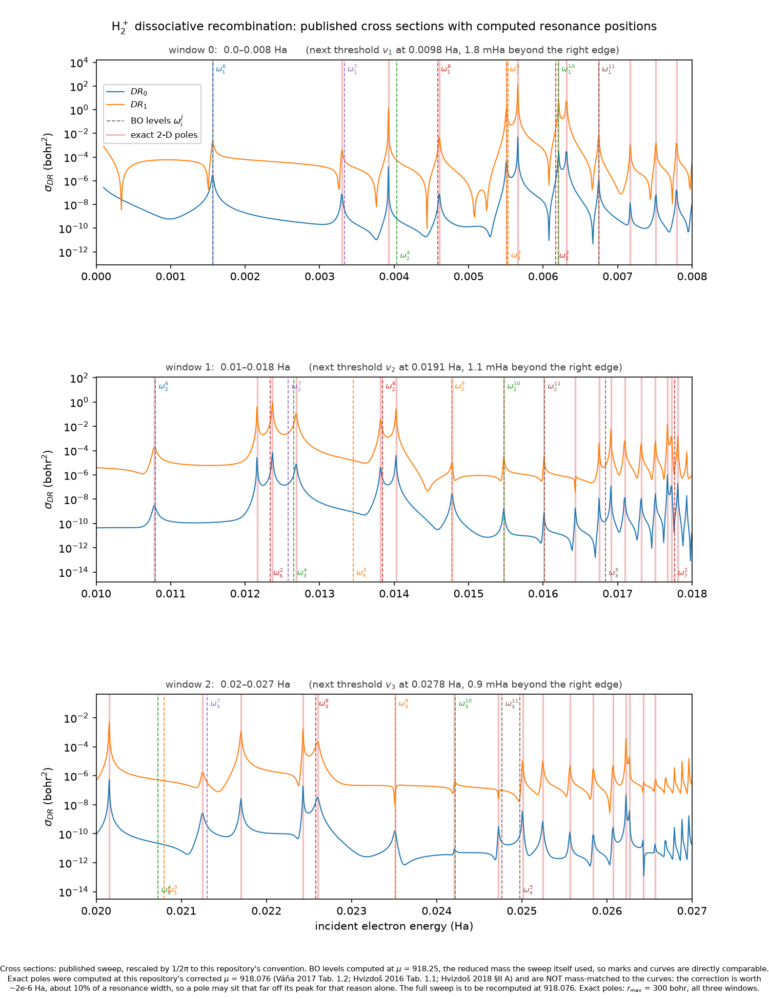

# H₂⁺ — the first ionic target

H₂⁺ is the only **ion** in this repository. Every molecule before it — N₂, NO, F₂ —
is a neutral electron–diatomic scattering problem; H₂⁺ is `e⁻ + H₂⁺(v) → H + H`,
**dissociative recombination (DR)**, and the scattering electron sees the ionic
core's `+1` charge. `qscat.model.H2P` is verified to be an `IonicResonanceModel`
with `charge = -1` (the neutral models — `N2`, `NO`, `F2` — are all
`DiatomicResonanceModel` with `charge = 0`). That single sign changes three things
at once: the incident wave becomes a long-range Coulomb wave rather than a free
one, the electronic grid has to reach ~1300 bohr to hold it, and instead of one
dissociation channel there is a whole Rydberg **series** of exit channels — the
neutral H₂'s bound electronic states, accumulating at the continuum edge, cut off
at a measurable number (`N_CHANNELS = 3` here). It is also, for exactly that grid
reason, the **first model in this repository that does not run on a laptop.**

:::{dropdown} The model — form and parameters
:icon: table

`qscat.model.H2P` (`IonicResonanceModel`), values printed directly from the model
object:

| parameter | value |
|---|---|
| `mu` (nuclear reduced mass) | 918.076 |
| `ell` (fixed partial wave) | 1 |
| `charge` | −1 |
| `V0` (ion Morse well depth) | 0.1027 |
| `R0` (ion Morse equilibrium bond length, bohr) | 2.0 |
| `alpha` (ion Morse range) | 0.69 |
| `a1` (σ-capture amplitude) | 1.6435 |
| `a2` | 6.2 |
| `a3` | 0.0125 |
| `a4` | 1.15 |
| `max_nuclear_ecs_angle_deg` | 22.5 |

Reproduce with:

```python
from qscat.model import H2P
print({k: v for k, v in vars(H2P).items() if not k.startswith("_")})
```

The ion Morse `v0(R)` folds in the `1/R` proton–proton repulsion rather than
carrying it as a separate term; the electronic surface is `v0(R) + v_int(r,R) +
ℓ(ℓ+1)/(2r²) + charge/r`, where `charge/r = −1/r` is the ionic electron–core
Coulomb attraction. `mu = 918.076` is `m_p/2` for the modern proton mass, given by
three independent published sources (Hvizdoš 2016 Table 1.1; Váňa 2017 Table 1.2;
Hvizdoš et al., *Phys. Rev. A* **97**, 022704 (2018) §II A) — eMoScat's own JSON
deck instead carries `918.25`, which those three sources contradict; the port
originally inherited eMoScat's value and it was corrected on 2026-08-15.
:::

## The first non-laptop model

The Coulomb tail's long range forces a large electronic grid — the full deck reaches
1300 bohr electronically and 14 bohr nuclearly, giving **~1.15 million unknowns**
(1,150,108 measured, 19,507,356 nonzeros). That is Docker/MUMPS territory, not
laptop-runnable: a measured full-deck energy point costs **17.4 s** on a 32-core,
123 GB x86-64 host under MUMPS (peak RSS 4.34 GB), so a σ(E) sweep costs roughly an
hour per 200 energies — an overnight job, not a multi-day one. A smaller
`config.proxy_grid()` (electronic → 60 bohr) gives a laptop-feasible
well-posedness/threshold gate, not a converged cross section. No independent
golden σ_DR data ships with this repository (eMoScat's own output file is absent
from the snapshot), so — as with NO/F₂'s dissociative attachment — the exact
solver is the oracle here too.


The DR1 (`n=0`) channel peaks at `E ≈ 6.31×10⁻³` Ha, `σ ≈ 1.54×10⁻³` bohr² above a
~10⁻¹⁰ background; DR2 (`n=1`) is ~10⁻⁶; DR3 (`n=2`) is closed in this window
(threshold ≈ 0.0426 Ha).

::::{grid} 1 1 2 2
:gutter: 3

:::{grid-item-card} Dissociative recombination, exactly
:link: ../physics/h2plus-dr
:link-type: doc

The Coulomb-generalized driven Lippmann–Schwinger solve, looped over the Rydberg
exit series. Checked against a prior external reference sweep: the published
`ω_i^j` level table (53 levels) agrees to ≤4e-6 Ha, but σ_DR itself carries two
open discrepancies — a ~30% systematic deficit in the DR1 channel, and a
runaway near a vibrational threshold (7.6×/3.7× too high, DR0/DR1) that grows to
100–700× too large right at a Rydberg channel's opening.
:::

:::{grid-item-card} Resonance states, verified
:link: ../physics/h2plus-resonance-states
:link-type: doc

Poles of the full 2-D S-matrix, checked against a Born–Oppenheimer basis by
overlap rather than trusted on angle stability alone. Detail below.
:::

::::

## Angle stability is necessary — and not sufficient

`qscat.core.exact_resonance_states` finds poles by two-angle ECS stability: an
eigenvalue that does not move when either the electronic or the nuclear ECS
rotation angle does. On H₂⁺'s three published DR energy windows that test found 57
angle-stable states. Overlapping each one against a Born–Oppenheimer basis
(`qscat.core.bo`/`assignment`, the c-product overlap) turned up two failure modes
angle stability alone cannot see:

**Four of the 57 are not resonances at all.** They pass angle stability — the
eigenvalue genuinely does not move as the contour rotates — but score overlaps of
**6×10⁻⁴ to 7×10⁻³** against every state in the Born–Oppenheimer basis, where the
genuine resonances score **0.87–0.99**. They are rotated-continuum eigenvalues
that happen to sit in a stable corner of the spectrum, not physical states. (At
`E = 0.004479` Ha the best overlap is 0.0006 — three orders of magnitude below
even the low end of the genuine-state range.)

**A further 18 of the 57 are `box-limited`**, which the overlap is structurally
blind to. The c-product cancels the rotated ECS tail by construction — that is
what makes it the *correct* pairing rule — so a state with 97% of its probability
outside the unscaled region still overlaps at 0.99 with the Born–Oppenheimer
product it genuinely is. `real_weight` (the fraction of `|Ψ|²` inside the unscaled
region) is the separate check the overlap cannot make: across one window it
collapses from 0.682 at `Ry₁₁` to 0.010 at `Ry₁₆`, because those high-`n` Rydberg
orbitals (`⟨r⟩ ~ n²`) are simply larger than the 300-bohr box. 18 of 57 fall below
a 0.5 `real_weight` threshold — reported, not deleted, since the identification
still stands; nothing about their shift or width is quotable until the box grows.

```{figure} ../physics/figures/h2p-exact-2d-resonance-state-vs-bo-exact.png
The exact 2-D pole at `E_tot = −0.093680` Ha (`E ≈ 0.0039` Ha), `Γ = 5.6×10⁻⁷` Ha.
```

```{figure} ../physics/figures/h2p-exact-2d-resonance-state-vs-bo-product.png
The Born–Oppenheimer product `φ_Ry4(r;R)·χ_v=2(R)` at `E_BO = −0.093564` Ha — the
state the approximation asserts the one above is. They share a core (five radial
lobes, two nodes in `R`, the same turning surface); the exact state carries extra
amplitude near `r ≈ 130–160` bohr the product has nowhere to put.
```

```{figure} ../physics/figures/h2p-exact-2d-resonance-state-pair-a.png
`ω₁⁹` (`Ry₉`, `v=1`): diffuse, ~9 radial lobes reaching past 250 bohr. Overlap
0.970 — nearly pure, and it barely moves against the Born-Oppenheimer level.
```

```{figure} ../physics/figures/h2p-exact-2d-resonance-state-pair-b.png
`ω₃³` (`Ry₃`, `v=3`): compact, confined inside ~70 bohr. Overlap 0.783 — strongly
mixed, and it carries almost the whole splitting of a near-degeneracy with the
pair above.
```

Once the four non-resonances and the 18 box-limited states are set aside, the
BO error itself sorts by *regime*, not by level index — an eightfold split
between diffuse high-`n` Rydberg states (median 0.457 meV) and compact low-`n`
ones (median 3.702 meV), both larger than N₂'s 0.22 meV
({doc}`../physics/exact-2d-resonances`). The Born-Oppenheimer levels and the
exact poles, marked on the DR sweep that measures both:



## What is established, and what is not

Quoted directly from the resonance-states note:

| claim | status |
|---|---|
| exact poles land on the published peaks, 0.2–0.3 widths, all three windows | measured against data the poles were not fitted to |
| 4 of 57 angle-stable poles are not resonances | overlaps 6e-4…7e-3 against a basis proven complete at those energies |
| the BO shift splits by regime, 0.457 vs 3.702 meV median | 24 quotable pairs |
| 18 of 57 poles are `box-limited` (`real_weight` < 0.5) | the high-`n` Rydberg orbitals are larger than the 300-bohr box; nothing about them is quotable |
| pole POSITIONS are box-converged | `r_max` 300 → 600 moved them 3e-9 or less |
| the pole COUNT is **not** converged | 18→22, 13→10, 14→13 across the three windows — not even monotone |
| per-level shifts for the 6 `basis-limited` poles | **not quoted** — their partner is outside the basis |
| σ_DR near a threshold | **wrong**, 100–700× too large |

Both level/pole figures above are computed at `μ = 918.25` (the value the σ_DR
reference sweep itself used), not the model's shipped `918.076` — a deliberate
choice so the marks and the curve are on the same footing; the ~2×10⁻⁶ Ha the
mass correction is worth would otherwise read as ~10% of a resonance width.

## Where to read more

The Coulomb channel, the discretisation, and the full DR cross section including
its two open discrepancies against an external reference sweep:
{doc}`../physics/h2plus-dr`. The exact resonance-state verification — angle
stability, the overlap test, and the box-limited states:
{doc}`../physics/h2plus-resonance-states`. The general two-angle method this is
built on, and its first (N₂, neutral) application: {doc}`../physics/exact-2d-resonances`,
{doc}`n2`. The Born–Oppenheimer resonance levels these exact poles are compared
against: {doc}`../physics/lcp-resonance-levels`.
