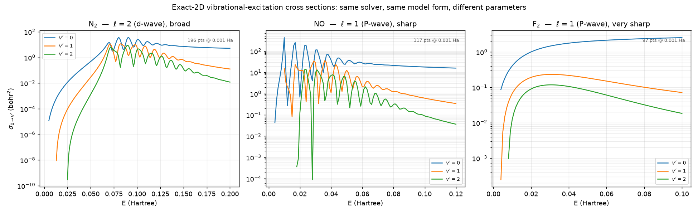
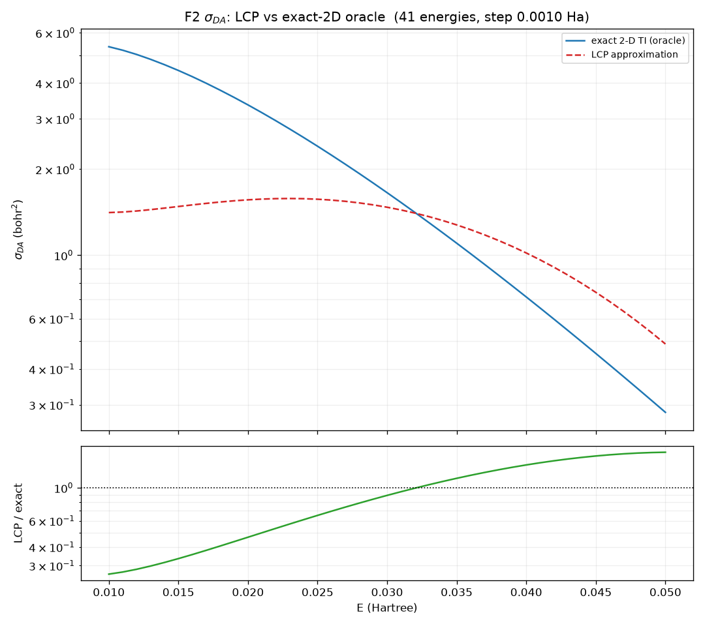
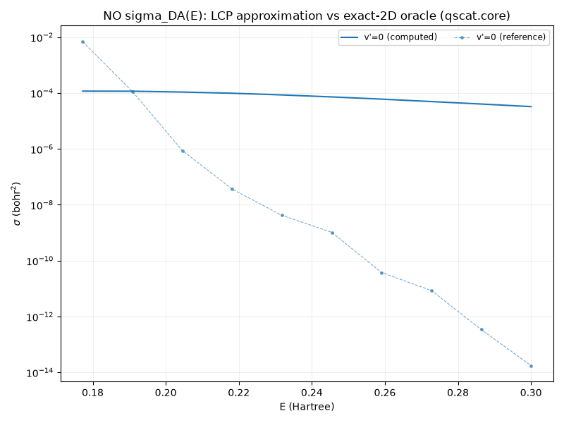
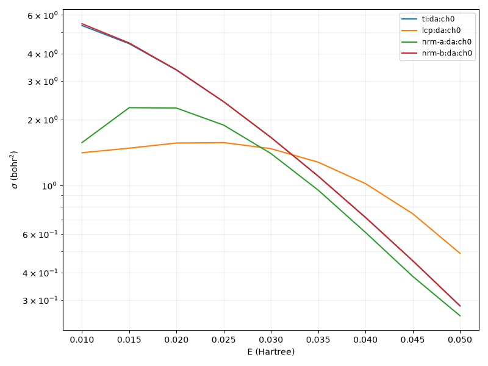

# NO and F₂ — no independent data

Neither of these molecules has a published cross section this repository can check
against. N₂ has Houfek's independent `CSVE.V00.J00` data; NO and F₂ do not. For both,
the exact 2-D driven-equation solver (`qscat.core.driven.ve_cross_section` /
`qscat.core.dissociation.da_cross_section`) **is** the oracle, and every approximation
below is measured against *that* solver's own output. Agreement here is
**self-consistency between two routes through the same repository, not agreement with
an external experiment or an independent calculation.** That distinction is the most
important thing on this page and it is not softened anywhere below.

Same model and method as N₂ — `H = −½∂²_r − (1/2μ)∂²_R + v0(R) + l(l+1)/2r² −
λ(R)e^{−α_c r²}` — differing only in the fitted parameters
(`qscat.model.{NO,F2}`). Adding each molecule was data + validation, not new solver
code. Atomic units throughout.

:::{dropdown} The models — form and parameters
:icon: table

Both are `DiatomicResonanceModel` with `charge = 0` (verified: `type(NO).__name__ ==
type(F2).__name__ == "DiatomicResonanceModel"`), the same neutral-diatomic form N₂
uses. Values printed directly from the model objects:

| parameter | NO | F₂ |
|---|---|---|
| `mu` (nuclear reduced mass) | 13614.16 | 17315.99 |
| `ell` (fixed partial wave) | 1 | 1 |
| `D0` (Morse well depth, Ha) | 0.2363 | 0.0598 |
| `alpha0` (Morse range) | 1.571 | 1.5161 |
| `R0` (equilibrium bond length, bohr) | 2.157 | 2.6906 |
| `lambda_inf` | 6.367 | 18.849 |
| `lambda_1` | 5.0 | 3.213 |
| `R_lambda` | 2.0843 | 1.832 |
| `lambda_c` | 6.05 | 18.145 |
| `R_c` | 2.285 | 2.595 |
| `alpha_c` | 1.0 | 3.0 |
| `charge` | 0 | 0 |

Reproduce these with:

```python
from qscat.model import NO, F2
print({k: v for k, v in vars(NO).items() if not k.startswith("_")})
print({k: v for k, v in vars(F2).items() if not k.startswith("_")})
```
:::

## Sharper, lower resonances than N₂

Both partial waves are `ℓ = 1` (P-wave) rather than N₂'s `ℓ = 2` (d-wave), and both
resonances sit lower and narrower:

| | partial wave ℓ | α_c | neutral vib. spacing ε₁−ε₀ | resonance window |
|---|---|---|---|---|
| N₂ | 2 (d-wave) | 0.40 | 0.0124 Ha | ~0.07–0.10 Ha (broad) |
| NO | 1 (P-wave) | 1.00 | 0.0091 Ha | ~0.02–0.05 Ha (sharp) |
| F₂ | 1 (P-wave) | 3.00 | 0.0039 Ha | ~0.01–0.04 Ha (very sharp, near threshold) |

F₂ is weakly bound (`D0 = 0.0598` Ha, ~1.6 eV) with an extremely sharp near-threshold
resonance — boomerang features only ~0.004 Ha wide — which is why F₂ is a famously
strong dissociative-attachment (DA) system: its DA channel is exothermic
(**threshold −0.0691 Ha**, open at every `E > 0`), while NO's opens at **+0.1719 Ha**
and N₂'s stays closed throughout the measured range (+0.5016 Ha). The three exact-2D
VE cross sections side by side:



Both curves in this figure are computed on each molecule's own eMoScat production
deck (NO: 132×597 electronic×nuclear points; F₂: 132×974), not the shared N₂-style
grid — DA's outgoing flux is in the nuclear coordinate and needs a much finer nuclear
grid to resolve (F₂'s exit wave has `K_R ≈ 58`, wavelength ~0.107 bohr; the coarse
shared grid does not converge it).

## What has been computed

::::{grid} 1 1 2 2
:gutter: 3

:::{grid-item-card} Vibrational excitation and dissociative attachment, exactly
:link: ../physics/diatomic-ve-cross-sections
:link-type: doc

The exact 2-D driven-equation solve for both channels, on each molecule's own
per-molecule nuclear deck. VE figures:
`../physics/figures/no-2d-ti-cross-section.png`,
`../physics/figures/f2-2d-ti-cross-section.png`. DA figures:
`../physics/figures/no-2d-ti-da-cross-section.png`,
`../physics/figures/f2-2d-ti-da-cross-section.png`.
:::

:::{grid-item-card} The local-complex-potential approximation
:link: ../physics/diatomic-ve-cross-sections
:link-type: doc

The 1-D reduction, measured against the exact-2D DA oracle: systematically and
energy-dependently wrong on F₂ (never a fixed percentage), and off by a ratio
reaching 1.8×10⁹ on NO away from threshold, where it fails to reproduce the
exponential decay at all. Detail below.
:::

:::{grid-item-card} The nonlocal resonance model
:link: ../physics/nonlocal-resonance-model
:link-type: doc

Keeps the full nonlocal Feshbach coupling instead of reducing to a local potential.
Closes almost all of the LCP's gap on F₂; collapses by orders of magnitude on NO, for
reasons the investigation has not resolved. Figure:
`../physics/figures/f2-da-nrm-vs-lcp-vs-exact.png`.
:::

:::{grid-item-card} The discretisation this needed
:link: ../physics/discretisation-tuning
:link-type: doc

Why a shared N₂-style nuclear grid does not converge F₂'s DA channel, and how the
automatic discretisation tuner reproduces-and-beats eMoScat's hand-tuned per-molecule
deck once it is told to look at the resonance curve, not just the potential.
:::

:::{grid-item-card} Does the fixed-partial-wave reduction hold?
:link: ../physics/coupled-partial-waves
:link-type: doc

NO's shape resonance is shipped as a single partial wave. Coupling it to
neighbouring partial waves through a physically motivated, non-spherical
interaction: only `l = 1` hosts a resonance at all — O⁻ has one bound orbital,
2p — so the single pole is explained rather than merely observed. For the
angle-integrated VE cross section the fixed-wave reduction is a good
approximation, because a low-energy electron cannot resolve the anisotropy:
the truncation costs 2–7 % (σ-weighted) against a reference converged to
0.3–0.5 %.
:::

::::

## The LCP approximation — systematic and energy-dependent error

The local-complex-potential (LCP) reduction collapses the full electron–nuclear
problem to a 1-D nuclear problem on a complex potential `V_d(R) − iΓ(R)/2`. Its error
on σ_DA is **not a fixed percentage** — it is a signed, energy-dependent departure
that changes sign inside the measured range.

**F₂**, 41 energies over 0.010–0.050 Ha (recomputed 2026-08-17):

| E (Ha) | σ_DA LCP | σ_DA exact | LCP/exact |
|---|---|---|---|
| 0.010 (threshold) | 1.410 | 5.366 | 0.263 |
| 0.020 | 1.56 | 3.36 | 0.47 |
| 0.030 | 1.471 | 1.656 | 0.888 |
| 0.040 | 1.02 | 0.72 | 1.43 |
| 0.050 | 0.490 | 0.282 | 1.736 |

The exact σ_DA falls by a factor of 19 across this range while the LCP stays nearly
flat, so the ratio sweeps 0.263 → 1.736, crossing unity near E ≈ 0.032 — i.e. the
LCP's *relative* error, `|ratio − 1|`, computed from the ratio column above, runs
from 11.2% (at the crossing, E = 0.030, `|0.888 − 1|`) up to 73.7% (at threshold,
`|0.263 − 1|`) and 73.6% (at E = 0.050, `|1.736 − 1|`): **roughly an 11–74% error
band**, not a single quoted figure. The LCP under-predicts below ~0.03 Ha and
over-predicts above it.



**NO**, 151 energies over 0.150–0.300 Ha: the exact σ_DA is a sharp spike at
threshold (peak 0.0925 bohr² at E = 0.172) that then decays by **thirteen orders of
magnitude**, to 1.8×10⁻¹⁴ at E = 0.300. The LCP does not decay — it stays near 10⁻⁴
across the whole range — so the ratio runs from 0.067 near the spike to **1.8×10⁹**
at the top of the range. The LCP does not reproduce the exponential suppression of
dissociative attachment away from threshold at all.



Source: {doc}`../physics/diatomic-ve-cross-sections`.

## The nonlocal resonance model — closes the F₂ gap, collapses on NO

The nonlocal resonance model (NRM, PRA 77's Feshbach formalism) is a different
approximation from the LCP: instead of reducing the resonance to a local complex
potential, it keeps the full nonlocal coupling, expanded in a discrete-state basis.
Two discrete-state choices exist (A: the physical, R-dependent state; B: an
R-independent state with the Eq. (37) background term). Measured against the same
exact-2D `da_cross_section` oracle, on each molecule's own eMoScat production deck:

**F₂ — choice B reproduces the oracle.**

| E (Ha) | σ exact | σ LCP | σ NRM-B | LCP/ex | B/ex |
|---|---|---|---|---|---|
| 0.010 | 5.36634 | 1.41038 | 5.46688 | 0.263 | 1.0187 |
| 0.020 | 3.35886 | 1.56292 | 3.36989 | 0.465 | 1.0033 |
| 0.030 | 1.65611 | 1.47242 | 1.65514 | 0.889 | 0.99941 |
| 0.040 | 0.71510 | 1.01869 | 0.71415 | 1.425 | 0.99867 |
| 0.050 | 0.28238 | 0.48945 | 0.28211 | 1.733 | 0.99903 |

Choice B reproduces the exact 2-D σ_DA to **0.06–0.33% at four of the five anchors,
and to 1.9% at the lowest** (E = 0.010, nearest threshold) — against the LCP's own
11–74% band over the same anchors. That is choice B beating the LCP by **factors of
39 / 163 / 189 / 319 / 758** at the five anchors respectively. Choice A (not shown,
the physical R-dependent state) is markedly worse — it under-predicts and worsens
toward threshold (A/ex: 0.901 → 0.292), 38–266× further from the oracle than choice
B, matching the Born–Oppenheimer breakdown PRA 77 documents for DA.



**NO — choice B collapses by five to eight orders of magnitude, unresolved.**

| E (Ha) | σ exact | σ NRM-B | B/ex |
|---|---|---|---|
| 0.175 | 1.61389e-2 | 7.54001e-10 | 4.7e-8 |
| 0.180 | 1.56645e-3 | 2.83314e-10 | 1.8e-7 |
| 0.185 | 2.26604e-5 | 1.06926e-10 | 4.7e-6 |
| 0.190 | 7.07979e-5 | 4.05467e-11 | 5.7e-7 |
| 0.200 | 1.71756e-6 | 5.92119e-12 | 3.4e-6 |

None of the three approximations track the exact curve's structure here: over these
five anchors the exact σ_DA swings by a factor of 9397 (real, non-monotone
structure), while the LCP swings by only 1.04×, NRM choice A (not converged, shown
only because dropping it would hide one of the three routes) by 2.47×, and NRM
choice B by 127× — all flat by comparison to the oracle's 9397×.

**This is genuinely unresolved: "No located defect, and no confirmed mechanism."**
An equation-by-equation audit against Eqs. (55)–(61) found the implementation
correct, and further hypotheses and mechanisms were killed by direct measurement
without resolving the collapse: a suppressed NO doorway (it is actually 3.4×
*larger* than F₂'s), wrong ingredients (`E_n`, `V_dn`, `V_d` validated against the
independent ECS pole to 0.1–2.6%), a wrong energy argument inside the coupling
kernel `F` (its local limit reproduces `Γ(ε_loc, R)` to a median of 0.977 on NO
and 1.011 on F₂), a badly built asymptotic electronic state, grid or quadrature
error (converged to seven figures), bad adiabatic state labelling (minimum
overlap 0.99998709), a threshold mismatch (three independent code paths agree to
9.0×10⁻¹⁴), and a doorway-position mechanism that was proposed and then refuted
by raising `v_init`. Two further dead ends are recorded separately: switching
the coupling `F` off entirely (which detunes rather than de-absorbs — it removes
the real level shift, not the loss mechanism), and setting `Γ = 0` in the
already-validated LCP (which gives σ_DA exactly 0, so "no absorption ⟹ an upper
bound" has no basis even in the trusted method). One unverified hypothesis
remains open — NO's exit momentum is small just above its DA threshold, which would
put an autodetachment survival factor deep in an exponential the note has not yet
computed — but it is explicitly flagged as unverified, not a finding.

This does not contradict PRA 77: the paper contains **no NO or N₂ dissociative-
attachment cross section at all**, for any discrete-state choice — its only DA panels
are for F₂. The NO run here extends more than twice past the highest energy the
paper studied for NO, so this is an extension beyond the paper's tested range, not a
disagreement with it.

Source: {doc}`../physics/nonlocal-resonance-model`.

## Where to read more

The exact-2D VE and DA solves, the LCP reduction, and the per-molecule
discretisation requirement: {doc}`../physics/diatomic-ve-cross-sections`. The
nonlocal resonance model, both its F₂ success and its unresolved NO collapse:
{doc}`../physics/nonlocal-resonance-model`. The automatic discretisation tuner,
calibrated against F₂'s DA channel: {doc}`../physics/discretisation-tuning`. The
shared model-independent engine both molecules run through, and the N₂ page that
explains why N₂ alone can act as an anchor: {doc}`../physics/qscat-core-scattering`,
{doc}`n2`.
