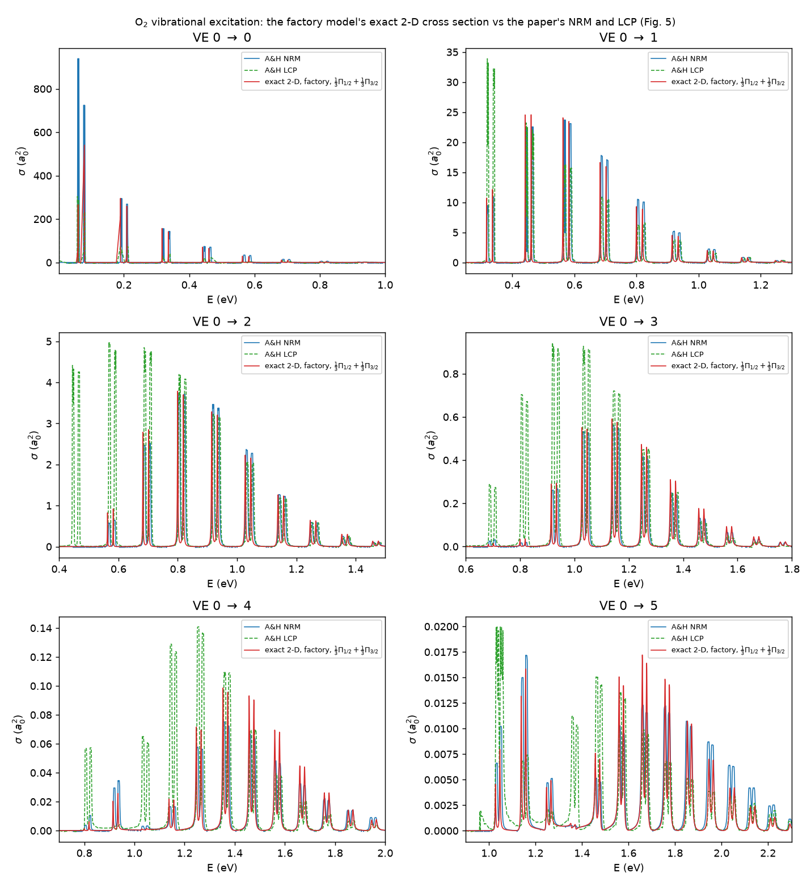

# O₂ — the first fitted target

O₂ is the first molecule in this repository whose model is a **fit rather than
a published parameter set**: the potential factory
({doc}`../physics/potential-factory`) fitted a `FlexibleDiatomicModel` to the
curves of V. Alt and K. Houfek, Phys. Rev. A **103**, 032829 (2021), and the
exact 2-D solver then computed its vibrational-excitation (VE) cross section.
The comparison is **theory against theory**: the exact 2-D result of the fitted
potential is overlaid on the paper's *own* nonlocal-model and
local-complex-potential curves. The paper's measured traces are not
extracted, nothing is fitted to an observable, and nothing is compared with
experiment.

The target is not digitised by eye. The paper embeds its figures as vector
paths, so the neutral curve, the anion curve, the resonance width (Fig. 2),
the spin–orbit splitting Δ_SO(R) (Fig. 1) and the cross sections (Fig. 5) are
recovered exactly from the PDF — to ~0.02 eV on the curves, ~1 meV in energy
on the cross sections (`validation/factory/data/o2/README.md`).

Atomic units throughout (Hartree, bohr).

:::{dropdown} The model — form and parameters
:icon: table

`qscat.model.O2` is a `FlexibleDiatomicModel` with `charge = 0`: an Expanded
Morse Oscillator neutral curve (five-term $\beta(R)$ in Le Roy's $y_3$) and a
Gaussian electron–molecule well $-\lambda(R)\,e^{-\alpha(R) r^2}$ at partial
wave `ℓ = 2`, whose $\lambda(R)$ is the long-range-correct `TailR` form (nine
coefficients, dying as $R^{-4}$) and whose $\alpha(R)$ is a constant. Values
printed from the model object:

| parameter | value |
|---|---|
| `mu` (nuclear reduced mass) | 14578.47 |
| `ell` (fixed partial wave) | 2 |
| `D_e` (EMO well depth) | 0.19332 |
| `R_e` (equilibrium bond length, bohr) | 2.2680 |
| `lam` | `TailR`, $\lambda_\infty$ = 5.0643, 9 coefficients, $q = 4$ |
| `alpha` | constant 0.3613 |
| `shell` | none (amplitude 0) |
| `charge` | 0 |

Reproduce these with:

```python
from qscat.model import O2, O2_SO12, O2_SO32
print(O2)
```

The constants are copied from the committed fit report
(`validation/factory/results/o2-fit-report.json`) and locked to it by
`validation/factory/test_o2_report.py`. `O2_SO12` and `O2_SO32` are the two
spin–orbit components ($^2\Pi_{1/2}$, $^2\Pi_{3/2}$): the same neutral curve,
the anion curve moved by ∓Δ_SO(R)/2, polished from `O2` and locked the same
way. See `reference/literature/alt-houfek-2021-pra103-032829.md` for the
tracked reference note.
:::

## What has been computed

::::{grid} 1 1 2 2
:gutter: 3

:::{grid-item-card} The fit
:link: ../physics/potential-factory
:link-type: doc

Over the full 1.85–6.0 bohr range of Fig. 2: neutral curve rms 14 meV (T0
met), resonance position rms 20 meV — the extraction floor — and width to
8 %/14 % (T1 met), the crossing at 2.2890 vs the paper's 2.289 bohr, and the
anion curve ending in theory at $-\mathrm{EA}(\mathrm{O})$ through the
polarisation tail $-\alpha_d/2R^4$ (asymptote met, −0.08 mHa at 14 bohr).
87 s on a laptop. Figure: `../physics/figures/o2-factory-fit.png`.
:::

:::{grid-item-card} The spectral check
:link: ../physics/potential-factory
:link-type: doc

The metric that predicts the VE figure is not the curve rms but the anion's
quasi-bound levels: `validation/factory/o2_levels.py` puts the fitted
model's peak positions within ±7 meV of the extracted curve's over
v = 0…24 (0–2.3 eV) and the widths within ~10 % from v ≈ 7 up. Two earlier
fits with the *same* T1 rms put them 20 and 73 meV off — the rms could not
tell a VE-ready model from a bad one; the levels could.
:::

:::{grid-item-card} The deck
:link: ../physics/discretisation-tuning
:link-type: doc

Built by the discretisation tuner (`validation/factory/o2_grids.py`), the
nuclear grid cut at 8 bohr (DA is closed below 3.7 eV) and then h-refined
once: the 2-D spot check moved σ(0→1) at 1.36 eV by 69 % on one refinement
and under 2 % after — a comb of meV peaks needs its levels far tighter than
the 1-D probes' 1e-3. 324 × 549 = 178k unknowns: 0.38 s per energy with
MUMPS, 46 s with SuperLU.
:::

:::{grid-item-card} The energy mesh
:link: ../physics/potential-factory
:link-type: doc

Level-aware: a 0.5 mHa background plus 121 points across ±6 widths of every
anion level, written into `apps/qscat-run/examples/o2*-ve.yaml` by
`validation/factory/o2_ve_energies.py` (3343 energies per model). The mesh
decides the heights — at Γ/1.5 spacing every peak read ×0.69, a Lorentzian
missed by Γ/3.
:::

::::

## The result — spin–orbit doublets on the paper's comb

Fig. 5's curves are spin–orbit resolved: every peak is a doublet, the sum of
a $^2\Pi_{1/2}$ and a $^2\Pi_{3/2}$ component of statistical weight ⅓ each.
The only comparison that means anything treats the model the same way, so
the two components were run separately (3343 energies × six channels each)
and summed at ⅓ each by `validation/factory/o2_ve_figure.py`:

- **Both members of every doublet in 0 → 1…3 sit within 1–8 meV of the
  paper's nonlocal-model doublets**, with heights 0.9–1.1 on the main peaks;
  the weak 0 → 5 channel reads 0.8–0.96 on its stronger members.
- The doublet separation is 19.0–19.3 meV across the 0 → 1 comb (19.0 meV at
  the v' = 9 pair near 1.04 eV), against the paper's model's 17.8 meV and the
  measurement it cites, 19.6 ± 1.0 meV — noted, not claimed: nothing here was
  tuned to it.
- The paper's LCP is offset from both by 10–40 meV in the inelastic channels,
  the way this repository's own LCP is on N₂ and F₂.
- The residual: each inelastic channel's weakest threshold peak runs 1.4–2×
  high (0.57 eV in 0 → 2, 0.81 eV in 0 → 3), and a 0.004-meV-wide elastic
  peak cannot be height-resolved by time-independent sampling.



## What is open

The T3 tier — the paper's energy-dependent width $\tilde\Gamma(\varepsilon,R)$
from its Table II — is not met and is not a fitting failure: the factory's
width is built on the R-independent discrete state while Table II is a
Breit–Wigner pole width, and their energy dependences differ. It does not
enter the exact 2-D cross section, which is computed from the potential
surface alone. The authors' tabulated curves, in place of the figures, are
the natural next input.

## Where to read more

The factory, the O₂ campaign and every measured number above:
{doc}`../physics/potential-factory`. Why the factory exists and the target
hierarchy it is built from: {doc}`../physics/potential-factory-options`. The
discretisation tuner that built the deck: {doc}`../physics/discretisation-tuning`.
Run the sweep yourself: `apps/qscat-run/examples/o2-so12-ve.yaml` and
`o2-so32-ve.yaml` (`qscat-run run <config>`; MUMPS strongly advised).
