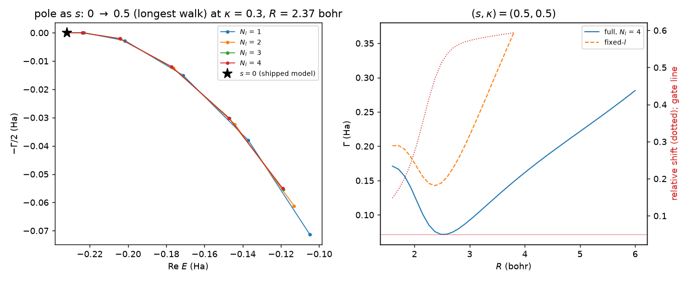

# Coupled partial waves in the NO shape resonance: does the fixed-l reduction hold?

**Location:** `projects/no_coupled_channels/` (`anisotropy.py`, `model.py`,
`blocks.py`, `angular.py`) for the coupled-channel model; `validation/coupled/`
(`screen.py`, `observable.py`, `figures.py`) for the campaign, the gate, and
the figure.
**Origin:** a coupled-channel extension of `qscat.model.NO`'s local complex
potential (LCP) model — the shipped model represents the anion shape resonance
with a single partial wave (`Lambda = 1`), and this project asks whether that
reduction still holds once a physically motivated, non-spherical interaction
is allowed to couple it to neighbouring partial waves.
**Units:** atomic units throughout (energy in Hartree, length in Bohr, cross
section in bohr²). Every matrix here is complex symmetric (ECS), never
Hermitian.

## Key result

The gate is **OPEN**, but not on the criterion the whole project was built to
test. Across the entire campaign — every $R$, every anisotropy strength
$s$, every channel count $N_l = 1 \ldots 5$ — the widest angle-stable window
never contains more than one state that passes the residual cut: **the
resonance stays a single pole under coupling**, so criterion (a) (a genuine
second pole) never fires (`max n_poles = 1` everywhere). That null is only as
good as the cut it rests on: `resid_max = 1e-5` (`validation/coupled/screen.py`),
against a worst *genuine* residual on this sample of 9.8e-6 — within about 2%
of the cut, not the comfortable margin a smaller number would suggest, so the
accepted population reaches essentially to the cut itself — a search window
of only $\pm 0.15$ Ha, and at most 2 angle-stable states ever found at any
point on the campaign. A genuinely split second pole would typically be broad
and marginal, which is exactly the population most at risk of being rejected
by the residual cut as spurious.
No overlap verification against a reference basis (the discriminator this
repository otherwise relies on for exactly this question, see
[`h2plus-resonance-states.md`](h2plus-resonance-states.md)) was run here — angle stability alone is
documented elsewhere in this repository to admit fake poles, so this null
result should be read as "no second pole survived this screen's detection
floor," not as a proof that none exists. What does fire are the other two
criteria, each at its own $\kappa = 0.5$ comparison point, because each is
only trustworthy up to a different anisotropy strength (see Method):
criterion (b), the width, at $s = 0.5$ (the largest $s$ both the coupled and
the fixed-$l$ walk reached) — the fixed-$l$ reduction misses $\Gamma(R)$ by
up to 59% there (measured over the 21 of 41 $R$ points where both curves
still have a pole at that $s$; see below for why $s=0.3$, where all 41 are
comparable, is the better headline), far past the 5% gate. Criterion (c), the
vibrationally-elastic/inelastic cross section, at $s = 0.1$ (the largest $s$
at which the curve-difference construction is still a small perturbation of
the shipped width; see Method) — the median relative shift across the swept
energies and channels is 31%, also far past 5%. The pointwise *maximum*
shift at that same $s$ reaches ~3100%, but that number is a diagnostic, not
the criterion: it is the resonance lineshape being under-sampled by the
energy grid (three points across a width of 0.006 Ha), not a larger physical
effect, and is recorded only so the record shows the peaks moved, not just
that the curves differ.

Averaged over the resonant part of the curve rather than taken at the single
worst $R$, the width effect is just as large and better resolved: at
$s = 0.3$ the median relative $\Gamma$ difference across 41 comparable $R$
points is 58%, while the model itself (the $N_l = 4$ vs. $N_l = 5$ check) is
converged to 0.2% there — a large, well-resolved discrepancy, not
discretisation noise. At $s = 0.5$ the same comparison gives 55%, with the
model converged to 2.8%. Nothing here is compared with experiment: $s$ and
$\kappa$ are geometric knobs on a well shape, not fit parameters, and the
measured effect is confined to $R \in [1.6, 6.0]$ bohr by construction (see
Method).

Left: the pole in the complex plane at $R = 2.4$ bohr as $s$ is walked from 0
(the shipped model, star) up through every channel count $N_l = 1 \ldots 4$,
at $\kappa = 0.3$ — one pole per curve at every $s$, the picture behind
criterion (a)'s null. Right: $\Gamma(R)$ for the fully coupled ($N_l = 4$,
solid) and fixed-$l$ ($N_l = 1$, dashed) models at the criterion-(b)
comparison point $(s, \kappa) = (0.5, 0.5)$, with the pointwise relative
shift (dotted, right axis) against the 5% gate line — the picture behind
criterion (b) firing.

## Physical picture

The shipped NO model represents the $^2\Pi$ anion shape resonance as a single
partial wave, $\Lambda = 1$ ($l = 1$), sitting in an isotropic Gaussian well
$-\lambda(R)\,e^{-\alpha r^2}$ centred on the molecule. That is already an
approximation: NO is a diatomic, not a sphere, and its true electrostatic and
exchange field mixes partial waves of the same $\Lambda$ that an isotropic
well keeps decoupled.

This project makes that anisotropy explicit and geometric rather than fitted.
`TwoCentreWell` (`projects/no_coupled_channels/anisotropy.py`) splits the
shipped Gaussian well into two off-centre wells,

$$V_{\rm int}(\vec r, R) = -\tfrac{1+\kappa}{2}\lambda(R)\,e^{-\alpha|\vec r - d\hat z|^2}
-\tfrac{1-\kappa}{2}\lambda(R)\,e^{-\alpha|\vec r + d\hat z|^2}, \qquad d = sR/2,$$

with two knobs. $s \in [0, 1]$ moves the wells from the molecular centre
($s=0$, where the sum collapses back to the shipped isotropic well for *any*
$\kappa$ — the embedding identity below) out onto the two nuclei ($s=1$).
$\kappa$ is the amplitude asymmetry between the two wells and is what makes
the molecule heteronuclear rather than homonuclear: at $\kappa = 0$ the well
is symmetric and only even angular-momentum transfers survive, so within
$\Lambda = 1$ the resonance couples only as far as $l = 3$; turning $\kappa$
on opens the $l=1 \leftrightarrow l=2$ coupling a symmetric well forbids.
`CoupledModel` (`model.py`) assembles the resulting $N_l$-channel block
Hamiltonian for $l = \Lambda, \ldots, \Lambda + N_l - 1$ on a fixed-$R$
electronic grid; $N_l = 1$ is not a degenerate corner case, it *is* the
fixed-$l$ reduction under test, built from the same code as every coupled
model so the comparison is differential.

## Method

**The screen.** At each sampled bond length $R$, the resonance pole of the
$N_l$-channel electronic Hamiltonian is located exactly as the shipped
model's own poles are: two-angle ECS stability
(`qscat.ecs.match_angle_stable`) on a coupled rather than a single-channel
Hamiltonian. The screen walks a ladder of anisotropy strengths $s = 0, 0.1,
\ldots$ at fixed $\kappa$, seeded at $s=0$ from `qscat.model.NO`'s own
$v_0(R)$ (never from the approximation being measured), and stops once the
narrowest point on the curve is no longer a resonance — $\min(\Gamma/\varepsilon)$
over the points that are actually resonant reaching 1. In this campaign every
walk stops by $s = 0.5$–$0.6$; none reaches $s=1$. It is repeated for
$N_l = 1, 2, 3, 4$ over $\kappa = 0.0$–$0.5$, plus an $N_l = 5$ check at
$\kappa=0.5$ for a convergence estimate, over $R \in [1.6, 6.0]$ bohr (41
points) — the region where the resonance lives and where the crossing from
bound to resonant happens as the anisotropy is turned on: at $s=0$ only 7 of
the 41 $R$ points are resonant at all (the rest are bound, since at
$R \gtrsim 2.5$ bohr the shipped anion curve sits below the neutral one),
because it is precisely the anisotropy that turns those bound points into
resonances. On the $N_l=4$, $\kappa=0.3$ curve that count rises to 36 by
$s=0.2$ and to all 41 by $s=0.3$ (the fixed-$l$ and other channel-count
curves reach 41 at different $s$; this is the one the sentence above is
measured on). The electronic deck used here
is deliberately **not** the published NO deck (8 tail elements at 44°/52°
rather than 6 at 35°/44°): the published deck's tail cannot represent the
resonance once the anisotropy broadens it. At $s=0.4$, $R=2.0$ bohr, the
two-angle residual is already $6\times 10^{-4}$ on the published deck against
$3.0\times 10^{-9}$ on this one, five orders of magnitude apart with no
physics changed, and by $s=0.5$ the published deck loses the pole outright.

**The observable.** A resonance curve is not itself an observable. The
screen's curve difference (coupled minus fixed-$l$, in both $V_d(R)$ and
$\Gamma(R)$) is applied as a **difference** to the shipped
`qscat.core.lcp.local_complex_potential` output for `qscat.model.NO` —
linearly interpolated over the screen's $R$ sample and left at zero outside
it, which includes the ECS complex tail. That reuses the shipped assembly's
freezing near $R\to0$ and tail clamping untouched, so the comparison cannot
manufacture a tail artefact of its own — at the price of confining the
measured effect to $R \in [1.6, 6.0]$ bohr, exactly where the screen sampled.
The resulting curves (`"full"` and `"fixed"`) are each run through
`qscat.core.lcp.lcp_ve_cross_section`, the LCP's vibrational-excitation
route, over 41 energies from 0.020 to 0.100 Ha spanning NO's resonance, for
the elastic ($v'=0$) and first-inelastic ($v'=1$) channels. This is VE, never
DA: NO's dissociative-attachment channel opens at $+0.172$ Ha, well above
this sweep, so $\sigma_{\rm DA}$ there is a $\sim 10^{-19}\,a_0^2$ tail that
the LCP is documented to miss by five to seven orders — far too poorly
resolved to register a few-percent change in $\Gamma(R)$. Because both curves
are driven through the identical LCP machinery, the comparison is
differential by construction: it measures the effect of the coupling, not
the quality of the LCP approximation.

The shipped `local_complex_potential(NO, ...)` baseline both branches ride on
is recomputed here on this screen's own electronic deck (44°/52°, 8 tail
elements), not on NO's published production deck (35°/44°, 6 tail elements)
— the same substitution the screen itself makes and for the same reason (see
above). Measured over $R \in [1.6, 6.0]$ bohr, the two decks' baselines agree
to $\max|\Delta V_d| = 1.7\times10^{-4}$ Ha and $\max|\Delta\Gamma| =
2.8\times10^{-4}$ Ha — about 0.3% of $\max(\Gamma)$ — so the substitution is
benign and does not affect any of the numbers below.

Every run also emits `qscat.core.lcp.curve`'s standing warning that its pole
walk freezes below $R = 1.5187$ bohr for the last 23 of 507 nuclear nodes —
the small-$R$ breakdown that module's own docstring documents as deliberate
and usually harmless. That freeze sits outside the $R \in [1.6, 6.0]$ span
this project modifies and is identical on both the "full" and "fixed"
branches, so it cancels in the difference and is expected and harmless here.

**The perturbation limit.** The observable's construction (the curve
difference applied to the shipped LCP output, above) is only meaningful
while that difference stays small relative to the curve it is added to.
Measured across the campaign's own $s$ ladder, $\max|\Delta\Gamma(R)|$ as a
fraction of $\max(\Gamma^{\rm shipped}(R))$ is 0.01 at $s=0.1$, 0.62 at
$s=0.2$, 1.88 at $s=0.3$, 2.10 at $s=0.5$: past a fraction of about 0.2 the
difference exceeds the width it is modifying, $\Gamma^{\rm coupled}(R)$
clamps to zero across the doorway by the $\max(0, \cdot)$ in the
construction, and there is no cross section left to compare — the coupled
$\sigma_{\rm VE}$ collapses toward zero while the fixed-$l$ one does not, and
a pointwise relative-shift metric reports that collapse as if it were a
100%-or-more physical effect. The observable is therefore evaluated at the
largest $s$ where the fraction stays at or below 0.25, which on this
campaign is $s=0.1$; $s=0.2$ already fails it.

**The gate.** Three criteria. (a): a genuine second pole appears anywhere in
the whole campaign (read from the residual-filtered pole count, not the raw
angle-stable count — a spurious near-threshold state is angle-stable at
every $R$ and every $s$, so the raw count is 2 everywhere and cannot be the
criterion). This redefinition — `n_poles`, not the raw angle-stable
`n_stable` — was made before the campaign ran, so criterion (a) is exactly
the pre-registered criterion. (b): the maximum relative shift in $\Gamma(R)$
exceeds 5%, evaluated at the largest $s$ both the fully coupled ($N_l=4$) and
fixed-$l$ ($N_l=1$) walks reached at $\kappa=0.5$ ($s=0.5$ in this
campaign) — this criterion compares two computed curves directly, with no
construction in between, so it is sound wherever both curves exist and needs
no perturbation limit, and it is also exactly as specified. (c) is not: the
spec declared it as the *pointwise maximum* relative shift in
$\sigma_{\rm VE}(E)$ exceeding 5% at any sampled energy. What is reported
below is the *median* relative shift, evaluated at an $s$ chosen by the
perturbation limit above — and both of those changes were made **after**
the first campaign run had already produced numbers, not declared ahead of
it. The reason is documented in the perturbation-limit discussion just
above: the pointwise-maximum form was measuring the curve-difference
construction's own collapse near and past $s\approx0.2$, not a larger
physical effect, and reading it literally would have reported that
collapse as a 100%-or-more shift in the cross section. Both changes made
the gate **harder to open**, not easier — a stricter reduction (median) and
a more conservative evaluation point ($s=0.1$ rather than whatever larger
$s$ the raw walk reached). The gate's conclusion is unaffected by this
post-hoc tightening of (c): criterion (b), which needs no construction and
was never changed, opens it on its own. Because criteria (b) and (c) are
evaluated at different $s$ for two distinct reasons, they are reported with
the $s$ each used, and a reader must not assume they refer to the same
point on the ladder. Any one criterion firing opens the gate; a shut gate
would have been reported as prominently as the open one it turned out to
be.

## Validation

At $s=0$, every channel count from $N_l=1$ through the $N_l=5$ check agrees
to better than $10^{-11}$ — measured over every $s=0$ payload in
`validation/coupled/results/screen.json`, $\max|\Delta V_d| = 2.79\times
10^{-12}$ Ha and $\max|\Delta\Gamma| = 4.73\times10^{-12}$ Ha — the embedding
identity built into `TwoCentreWell` (the two-well sum collapses to the
shipped isotropic well at $s=0$ for any $\kappa$) holding at full campaign
scale, on the real solver rather than a toy case. That identity is what stands in for external validation once
$s>0$: no independent reference exists for this anisotropic extension, since
nothing here is fit to or compared against experiment or any published
curve — $s$ and $\kappa$ are geometric, and the anisotropic model is
deliberately never treated as anything other than a testbed for the fixed-$l$
approximation. The $N_l=4$ vs. $N_l=5$ channel comparison serves the same
role the model has for the width claim itself: at $s=0.3$, where the
headline 58% median $\Gamma$ discrepancy is quoted, that check agrees to
0.2%, so the discrepancy is resolved against a model that is itself two
orders of magnitude tighter than the effect being reported. At $s=0.5$ the
same check is looser (2.8%), so the $s=0.5$ number is corroboration for the
$s=0.3$ result, not the headline on its own.
