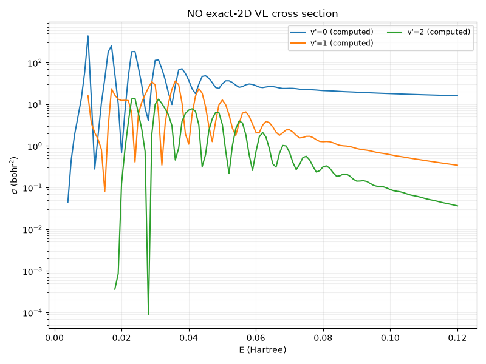
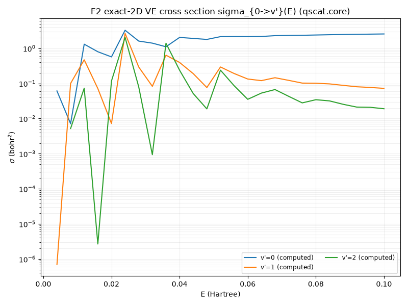
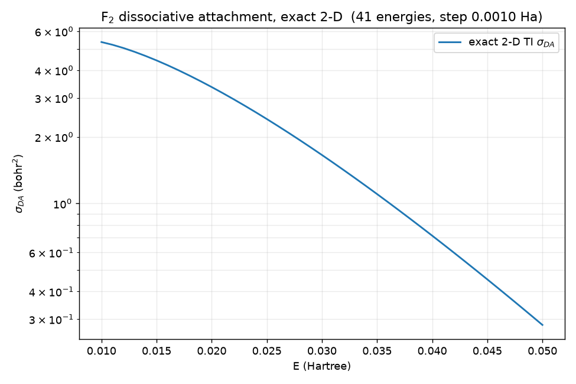
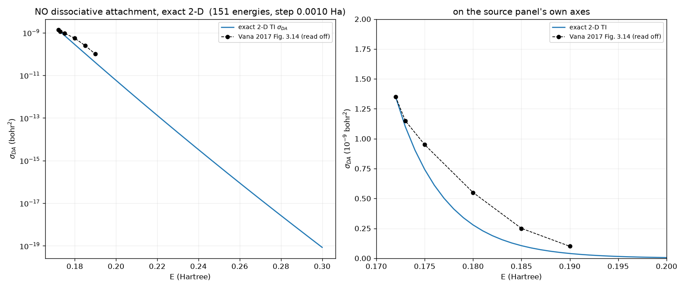

# NO and F₂ exact-2D VE cross sections (the model port)

**Location:** `validation/diatomic/` (`config.py` — per-molecule grid/energy config;
`curves.py` — the exact-2D TI oracle driver + committed figures; `test_diatomic.py`).
**Computed entirely through the promoted library** `qscat.core` + `qscat.model` — the first
consumers of the generalization beyond N₂ (sub-project A). **Origin:** sub-projects B (NO) and
C (F₂) of the diatomic VE-scattering spec. **Units:** atomic units.

## What this is

The exact 2-D time-independent vibrational-excitation cross section σ_{0→v'}(E) for **NO** and
**F₂** — the same model and method as N₂ (`H = −½∂²_r − (1/2μ)∂²_R + v0(R) + l(l+1)/2r² −
λ(R)e^{−α_c r²}`), differing only in parameters (`qscat.model.{NO,F2}`). Adding each molecule
was **data + validation, no new solver code**: a `qscat.model` registry entry + a
`validation/diatomic/config.MoleculeConfig` grid/energy entry + `compute_ti_curve` calling
`qscat.core.driven.ve_cross_section`.

## The oracle (no independent golden data)

Unlike N₂ (gated against Houfek's independent `CSVE.V00.J00`), **no independent cross-section
data ships for NO/F₂** — so the exact-2D TI solver *is* the reference (the research program's
stance: the exact solution is the oracle, the LCP/TD approximations are under test). The
committed σ(E) curves are that oracle:

Both show clear **boomerang** oscillation structure from a low-lying shape resonance, decaying
smoothly at higher E:

| | partial wave l | α_c | neutral vib spacing eps₁−eps₀ | resonance window |
|---|---|---|---|---|
| N₂ | 2 (d-wave) | 0.40 | 0.0124 Ha | ~0.07–0.10 Ha (broad) |
| NO | 1 (P-wave) | 1.00 | 0.0091 Ha | ~0.02–0.05 Ha (sharp) |
| F₂ | 1 (P-wave) | 3.00 | 0.0039 Ha | ~0.01–0.04 Ha (very sharp, near threshold) |

NO and F₂ have **lower, sharper** resonances than N₂: NO's ²Π shape resonance sits low, and F₂
— weakly bound (D₀ = 0.06 Ha, ~1.6 eV), a strong dissociative-attachment system — has an
extremely sharp near-threshold resonance with boomerang features only ~0.004 Ha wide.

**Convergence:** the N₂-style FEM-DVR-ECS grid (electronic r_max = 16, nuclear r_max = 22) is
converged for NO and F₂ as well — the exact-2D σ(E) is unchanged to <1 % at electronic
r_max = 16/24/32 for NO, so the sharp low-E swings are *genuine* resonance structure, not grid
noise.

## The three molecules side by side

N₂'s broad d-wave resonance vs NO/F₂'s sharp low-lying P-wave ones, all from the same model
and the same `qscat.core` solver — only the parameters differ.

## Dissociative attachment (DA) — the second exit channel

Beyond vibrational excitation (VE — the electron re-emitted, `e⁻ + AB(v=0) → AB⁻* → e⁻ +
AB(v')`), the transient anion `AB⁻*` can **dissociate**: `e⁻ + AB(v=0) → AB⁻* → A + B⁻`. The
outgoing flux is then in the **nuclear** coordinate (R→∞) rather than the electronic one. eMoScat
measures it with a second test function on the nuclear coordinate (`Model2d/MultiTestFunction2d.cpp`,
`TestFunction2d.cpp`, `Potentials2d.cpp`): the DA exit channel is

  Φ_DA(r,R) = φ_e(r) · F^out_R(R),

where **φ_e(r) is the anion's bound electronic state at the dissociation limit** — the bound
eigenstate of the electronic Hamiltonian `−½∂²_r + v0(R_∞) + l(l+1)/2r² − λ(R_∞)e^{−α_c r²}`
(`Neutral2dPotential` at the outer nuclear edge; λ(R_∞) → λ_inf) — and `F^out_R(R)` is the
outgoing nuclear wave `√(μ/2πk_R)·e^{ik_R R}`, `k_R = √(2μ(E_tot − ε_e))`. The cross section is
`σ_DA = π|S_DA|²/2E` with S_DA from the same Tannor-Weeks transform / driven-equation projection
as VE. This is the eMoScat convention (deck: the first, nuclear-coordinate test function; "1
transversal eigenstate" = the single bound anion electronic state).

**Thresholds (computed here, validated against the physics):** `ε_e(R_∞) − eps[0]` in collision
energy —

| | anion ε_e (Ha) | DA threshold (E_coll) | status |
|---|---|---|---|
| N₂ | −0.243 | +0.502 Ha | **closed** in the measurement range — matching eMoScat *disabling* N₂'s DA |
| NO | −0.060 | +0.172 Ha | opens above the resonance |
| F₂ | −0.127 | **−0.069 Ha (exothermic)** | **open at all E>0** — matching F₂'s famously *strong* dissociative attachment |

There is exactly one bound anion electronic state per molecule (a real eigenvalue below a
complex ECS continuum), matching "1 transversal eigenstate." **F₂'s exothermic DA and N₂'s
closed channel are the key physical validations of the setup.**

**The DA cross section — a TIME-INDEPENDENT driven-equation T-matrix (eMoScat
`time_independent_model.cpp`).** eMoScat computes DA (and H₂⁺ DR) exactly and time-*in*dependently,
via the SAME driven equation as VE (`Ψ₊ = Ψ_i + (E−H)⁻¹ V_int Ψ_i`) but projected onto the DA
exit channel with the **rearrangement interaction**

  `V_DR(r,R) = V_int(r,R) + v0(R) − V_int(r, R→∞)`  (i.e. `H − H_final`, NOT `V_int`),

and the DA T-matrix `T_DA = ⟨φ_e(r) · F^nuc_{K_R,0}(R) | V_DR | Ψ₊⟩`, `σ_DA = 4π³|T_DA|²/(2E)` —
where `φ_e` is the anion bound electronic state at the dissociation limit and `F^nuc` is the
energy-normalized regular nuclear Bessel (l=0, mass μ), `K_R = √(2μ(E_tot − ε_e))`. (An earlier
prototype of mine used `V_int` instead of `V_DR` and got a ~10⁶ unitarity violation — that was
the bug, NOT a structural obstacle to a TI DA.) With `V_DR`, σ_DA is O(1) bohr² and within the
unitarity cap `π/2E` for F₂; N₂/NO closed (correct). Implemented in
`qscat.core.dissociation` (`anion_electronic_states`, `v_dr_diag`, `da_cross_section`).

**The discretisation must be per-molecule.** DA's outgoing flux is in the NUCLEAR coordinate, and
the heavy nuclei make the exit wave `F^nuc = √(2μ/πK)·sin(K_R R)` oscillate fast (F₂:
`K_R ≈ 58`, wavelength ~0.107 bohr). On the single N₂-style nuclear grid (1.0-bohr outer
elements) σ_DA did NOT converge — it swung `0.16 → 26 → 0.54 → 2.3 → 4.0` bohr² as the nuclear
*quadrature* was raised, because increasing points-per-element (p-refinement) cannot resolve an
oscillatory integrand; element density (h-refinement) must. The fix is eMoScat's **already-tested
per-molecule grids** (`reference/eMoScat/input/{NO,F₂}/grids.txt`), whose nuclear grids are far
finer over the dissociation region (NO: 37×0.2 bohr over [1.6, 9.0]; F₂: 40×0.2 bohr over
[2.7, 10.7] plus 0.024 bohr around the 2.5–2.7 resonance). On the F₂ eMoScat grid (nuclear
`n = 974`, `R0 = 10.7`) σ_DA(E=0.03) = **1.66 bohr²**, **stable to < 0.002 %** under a
quadrature-order refinement (nuc_quad 14→16) of that already-fine mesh — the coarse-grid `25.99`
was a pure quadrature artifact. (A full element-doubling *h*-refinement at this ~10⁵-unknown deck
size exceeds a laptop's memory; confirming it needs the Docker+MUMPS backend — a follow-on.) `qscat.core.grids.segmented_grid`
builds any such deck; `validation.diatomic.config.MoleculeConfig.da_grid()` carries the NO/F₂
decks. This distinction is why VE converged on the coarse nuclear grid but DA did not: **VE's
outgoing flux is electronic** (needs fine *electronic* resolution, already validated at
r_max = 16), **DA's is nuclear** — they stress different coordinates.

The exact-2D TI σ_DA(E) oracle curves on those grids (F₂ exothermic; NO opening ~0.17 Ha):

**Automatic discretisation.** The eMoScat decks above are hand-tuned; `qscat.tuning` (the
`discretisation-tuner` skill) now computes a grid from the potential curve alone — an
equidistribution mesh bounding the per-element de Broglie phase, an h/p quadrature sweep, and a
double-ECS-safe tail — calibrated and gated against exactly these N₂/NO/F₂ decks, including F₂'s
K≈58-78 DA wave. See docs/physics/discretisation-tuning.md.

**H₂⁺ DR** is the same T-matrix looped over the neutral's MANY bound electronic (Rydberg) states
+ a Coulomb incident (`coulomb::sF_en`). See the DA design spec.

## Dissociative recombination (DR) — H₂⁺, many channels

The same machinery generalizes to **dissociative recombination** for a molecular *ion*
(`e⁻ + AB⁺ → A + B`): the exit channels are the **multiple** bound electronic states of the
neutral AB at large R (a Rydberg series → in principle infinitely many, cut off at a
measurable number). This is the H₂⁺ case — deferred with the Coulomb tail (the ionic
`sphHankel1En` Coulomb branch exists in eMoScat), but structurally it is "DA with N electronic
channels instead of 1."

## Local-complex-potential (LCP) DA — the approximation under test

The exact-2D DA above is the ORACLE. The **local-complex-potential (LCP)** model is the
*approximation*: it reduces the full electron–nuclear problem to a **1-D nuclear** problem on a
complex potential `V_d(R) − iΓ(R)/2`, where the fixed-R electronic resonance pole gives
`V_d(R) = Re(E_pole(R))`, `Γ(R) = max(0, −2 Im(E_pole(R)))`. Implemented model-independently in
`qscat.core.lcp`: `local_complex_potential` finds `E_pole(R)` by two-angle ECS matching
(`qscat.ecs.find_resonance_pole`) of `−½∂²_r + model.surface(r,R)`, **seeded from the bound anion
state at R_inf** (`anion_electronic_states`) and continued inward (validated against the N₂
`vres_on_grid` oracle to ~1e-5). `lcp_da_cross_section` is the **time-independent resolvent** form
(the T→∞ limit of eMoScat's `ModelLCP/SMatrix.cpp` doorway propagation, cheaper and
confound-free): from the doorway `d = √(Γ/2π)·χ_{v₀}`, solve `ψ_sc = (E_tot·I − H_res)⁻¹ d`, and
the DA amplitude is the outgoing flux at the boundary `X`, `S_DA = √(K/2πμ)·ψ_sc(X)`,
`σ_DA = 4π³|S_DA|²/2E`.

**Two subtleties are decisive** (each collapsed σ_DA by many orders when wrong): (1) the nuclear
grid must be the **fine per-molecule eMoScat deck** — the K≈58 outgoing dissociation wave is
unresolved on the coarse shared grid (σ_DA drops ~36 orders); (2) the boundary observable is the
wavefunction **value** `ψ_sc(X) = ψ_sc_coeff[b]/√(w_b)`, NOT the raw DVR coefficient (a √w
boundary-weight factor, ~27× in σ). These are the same lessons as the exact DA (per-molecule grid)
plus a DVR-normalization one.

**Result (F₂).** With both, the LCP is a **good approximation away from threshold**:

| E (Ha) | σ_DA LCP | σ_DA exact-2D | LCP/exact |
|---|---|---|---|
| 0.02 (near threshold) | 1.56 | **3.36** | 0.47 |
| 0.03 | 1.47 | 1.66 | **0.89** |
| 0.04 | 1.02 | 0.72 | 1.43 |

Two **documented, physically-sensible LCP departures** (the point of the comparison — the exact
solver is the oracle, the LCP is under test): (a) it **under-predicts the near-threshold spike** —
the exact σ_DA rises sharply as E→threshold while the LCP stays smooth (ratio 0.47 at E=0.02);
(b) for the sibling VE channel, the LCP **elastic omits the non-resonant background** that the
exact elastic T-matrix contains (`driven.py` documents this) — a known *qualitative* LCP
limitation (the resonant inelastic channels are captured better). The LCP VE cross section itself
is not computed in this sub-project (`lcp_ve_cross_section` is a documented follow-on), so no
quantitative LCP-VE agreement is claimed here. N₂'s DA channel is closed (threshold +0.5 Ha),
so LCP and exact both give ≈0 there — a consistency sanity, no figure.

**NO** is a harder, near-threshold-dominated case: its exact σ_DA is a sharp spike at the ~0.17 Ha
threshold decaying to ~1e-14, so the LCP–exact comparison is dominated by that near-threshold
region (where, as for F₂, the LCP departs) rather than a clean plateau — shown for completeness,
not as a quantitative agreement claim.

## Time-dependent route (next)

The N₂ time-dependent route (order-3 Padé + Tannor-Weeks, `qscat.core.time_dependent`) matches
the exact TI to ~1–2 % across N₂'s broad resonance. For NO and especially F₂ the resonances are
**much sharper and lower** — their ~0.004–0.01 Ha boomerang features are at or below the
finite-time-propagation resolution `2π/T`, so a TD-vs-TI reproduction to the N₂-level tolerance
needs a dedicated long-propagation convergence study (the near-threshold limit already documented
for N₂'s own low-E edge — see `docs/physics/n2-2d-td-cross-section.md` and issue #1). That study
is the natural follow-on; the exact-2D TI oracle delivered here is what it would be gated against.
