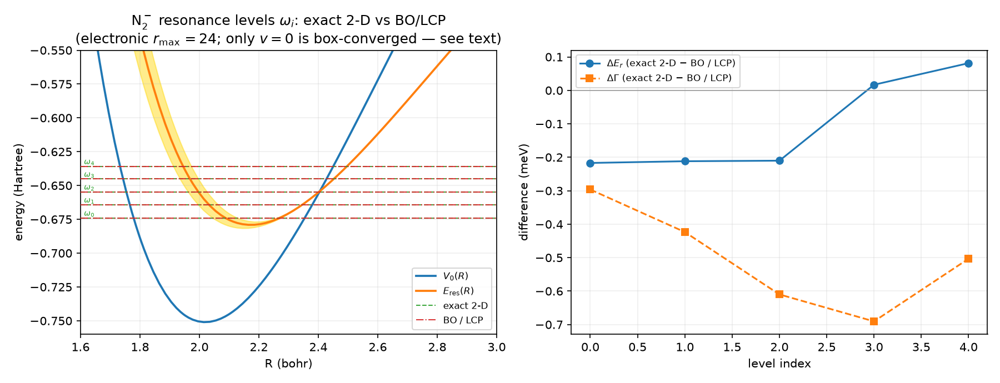
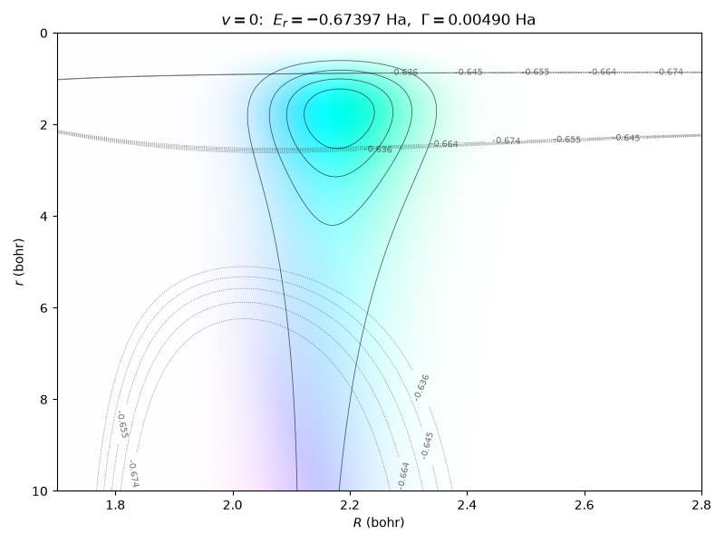
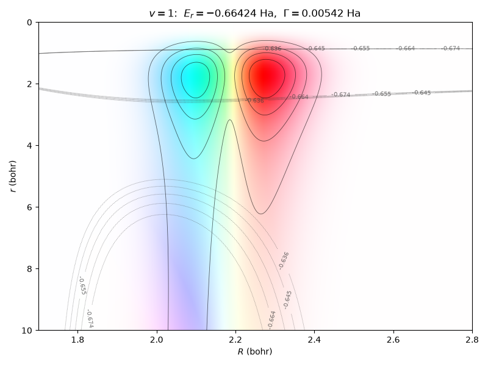

# Exact (non-Born-Oppenheimer) resonance states of the 2-D model

`qscat.core.exact_resonance_states` computes poles of the **full 2-D S-matrix**:
eigenvalues `E_r − iΓ/2` of the complex-scaled electronic × nuclear Hamiltonian,
with outgoing boundary conditions in both coordinates. No Born-Oppenheimer
separation, no discrete state, no local approximation.

These are the objects `qscat.core.lcp.resonance_levels` approximates. Having
both lets the non-adiabatic error be read directly off pole positions and
widths, instead of inferred from a cross section in which many poles and a
background are superposed.

## Method

A resonance eigenvalue is (nearly) invariant under the ECS rotation angle while
the discretized continuum rotates with it. In 2-D there are **two** continua —
electronic (`r → ∞`) and nuclear (`R → ∞`) — each rotating with its own angle,
so a state must be stable against both.

Three spectra are computed on the same model:

| grid | θ_r | θ_R | what its comparison with the base tests |
|---|---|---|---|
| base | 35° | 35° | — (energies and states are reported on this one) |
| electronic-moved | 44° | 35° | is the state in the electronic continuum? |
| nuclear-moved | 35° | 30° | is it in the nuclear continuum? |

Each spectrum comes from `qscat.linalg.ShiftInvertEigs` — resonances are
interior eigenvalues, unreachable by a plain Krylov iteration
(`docs/physics/shift-invert-eigensolver.md`). A state is accepted only if
$\lvert E_\mathrm{base} - E_\mathrm{partner}\rvert < \max(\mathrm{rel\_tol}\,\lvert E\rvert,\ \mathrm{atol})$ holds for **both** partners, and
the two residuals are reported separately rather than combined into one
midpoint: with two independent partners there is no single midpoint, and a state
can be solid in one coordinate while marginal in the other.

Moving both angles at once would save one spectrum. It is not done, because the
per-channel diagnosis is what distinguishes "no resonance here" from "the search
is misconfigured" — and on N₂ that is not academic. At the resonance energy the
raw spectrum is dominated by electronic-continuum × vibrational states, which
the nuclear test alone accepts without complaint; only the electronic partner
rejects them (they move by 2.5e-3 and 6.2e-3 Ha when θ_r changes, against
~1e-6 for a genuine pole).

**Seeds are supplied by the caller.** The natural source is the BO/LCP levels,
but the exact solver never calls the approximation it exists to measure.

## Validation: the separable limit

Switch the electronic-nuclear coupling off and the tensor Hamiltonian becomes an
exact Kronecker sum,

$$H = (T_r + \mathrm{diag}\,v_\mathrm{el}) \oplus (T_R + \mathrm{diag}\,v_\mathrm{nuc}),$$

whose eigenvalues are exactly the pairwise sums $\varepsilon_\mathrm{el} + \varepsilon_\mathrm{vib}$ of the 1-D
eigenvalues **on the same grids**, and whose eigenvectors are exactly the
products $\phi(r)\,\chi(R)$. That is a 2-D resonance with a known position, a known
width, and a known wavefunction — an oracle that a coarse grid does not weaken,
because the oracle is evaluated on the identical discretization.

Measured on such a model (electronic potential frozen at `R = 2.02`, a Morse
nuclear well):

| quantity | result |
|---|---|
| pole vs `ε_el + ε_vib` | agrees to **8.6e-15** |
| width vs the electronic width alone | agrees to `rel = 1e-6` |
| eigenvector vs `φ⊗χ` (c-product overlap) | `1` to within `1e-6` |
| electronic residual vs the 1-D pole's own | **2.31e-07**, identical |
| nuclear residual | `~1e-17` (a bound factor cannot move) |

The last two rows are the sharpest test of the two-angle bookkeeping: in the
separable limit the nuclear factor is common to both electronic grids and
cancels, so the 2-D electronic residual *must* reduce to the 1-D one, and the
nuclear residual *must* vanish.

## Result: N₂

Production deck (`n_r = 107`, `n_R = 251`, **26 857** unknowns), seeded from the
first five BO/LCP levels, 118 s for the whole search on the SuperLU backend.
Seven angle-stable states were found — a vibrational ladder of N₂⁻ with widths
growing as it climbs, which is the boomerang picture recovered with no
approximation at all.

| exact $E_r$ (Ha) | exact $\Gamma$ (Ha) | BO/LCP $E_r$ | BO/LCP $\Gamma$ | $\Delta E_r$ (meV) | $\Delta\Gamma$ (meV) |
|---|---|---|---|---|---|
| −0.673968 | 0.004902 | −0.673960 | 0.004914 | −0.22 | −0.33 |
| −0.664238 | 0.005425 | −0.664231 | 0.005439 | −0.19 | −0.38 |
| −0.654646 | 0.005929 | −0.654640 | 0.005949 | −0.16 | −0.54 |
| −0.645190 | 0.006404 | −0.645187 | 0.006422 | −0.08 | −0.49 |
| −0.635864 | 0.006833 | −0.635863 | 0.006847 | −0.03 | −0.38 |
| −0.626658 | 0.007212 | −0.626658 | 0.007221 | −0.00 | −0.24 |
| −0.617566 | 0.007550 | −0.617566 | 0.007555 | −0.00 | −0.14 |

Angle residuals across the set: electronic `1e-7`–`3e-6`, nuclear `1e-19`–`5e-14`.

**On N₂, the Born-Oppenheimer + local approximation is excellent for the
resonance levels** — the differences are sub-meV throughout. Their precise size
is a convergence question, answered next; the numbers in the table above are the
production deck's, and for `v >= 3` they are *not* converged.

That verdict is specific to **this observable on this molecule**, and does not
carry over. On σ_DA cross sections the same local approximation does poorly and
in an energy-dependent way — on F₂ the LCP/exact ratio sweeps 0.263 → 1.736
across 0.010–0.050 Ha, and on NO it misses the exponential decay away from
threshold entirely (see `docs/physics/diatomic-ve-cross-sections.md`).
Reproducing where a resonance *sits* is a weaker demand than reproducing how
much flux leaves through a given exit channel.

### Converging the difference

Both sides depend on the electronic discretization — the BO levels come from an
electronic pole walk — so both were recomputed at every refinement level, and it
is their **difference** that has to settle.

**Polynomial order converges at 8.** Orders 8, 9 and 10 (`n_complex = 6`,
`r_max = 16`) give bit-identical energies and widths to nine decimals. Order is
not the limiting knob.

**The real-region extent is.** Holding order at 8 and growing `r_max` from 24 to
72 bohr (ΔE / ΔΓ in meV, exact − BO; the nuclear grid held at its converged
setting throughout):

| `r_max` | `n_r` | `v = 0` | `v = 1` | `v = 2` | `v = 3` |
|---|---|---|---|---|---|
| 24 | 146 | −0.217 / −0.296 | −0.212 / −0.423 | −0.210 / −0.610 | +0.017 / −0.691 |
| 32 | 160 | −0.226 / −0.300 | −0.221 / −0.480 | −0.141 / −0.626 | +0.076 / −0.625 |
| 40 | 174 | −0.221 / −0.304 | −0.224 / −0.489 | −0.108 / −0.642 | −0.000 / −0.605 |
| 56 | 202 | −0.225 / −0.301 | −0.194 / −0.485 | −0.070 / −0.439 | −0.006 / −0.676 |
| 72 | 230 | −0.220 / −0.315 | −0.185 / −0.370 | −0.082 / −0.602 | −0.016 / −0.745 |

**Only `v = 0` is converged.** It holds at ΔE = −0.22 meV (spread ±0.005) and
ΔΓ = −0.30 meV (spread ±0.015) across a box grown by a factor of three.

Everything above it still moves. `v = 1` looked settled at −0.22 meV on boxes up
to 40 bohr and then drifted to −0.185 by 72; its width difference swings by
0.12 meV. `v = 2` and `v = 3` scatter more still, and their width differences
wander by up to 0.2 meV with no clear limit.

Two things are worth reading off that.

The **widths converge more slowly than the positions**, systematically. That is
expected rather than anomalous: a width measures coupling to the continuum, and
growing the box changes the density of discretized continuum states the
resonance is embedded in, so `Γ` keeps feeling the discretization after `E_r`
has stopped.

And **higher levels converge later**, which is also the expected ordering: a
higher vibrational level has a more extended nuclear wavefunction, samples the
electronic potential further out, and therefore feels a truncated electronic box
first.

### What is established

| claim | status |
|---|---|
| `v = 0`: ΔE_r = **−0.22 meV**, ΔΓ = **−0.30 meV** | converged over `r_max` 24→72 |
| the exact pole lies **below** BO/LCP in *both* position and width | **width: yes, every level, every box. Position: NOT general** — on the finer 46 428-unknown deck ΔE_r turns positive at `v >= 3` (see the overlap-check section) |
| the poles are genuine resonances, and the index pairing is correct | verified by overlap on the 46 428-unknown deck: 6/6 clean, 0/6 pairing disagreements |
| \|ΔE_r\| ≲ 0.25 meV and \|ΔΓ\| ≈ 0.3–0.75 meV throughout | robust in magnitude |
| per-level values for `v >= 1` | **not converged** — do not cite |
| any trend of the difference with `v` | **not established** |

So the approximation puts the `v = 0` state 0.22 meV too high and makes it
0.30 meV too broad, and for the higher levels all that can be said is that the
sign is the same and the size is of the same order.

Two earlier readings are withdrawn. The first: on the small production deck the
position difference appeared to shrink steadily with `v` (−0.22, −0.19, −0.16,
−0.07, −0.03, …), which looked like a physical trend and was written down as
one; it is largely the electronic box. The second: on boxes up to 40 bohr
`v = 1` appeared converged to ≲0.01 meV, and it is not — extending the box to 72
moved it by 0.04 meV in position and 0.12 meV in width. Only `v = 0` survives
the full sweep.

### Are these poles resonances? The overlap check

Everything above rests on the poles being resonances and on the exact/BO pairing
being right — and until the H₂⁺ campaign, neither was tested. Angle stability
found them; angle stability is *necessary and not sufficient*. On H₂⁺ the same
procedure produced four non-resonances out of 57
([`h2plus-resonance-states.md`](h2plus-resonance-states.md)), so this is not a hypothetical.

`validation/n2/pole_verification.py` runs the check with the machinery promoted
out of that campaign. **The result is clean:**

| question | answer |
|---|---|
| are the poles resonances? | **yes** — all 6 pair cleanly, no `spurious`, no `weak`, no `box-limited` |
| does the sorted-index pairing hold? | **yes** — overlap agrees at every level, 0/6 disagreements |
| does a bijection by energy agree? | **yes** — Hungarian assignment gives the same map |

The reference basis is *not* a Rydberg series here. N₂'s anion state is a
resonance, so the electronic factor comes from `qscat.core.bo.resonance_curve`
(the two-angle pole walk, keeping the eigenvector `local_complex_potential`
discards) and the nuclear factor from `resonance_levels`, combined by
`bo_basis_from_levels`. Same comparator, different builder.

Two things the check turned up that the pole table does not show.

**The overlap exceeds 1, legitimately.** The c-product is a *bilinear form*, so
Cauchy–Schwarz does not bound it. With both states c-normalized the value is
just $\lvert c(a,b)\rvert$, inflated by $1/\sqrt{\rho_a \rho_b}$ where $\rho = \lvert c(\psi,\psi)\rvert / \lVert\psi\rVert^2$ measures
how close to real-valued a state is. The six identifications score 1.02, 1.05,
1.08, 1.11, 1.15, 1.19 — **rising monotonically with Γ** as ρ falls 0.66 → 0.42.
H₂⁺'s narrow Rydberg resonances stay at 0.87–0.99 because they are nearly real.

**Dividing by the Euclidean norms to bound it at 1 is wrong**, which was
measured rather than argued. That denominator weights the exponentially growing
ECS tail — reintroducing exactly what the c-product's numerator cancels, the
same error as using `vdot`. On H₂⁺ it collapses to 0.03, 0.008 and 0.006 for
three states whose node counts identify them unambiguously, and re-ranks all
three onto the wrong partner. It penalizes diffuse states for being diffuse.

**These poles are well localized**, which is the separate question. `real_weight`
— the fraction of |Ψ|² inside the unscaled region — is 0.96 for all six, so ρ's
fall is about the states being *genuinely complex where they live*, not about
them leaking out of the box. On H₂⁺ the two quantities collapse together for a
different reason and 18 of 57 poles come back `box-limited`; N₂'s do not.

**The sign claim below needs narrowing.** This run uses the
`exact_resonance_figures.py` deck (46 428 unknowns), which is *finer* than the
26 857-unknown deck the table above was computed on. On it, ΔE_r reads −0.217,
−0.212, −0.210, **+0.017, +0.081, +0.081** meV — the sign flips at `v = 3`. ΔΓ
stays negative throughout. This is consistent with the existing warning that
per-level values for `v >= 1` are not converged, but it is a direct
counterexample to "negative at every level, on every box" as stated, and that
row is qualified accordingly.

### Figures

The level diagram, in the form the published version of this model uses
(M. Váňa, doctoral thesis, Charles University 2017, Fig. 3.2): the neutral
`V0(R)`, the resonance curve `E_res(R)` with its `Γ(R)/2` envelope shaded, and
the levels `ω_i` drawn in that well. The published figure shows the LCP levels
alone; here the exact 2-D levels are overlaid, and **they are indistinguishable
from the LCP ones at this scale** — a fifth of a meV against a 0.2 Ha axis.
That is the finding, not a defect of the plot; the right panel is where the
difference lives. Both level sets come from the `r_max = 24` grid, so only
`v = 0` is box-converged.

The exact resonance states `Ψ(r, R)` in the interaction zone, framed as the
thesis's Fig. 3.3 frames its wave-function panels (`R` horizontal, `r` vertical
increasing downward, complex phase as hue, magnitude as brightness, potential
contours in grey). `v = 0` is a single lobe of the trapped electron at
`r ≈ 1–3`, `R ≈ 2.2`; `v = 1` has the expected nuclear node, visible both as two
lobes in `R` and as the phase flip across them. `v = 2` (not shown inline)
carries two nodes. These are the states the BO picture approximates as products
`φ_res(r; R)·χ_v(R)`, and they are visibly close to that form here — which is
the same story the 0.22 meV difference tells, in a different currency.

Brightness is one global scale across each panel, so it means the same thing
everywhere in the frame. That leaves the outgoing tail faint — it is orders of
magnitude below the trapped core — and the tail's behaviour is reported
numerically in the next section rather than shown. (`qscat.viz.region_magnitudes`
can scale each region separately and does make the tail visible, but at the cost
of seams at the region boundaries and a brightness that no longer means one
thing across the panel; for a static figure of a trapped state that trade is not
worth it.)

Regenerate with `uv run python -m validation.n2.exact_resonance_figures`.

### Reading the phase in those panels

The obvious question on first sight of the state panels is why the phase varies
at all — an eigenstate is usually pictured as real up to one global phase. Three
different things are in the picture, and only one of them is phase variation.

**The lobe-to-lobe colour flips are a sign, not a winding.** Cyan and red sit
180° apart in hue, i.e. a factor of −1: that is a real function changing sign
across a node, which is exactly what the `v = 1` and `v = 2` nuclear factors do.

**Where the phase does wind, it must.** A constant-phase wavefunction carries no
probability current ($j \propto \operatorname{Im}(\psi^*\nabla\psi)$), and a resonance decays — $\Gamma = 0.0049$ Ha
here, a lifetime of ~200 a.u. — so it has to carry outgoing electronic flux, and
flux requires a phase gradient. A resonance eigenstate of constant phase would
be a bound state.

Both statements are measurable. Rotating each state by the single global phase
that makes it maximally real and then measuring the residual imaginary weight
`‖Im ψ‖ / ‖ψ‖` in shells of `r` (0 means real up to a constant phase, `1/√2`
means a pure traveling wave):

| state | `Γ` (Ha) | `r` ∈ [0,4) | [4,10) | [10,16) | [16,24) |
|---|---|---|---|---|---|
| `v = 0` | 0.00490 | **0.146** | 0.434 | 0.799 | 0.702 |
| `v = 1` | 0.00542 | 0.249 | 0.502 | 0.718 | 0.707 |
| `v = 2` | 0.00593 | 0.309 | 0.545 | 0.686 | 0.713 |

The core is nearly real — 85% for `v = 0` — and the tail saturates at **0.707**,
the traveling-wave value. So the state is quasi-bound where it is bright and
purely outgoing where it is faint, which is what a resonance is. The winding
rate measured along `r` (0.21–0.33 rad/bohr) sits just below the single-channel
estimate `Re k = √(2E)` (0.39–0.44), as it must: the state decays into several
open vibrational channels at once, each with its own momentum, so a single cut
shows their mixture.

**None of this is an ECS artefact.** Inside the real region the ECS map is the
identity, and `R0 = 24` bohr while the panels show `r <= 10`, so what is plotted
is the physical Siegert wavefunction. ECS's contribution is to make the state
findable at all: `Im k ≈ −0.006` means that outgoing tail grows as
`e^{+0.006 r}` — the Siegert divergence — and rotating the contour past `R0`
turns that growth into decay, so the state becomes a square-integrable
eigenvector.

One convention note: after c-product normalization (`ψᵀψ = 1`, not `ψ†ψ = 1`)
the residual freedom is only `±1`, so relative phase across the panel is
meaningful but the absolute hue is not.

The reality defect also tracks the widths — 14.6%, 24.9%, 30.9% against
`Γ` = 0.00490, 0.00542, 0.00593. Higher levels are more strongly coupled to the
continuum, so they are less quasi-bound and less real, which is the same physics
that makes their BO/exact differences converge more slowly than `v = 0`'s.

A caveat on the BO side: `resonance_levels` emits a warning for this model that
`Γ(R)` is nonzero where the anion curve lies below the neutral, i.e. where
autodetachment is closed, so the BO widths carry their own documented
qualification (see `docs/physics/lcp-resonance-levels.md`).

## Limits

- **Validated on N₂ and H₂⁺.** H₂⁺ (Coulomb, with a Rydberg series accumulating
  at each threshold) is covered in [`h2plus-resonance-states.md`](h2plus-resonance-states.md). F₂/NO — where
  the dissociative channel is open, so the nuclear residual becomes the
  informative one — have not been run.
- **The two-angle test is necessary, not sufficient.** A small residual says the
  eigenvalue did not move when the contour did — and a rotated-continuum state
  sitting in a stable corner produces that too, as four of H₂⁺'s 57 poles did. A
  grid too coarse to resolve a state can produce it for a third reason.
  Four separate checks answer four separate questions: overlap against a BO
  basis (`qscat.core.assignment.pair_by_overlap`) for "is this a resonance",
  `real_weight` for "does the box still hold it", grid refinement for "is the
  discretization adequate", and the residuals here for "did the contour move
  it". The overlap is blind to the second by construction — the c-product
  cancels the rotated tail — so a state 97 % outside the box still pairs at
  0.99. On H₂⁺ that blindness hid 18 poles.
- **Seed placement matters more than it looks.** `k` eigenpairs nearest a shift
  is a *local* window: with a vibrational spacing of ~0.0096 Ha, a seed one
  quantum away returns `v = 1` and `v = 2` while `v = 0` falls off the end of the
  list. The search then reports real states that are not the ones asked for.
- **The acceptance tolerance is a statement about the grid.** The default
  `rel_tol = 1e-4` can only be met if the electronic grid resolves the pole to
  better than that between angles. On a grid with `order = 5`, `r_max = 12` the
  1-D pole is angle-stable only to 7e-4, and *every* resonance is rejected —
  correctly, in the sense that the grid cannot support the claim.
- **Cost** is one sparse factorization per (grid, shift): three grids × the seed
  count. At 26 857 unknowns that is ~8 s each on SuperLU, and ~26 s at the 55 332
  unknowns of the `r_max = 40` convergence deck; the MUMPS backend is the route
  to larger decks.
- **Only `v = 0`'s difference is converged.** `v >= 1` still moves at
  `r_max = 72` bohr — in width especially — so those per-level numbers are
  indicative of sign and order of magnitude only.
