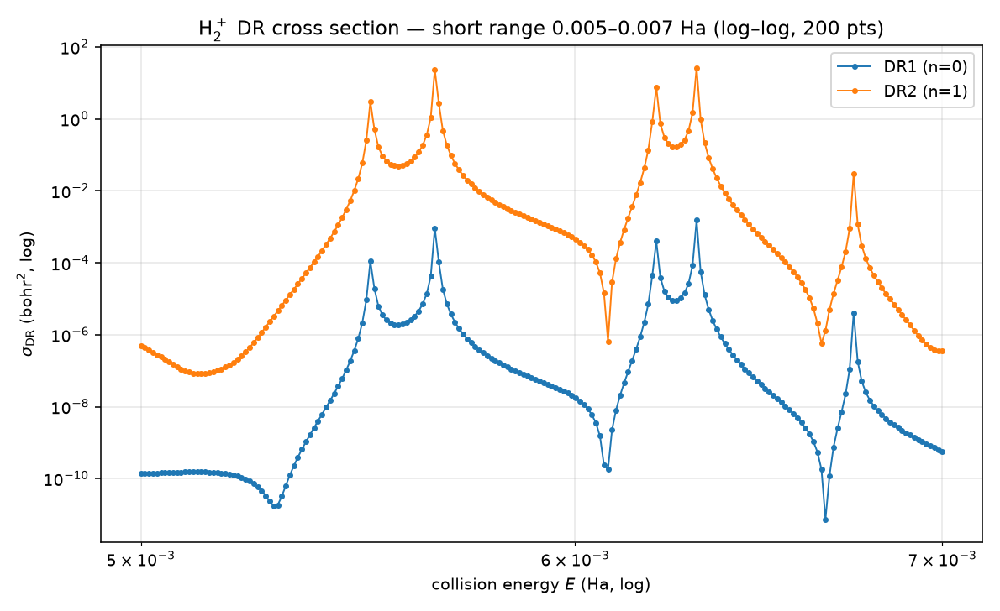

# H₂⁺ dissociative recombination (the first ionic model)

**Location:** the ionic pieces live in `qscat` (`qscat.special.coulomb`, `qscat.model.H2P` /
`IonicResonanceModel`, `qscat.core.dr_cross_section`); the deck + validation in
`validation/h2plus/` (`config.py` — the eMoScat deck definitions, kept as the tuner's reference +
the qscat-run deck-parity guard `test_config.py`; the exact σ_DR curves now run through
`apps/qscat-run`). The DR convention gate (c-product vs eMoScat's conjugated dot) lives in
`libs/qscat/tests/test_dissociation.py`.
**Origin:** sub-project D of the DA/DR design spec
(`docs/superpowers/specs/2026-07-27-da-cross-sections-design.md`), designed in
`docs/superpowers/specs/2026-07-28-h2plus-dr-design.md` and ported from eMoScat via port-scout.
**Units:** atomic units.

## Key result

The exact-2D TI $\sigma_\mathrm{DR}(E)$ for e⁻ + H₂⁺ is delivered at full
deck size — ~1.15 M unknowns on the 1300-bohr Coulomb electronic grid —
through `apps/qscat-run` under Docker/MUMPS at ~8 s/energy: the DR1 (n=0)
channel peaks at E ≈ 6.31×10⁻³ Ha, σ ≈ 1.54×10⁻³ bohr² above a ~10⁻¹⁰
background; DR2 (n=1) is ~10⁻⁶; DR3 (n=2) is closed in the window
(threshold ≈ 0.0426 Ha). Against a previously obtained reference sweep,
DR₀ agrees once a measured 2π normalization convention is accounted for
(geometric mean 1.001), while DR₁ carries a systematic ~1.3× deficit that
remains an OPEN, documented discrepancy — the narrative below records what
was ruled out, and why the Born-Oppenheimer levels are where the agreement
is genuinely readable.

## What this is — and why it is different

Everything before H₂⁺ was **neutral** electron–diatomic scattering. **H₂⁺ is an ion**: the
scattering electron sees the **+1 core charge**, i.e. a long-range **−1/r Coulomb tail**. That one
fact changes three things:

1. **The channel functions become Coulomb**, not free Riccati-Bessel. The incident wave is a
   long-range Coulomb wave — so the electronic grid must reach **~1300 bohr**.
2. **The process is dissociative recombination** (DR): `e⁻ + H₂⁺(v) → H + H`. The electron is
   captured into a Rydberg resonance of the neutral H₂, which dissociates on the neutral curve.
3. **There is a Rydberg *series* of exit channels** (the neutral's bound electronic states,
   accumulating at the −1/r continuum edge), cut off at a measurable number (`N_CHANNELS = 3`).

This is deliberately the **first non-laptop-scale** model — the full 2-D deck is ~1.15 million
unknowns (see Discretization). It targets the Docker/MUMPS path; the test suite validates it
analytically and on a reduced proxy.

## Coulomb special functions (`qscat.special.coulomb`)

The charge-z generalization of `riccati_bessel_en`/`riccati_hankel_en`. Energy-normalized regular /
irregular / outgoing Coulomb functions, Sommerfeld parameter $\eta = m z / k$, argument $\rho = k x$:

  $$F^\mathrm{en}(x,k,z,m,l) = \sqrt{2m/\pi k}\;F_l(\eta,\rho), \qquad
H_1^\mathrm{en} = \sqrt{2m/\pi k}\;(G_l + i F_l)$$

with $G^\mathrm{en}$ defined likewise.

Backed by **mpmath** (`coulombf`/`coulombg`), which accepts **complex** ρ — required for
ECS-rotated arguments. At $z=0$, $F_l(0,\rho) = \rho\,j_l(\rho)$, so `coulomb_f_en(·,·,0,m,l)` reduces
EXACTLY to `riccati_bessel_en` (mass m) — the direct differential-test hook, verified to ~1e-16.
(Note: `coulomb_h1_en(z=0) = i·riccati_hankel_en`, since $G_l(0,\rho) = -\rho\, y_l(\rho)$ while $F_l = +\rho\, j_l(\rho)$
give $G + iF = i(j_l + i y_l)\rho$ — the code keeps the physical `H⁺=G+iF`; only the *test* carries the
`i`.) Two eMoScat gotchas were NOT replicated: its `sH1` wrapper had a copy-paste bug (returned F,
not G+iF), and its wrappers ignored `coulcc`'s `ifail`.

## The ionic model (`qscat.model.H2P`)

The model layer was generalized for ions: the `ResonanceModel` protocol gained a `charge`
attribute (0 for the neutral diatomics — unchanged — and −1 for H₂⁺) and shed the engine-unused
`lam`. `H2P` is an `IonicResonanceModel` with the extracted eMoScat form (μ=918.076, ℓ=1,
charge=−1):

> **Reduced mass.** μ=918.076 is mₚ/2 for the modern proton mass (1836.15267/2), as given by
> three independent published sources: D. Hvizdoš, *Two-dimensional model of dissociative
> recombination*, master's thesis, Charles University 2016, Table 1.1 (the first time-independent
> solution of this model, which the present `dr_cross_section` descends from); Váňa 2017
> Table 1.2; and Hvizdoš et al., *Phys. Rev. A* **97**, 022704 (2018) §II A. eMoScat's
> JSON deck carries 918.25, which both publications contradict; the port originally inherited
> that value and it was corrected on 2026-08-15. The 0.019% shift moves H₂⁺ vibrational spacings
> by ~1e-4 relative — immaterial qualitatively, but wrong for reproducing published numbers.

- **ion Morse** $v_0(R) = V_0\left(e^{-2\alpha(R-R_0)} - 2e^{-\alpha(R-R_0)}\right)$, with
  `V0=0.1027, R0=2.0, alpha=0.69` (the
  initial vibrational state lives here; the `1/R` proton repulsion is folded into this single
  Morse, not explicit);
- **σ-capture** `v_int(r,R) = −a₁(1−tanh Q(R))·S(R)·(e^{−r²/3}/r)`, `Q=(a₂−R−a₃R⁴)/7`, `S=tanh(R/a₄)⁴`,
  `a₁=1.6435, a₂=6.2, a₃=0.0125, a₄=1.15`;
- **surface** $= v_0(R) + v_\mathrm{int}(r,R) + \ell(\ell+1)/2r^2 + \mathrm{charge}/r$ — the `charge/r = −1/r` is the ionic
  electron–core Coulomb attraction.

Adding an ion is data + validation, no engine changes (the same lesson as the neutral molecules).

## The DR cross section (`qscat.core.dr_cross_section`)

`dr_cross_section` is `da_cross_section` **generalized**, reusing `v_dr_diag`,
`anion_electronic_states`, `riccati_bessel_en_mass`, and the driven Lippmann-Schwinger sweep. The
only new physics is (a) a **Coulomb incident** (`channel_vector(..., charge=−1)`) and (b) a **loop**
over the Rydberg exit channels instead of one anion state:

1. $\Psi_+ = \Psi_i - (E_\mathrm{tot}\mathbb{1} - H_\mathrm{2D})^{-1} V_\mathrm{int} \Psi_i$, $E_\mathrm{tot} = E + \varepsilon_{v_\mathrm{init}}$, Coulomb $\Psi_i$ (potentials
   on the **complex** ECS coordinate — eMoScat's real-part `// FIXME` is fixed);
2. Rydberg states $\phi_e^{(n)}$, `E_ryd(n) = eps_e^(n)` from `anion_electronic_states(…, n_states=N)`
   (they are bound below the −1/r continuum — the same bound-state solver);
3. $V_\mathrm{DR} = V_\mathrm{int} + v_0(R) - V_\mathrm{int}(r,R_\infty)$ (the rearrangement interaction);
4. per open channel $n$ ($E_\mathrm{tot} > E_\mathrm{ryd}(n)$):
   $T_n = \langle \phi_e^{(n)} F^\mathrm{nuc}_{K_n,0} \,\vert\, V_\mathrm{DR} \,\vert\, \Psi_+ \rangle$ (c-product),
   $\sigma_n = 4\pi^3|T_n|^2/2E$.

**The c-product is the ECS-correct choice** where eMoScat used a conjugated dot (`zdotc`); the
port validates they agree — the relative difference is **≈3.4×10⁻¹²** on the proxy (the
rotated-nuclear-tail contribution is negligible there), so the convention question is settled.

## Discretization (`fem_grid_exp_tail`, `validation/h2plus/config.py`)

The Coulomb tail forces a huge electronic grid. A new builder `fem_grid_exp_tail` (like
`segmented_grid` but with an exponential-growth ECS tail — reusing the `_ecs_tail` helper) builds
the eMoScat deck:

| | real region | ECS tail | 2-D size |
|---|---|---|---|
| electronic | → **1300 bohr** (n=1406) | 5°, exp-growth ×25 | |
| nuclear | → 14 bohr (n=818) | 22°, exp-growth ×25 | ~**1.15 M unknowns** |

That is firmly **Docker/MUMPS** territory — not laptop-runnable. `config.proxy_grid()` (electronic
→60 bohr) and an even smaller test grid give a laptop-feasible **well-posedness/threshold** gate,
not a converged cross section.

### What a full-deck energy point costs (measured)

Measured 2026-08-17 on an x86-64 host (32 cores, 123 GB) under MUMPS, via
`apps/qscat-run/examples/h2p-dr-probe.yaml`:

| quantity | value |
|---|---|
| unknowns / nonzeros | 1 150 108 / 19 507 356 |
| `ti:dr`, 2 energies, 3 channels | 34.80 s → **17.4 s/energy** |
| grid build + vibrational states | 0.42 s |
| peak RSS (from an earlier 50-energy sweep) | 4.34 GB |

So a σ(E) sweep costs roughly **1 hour per 200 energies**. Over 0.023 Ha of
energy windows that is ~2.2 h at 5e-5 Ha spacing, ~5.6 h at 2e-5, ~11 h at 1e-5 —
an overnight job rather than the multi-day one the size suggests.

Two caveats worth carrying. Earlier ad-hoc sweeps on the same host recorded
12.4–14.1 s/energy, so **treat those as a lower bound and budget on 17.4**. And
the memory figure is comfortable only because MUMPS is used: the SuperLU path on
a deck an order of magnitude smaller already needed 7.4 GB
(`docs/physics/mumps-sparse-backend.md`).

## The converged full-size σ_DR(E) curve (delivered)

The exact-2D TI σ_DR(E) now runs through **`apps/qscat-run`** (config-driven — the per-molecule DR
driver was retired in the qscat-run consolidation). The H2P `emoscat` preset grid is byte-identical
to the retired driver's `full_grid` (locked by
`validation/h2plus/test_config.py::test_h2p_decks_match_presets`), so qscat-run reproduces its data
exactly. Run the full 1300-bohr deck under MUMPS via
`apps/qscat-run/examples/h2p-dr-ti.yaml` (`methods: [ti]`, `observables: [{kind: dr, channels: 3}]`,
`grid: {preset: emoscat}`):

```bash
docker/run.sh apps/qscat-run/examples/h2p-dr-ti.yaml runs/h2p-dr-ti
```

The committed figure `docs/physics/figures/h2plus-dr-cross-section-shortrange.png` is the log–log
short-range accuracy view (narrow the config's `energies` to a fine sweep across the DR1 resonance
in [0.005, 0.007] Ha to reproduce it):



The DR1 (n=0) channel peaks at **E ≈ 6.31×10⁻³ Ha, σ ≈ 1.54×10⁻³ bohr²** above a ~10⁻¹⁰
background; DR2 (n=1) is ~10⁻⁶; DR3 (n=2) is closed in this window (threshold ≈ 0.0426 Ha). The
solve runs in ~8 s/energy on the `sadaharu` host with the OpenMP MUMPS backend.

## Against a previously obtained reference sweep

A prior 5001-point σ_DR(E) sweep of this model, together with the author's own
Born-Oppenheimer level table, exists outside the repository. Both were used to
check this implementation, and they gave very different quality of answer — for
a reason worth recording, because it decides how this observable can be
validated at all.

### The normalization

**The reference σ values carry a $2\pi$ this repository does not.** That was
measured, not assumed: the ratio reference/computed is 5.3–7.2 on DR₀, clustering
on $2\pi = 6.283$ — not on 1, and not on $(2\pi)^2 = 39.5$. Across the sampled points
its geometric mean on DR₀ is **1.001**, so the constant is confirmed to ~0.1%.
(The corresponding VE convention differs by $(2\pi)^2$.)

### DR₁ carries a systematic deficit — an open discrepancy

Twelve energies have been compared, in two batches: six chosen on resonance
structure and six chosen for flatness (below). Splitting the residual by channel
separates two different effects, and only one of them is benign.

| channel | geometric mean | spread | points below 1 |
|---|---|---|---|
| DR₀ | 0.980 | 0.847–1.152 | 4 / 9 |
| DR₁ | **1.295** | 0.983–1.804 | **1 / 9** |

(excluding three points within 1e-3 Ha of a vibrational threshold, treated below)

**DR₀ scatters symmetrically about 1** — that is the position sensitivity
described in the next section, and it is not a defect.

**DR₁ does not.** Eleven of twelve points lie above 1 and the twelfth is 0.983.
A resonance-position difference moves a ratio in *both* directions, since our
resonance can fall on either side of the reference's; it cannot produce a
one-sided residual. So σ_DR₁ computed here is systematically **~30% below** the
reference, and that is **unexplained** — it should be treated as an open
discrepancy in this channel, not as agreement.

What is ruled out:

- **A global constant** — DR₀ would be shifted with it, and it is not.
- **The level positions and thresholds** — ≤4e-6 Ha and µHa respectively (below).
- **A channel-indexing mismatch.** The published `DR_1` really is this
  implementation's `eps_ryd[1]`, pinned by the *third* channel: `ch2` opens here
  at 0.042742 Ha and the reference's `DR_2` column turns on at 0.042803, so the
  columns line up one-for-one.
- **Degenerate states being grouped into one published column.** The exit series
  is measured clean — `n_eff` = 0.60, 2.00, 3.02, 4.02, 5.02, 6.02 with a
  smallest gap of 6e-3 Ha — so there is no near-degenerate pair for the reference
  to be summing where this implementation takes one state.

**The offset is flat in energy**, which narrows what it can be. An error in the
exit-channel normalization would most naturally enter through
`k_r = sqrt(2 mu e_dr)`, and `e_dr` for this channel varies by 80% across the
compared range (0.028→0.064 Ha) — so a `k_r`-dependent mistake would show up as
a trend. It does not: regressing `log(ratio)` on `log(k_r)` gives correlation
**+0.11** and an implied power of **+0.18**, i.e. no dependence, and on
`log(E)` correlation −0.01. The residual behaves as a **constant factor of
~1.3 applied to channel 1 alone**, with the symmetric position scatter
superposed on top of it (4 of 11 points fall below 1.295, 7 above).

So the thing to look for is a channel-specific constant — a normalization or
weight attached to the exit state — rather than an energy-dependent
normalization error. eMoScat's per-Rydberg-state deck `rydbergs.txt` is not in
this repository's reference snapshot, so the published per-channel convention
cannot be read off directly and this has to be settled against the source.

**Near a threshold σ_DR runs high, and badly so.** This is the larger of the two
problems and probably the more urgent.

At E=0.009543, 2.6e-4 Ha below the `v=1` vibrational threshold, this
implementation gives 7.6× (DR₀) and 3.7× (DR₁) MORE than the reference. All
three of the twelve compared points that lie within 1e-3 Ha of a vibrational
threshold are outliers, all in that direction.

The same failure appears far more starkly in the third Rydberg channel, which
is *barely open* over the whole range where it can be compared at all
(`apps/qscat-run/examples/h2p-dr-channel-probe.yaml`, three energies just above
its 0.0427 Ha opening):

| E (Ha) | ours | reference / 2π | ratio |
|---|---|---|---|
| 0.045259 | 1.35e-4 | 1.95e-7 | 0.0014 |
| 0.047465 | 3.24e-6 | 2.93e-7 | 0.090 |
| 0.049122 | 2.14e-5 | 6.81e-7 | 0.032 |

So σ_DR₂ here is **100–700× too large and non-monotonic** where the reference
rises smoothly. That is a qualitative failure, not a normalization offset, and
it cannot be position sensitivity at that magnitude.

The variable is **exit momentum, not diffuseness**. That probe was designed to
test whether the DR₁ offset scales with how diffuse the exit state is (ch2 has
`n_eff` 3.02 against ch1's 2.00), and it does not — the ratios do not order by
`n_eff` at all. What does order is `k_r = sqrt(2 mu e_dr)`: ≈49 for ch0
(ratio 1.08), ≈10 for ch1 (1.26), and **≈2–3 for ch2 (0.016)**. A channel
evaluated close to its own threshold, where `k_r` is small, is where this
implementation departs — consistent with the vibrational-threshold outliers
above, which are the same condition reached a different way.

That makes the near-threshold exit-channel treatment — `riccati_bessel_en_mass`
and its energy normalization at small `k_r` — the concrete thing to examine,
and it is a different defect from the flat DR₁ factor below.

### Why pointwise σ(E) is also position-limited

Beyond the DR₁ offset, the residual has a second component that IS benign and
that bounds how well any pointwise comparison can do:

- The DR resonances are narrow. Across the reference sweep there are **80
  prominent DR₁ peaks with a median FWHM of 2.0e-5 Ha**, and **54 of them are
  narrower than two of the sweep's own 1e-5 Ha samples**. The reference curve does
  not fully resolve its own structure, and neither would any sampling at that
  spacing.
- This repository's level positions agree with the reference's to a few µHa
  (below). On a 2e-5 Ha Lorentzian evaluated on its flank, a **3e-6 Ha position
  difference changes σ by ~26%** — the observed scatter, from agreement that is
  otherwise excellent.

So sampling σ at a structured energy measures *position agreement, amplified*,
and reports it as a cross-section disagreement. Independent corroboration of
the width scale: the exact 2-D poles computed here (`validation/h2plus/exact_poles.py`)
come out at Γ ≈ 1e-7–2e-5 Ha, the same scale as those measured peak widths.

A comparison energy therefore has to be chosen for *conditioning*, and "smooth"
judged by a finite difference at the reference's own 1e-5 spacing does not
qualify, since most peaks are unresolved there.
`apps/qscat-run/examples/h2p-dr-validation.yaml` selects the flattest energies in
the sweep instead: each varies by under 15% (the best under 2%) across ±6e-5 Ha —
20× the position agreement — in both open channels at once.

**That selection is necessary but demonstrably not sufficient**, and the honest
record of this is that choosing flat energies did *not* tighten the residual: the
flat batch spread 0.13–1.80 against the structured batch's 0.85–1.57. Flatness
alone does not screen out threshold proximity, and it does nothing at all about
the DR₁ offset above, which is not a conditioning problem. The remaining
conclusion is that pointwise σ_DR is a poor validation instrument for this model
whatever energies are chosen — which is why the level table below, not this
comparison, is what the repository gates on.

### Where the agreement is readable: the levels

The well-conditioned check is against the published $\omega_i^j$ level table, which is
the same physics without the amplification. All **53 published levels — 5 for
`Ry_0`, 12 each for `Ry_1`…`Ry_4` — agree to ≤4e-6 Ha**, gated in
`validation/h2plus/test_rydberg_levels.py` against
`validation/h2plus/reference_levels.py`.

That residual is itself accounted for, and it is not discretisation. Swapping in
eMoScat's reduced mass `918.25` for this repository's `918.076` drops the mean
level difference from 2.4e-6 to **1.1e-7 Ha** — so the published table was
computed with `918.25`, and one constant explains essentially all of it. The
`918.076` here is deliberate and better sourced (Váňa 2017 Table 1.2, Hvizdoš
2016 Table 1.1, Hvizdoš et al. 2018 §II A all give `m_p/2 = 918.076`, which
eMoScat's deck contradicts). **At matched constants this implementation
reproduces the published levels to ~1e-7 Ha.**

### The electronic grid near the origin

Worth stating explicitly, because the potential looks alarming there. At
`R = 14` bohr — the `R_inf` that sets the exit channels — `surface(r, R)` has a
deep, narrow well: **−4.11 Ha at r = 0.446 bohr**, with a steep `l = 1`
centrifugal wall inside it (`V(0.01) ≈ +9.8e3 Ha ≈ 1/r²`, a classically
forbidden region the wavefunction is exponentially suppressed in).

That well sits inside the innermost grid segment, which this repository
transcribes from eMoScat's `H2p.json` verbatim: **10 elements of 0.1 bohr over
[0, 1]** at `dvr_order = 8`, i.e. ~0.014 bohr between DVR points. Against the
shortest de Broglie wavelength in the well (2.69 bohr for the deepest channel)
that is ~190 points per wavelength, 0.037 wavelengths per element — heavily
over-resolved rather than marginal. The empirical confirmation is the level
table above: those levels are eigenvalues of exactly this electronic
Hamiltonian on exactly this inner grid, and they reproduce the published values
to ~1e-7 Ha at matched constants. **The near-origin discretisation is not a
source of error here**, and in particular is not a candidate for the DR₁
deficit.

Two further position checks agree independently:

| Check | Agreement |
|---|---|
| Cation vibrational thresholds `eps[v]`, v=0…5 | 1–4 µHa |
| Third Rydberg channel opening | ours 0.0428, reference 0.042803 Ha |

That last one also confirms the channel bookkeeping: `ch2` is identically zero
below 0.0428 Ha in this repository, and the reference's DR₂ column is likewise
zero until 0.042803.

- **Coulomb functions**: z→0 reproduces `riccati_bessel_en`/`riccati_hankel_en` (~1e-16); a known
  mpmath value; finite on complex ECS arguments.
- **The model**: `v0`/`v_int`/`surface` match the extracted formulas; `charge=−1`; the neutrals keep
  `charge=0` and `channel_vector(charge=0)` is byte-identical to before.
- **DR (small proxy, `@slow`)**: σ_DR finite, ≥0, correctly shaped; a genuinely **closed** Rydberg
  channel returns exactly 0 (the 3rd channel, threshold ≈0.0426 Ha, above the probe energies); and
  the **c-product vs conjugated-dot** agreement (≈3.4e-12) justifies the convention. This is a
  well-posedness gate, NOT a converged σ_DR — the real grid is 1300 bohr.
- **Docker/MUMPS**: the exact σ_DR(E) is a full-deck (~1.15 M unknown) solve — Docker/MUMPS only.
  No independent golden data ships (eMoScat's `output/H2+/sigma.txt` is absent from the snapshot),
  so — as for the neutral DA — the exact solver is the oracle. The converged curve is delivered —
  see "The converged full-size σ_DR(E) curve (delivered)" above.

## The resonance positions behind these peaks

Where the peaks in this cross section come from -- the exact 2-D poles, the
Born-Oppenheimer levels they are conventionally assigned to, the wavefunctions
of both, and the four angle-stable states that turn out not to be resonances --
is [`h2plus-resonance-states.md`](h2plus-resonance-states.md). That note also uses this sweep as its
measuring instrument: the poles land on its peaks to 0.2-0.3 resonance widths.

## Follow-ons

The π channel (`p_pi_potential`); optimizing the mpmath Coulomb functions (a Rust/COULCC port) if
they become the bottleneck; rotational / coupled-channel (non-adiabatic) DR.
