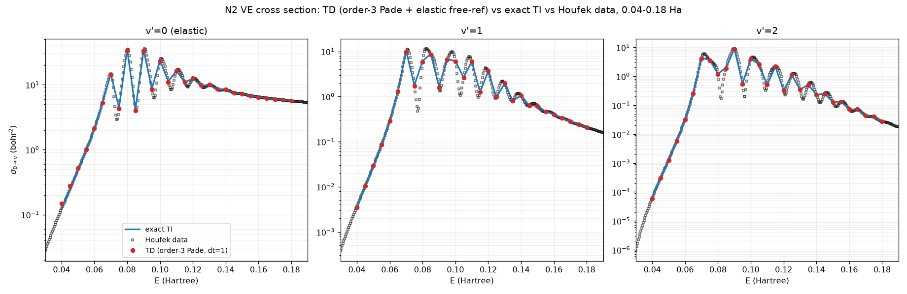

# N₂ vibrationally-elastic/inelastic cross section: time-dependent (Crank-Nicolson) route to the exact 2-D solution

**Location:** `qscat.evolution.make_sparse_cn_stepper` (the general sparse propagator),
`projects/n2_2d_td_cross_section/` (`wavepacket.py`, `td_propagation.py`, `correlation.py`,
`td_cross_section.py`, `convergence.py`, `observation.py`), `validation/n2/td_exact2d.py`
(the harness's Group F wiring), `validation/n2/experiment.py` (Group F).
**Origin:** the same 2-D (electronic `r` × nuclear `R`) electron-N₂ ²Π_g shape-resonance
model as `docs/physics/n2-2d-cross-section.md` (sub-project #6) — same potential surface
(`projects/n2_resonance/potential.py`), same grids/Hamiltonian machinery
(`projects/n2_2d_cross_section/electronic_grid.py`, `hamiltonian2d.py`), same
`l = 2` partial wave and nuclear reduced mass `MU`. This sub-project (#7) does not
introduce new potential physics or a new energy-domain solver; it is a **second,
independent numerical route** — time propagation instead of a direct linear solve — to
the identical exact cross section.
**Units:** atomic units throughout (energy in Hartree, length in Bohr, time in
`hbar`/Hartree, cross section in bohr²).

## Framing (read this before the numbers)

`docs/physics/n2-2d-cross-section.md` solves $(E_\mathrm{tot}\mathbb{1} - H_\mathrm{2D})^{-1} V_\mathrm{int} \Psi_i$ directly
— one sparse LU factorization per collision energy — and calls that the **exact 2-D**
result. This document computes the **same** exact `S`-matrix a different way: prepare an
incident wavepacket at `t=0`, propagate it forward under the full 2-D Hamiltonian with a
sparse Crank-Nicolson stepper, record its correlation with an outgoing test function over
time, and Fourier-transform (Tannor-Weeks) that correlation function into the energy
domain. This is the **time-domain twin** of #6: two structurally unrelated computations
(one direct linear solve per energy vs. one propagation covering every energy) converging
to the same number is a strong, non-trivial cross-check — not a restatement of #6, and not
a new physical model. Concretely, nothing here introduces new potential physics, a new
partial wave, or a new grid convention: every physical input — the potential surface, the
reduced mass, `l=2`, the FEM-DVR-ECS grids — is carried over from #6 unchanged, and the
two routes are validated against each other as an exact differential oracle.

$$
\begin{aligned}
S_\mathrm{TD}(E)
  &= \frac{1}{i} \int_0^{\infty} e^{\,i E_\mathrm{tot} t}\,
     \langle \Phi_\mathrm{out} | e^{-i H_\mathrm{2D} t} | \Psi_i(0) \rangle
     \,\mathrm{d}t \\
  &= \langle \Phi_\mathrm{out} |
     (E_\mathrm{tot}\mathbb{1} - H_\mathrm{2D})^{-1} | \Psi_i(0) \rangle \\
  &= S_\mathrm{TI}(E) &&\text{the exact-oracle relation}
\end{aligned}
$$

in the long-propagation-time limit — the Laplace transform of the propagator is exactly
the resolvent #6 computes directly.

## Method

1. **Incident wavepacket.** $\Psi(0) = g(r)\,\chi_0(R)$: a Gaussian in the electronic
   coordinate, `g(r) = exp(-(r-r0)^2/(2 sigma^2)) exp(i p0 r)` (`wavepacket.py`), tensored
   with the neutral-N₂ ground vibrational eigenvector `chi_0(R)` (the same
   `vibrational_states` output #6 uses), masked to the real (unscaled) grid region. Unlike
   #6's static incident channel function `F_{E,l}(r) chi_v(R)` (one fixed energy), the
   wavepacket carries a *spread* of energies set by `p0`/`sigma` — this is what lets one
   propagation cover a whole `sigma(E)` curve at once (see below).
2. **Order-3 Padé propagation** (`qscat.evolution.make_pade_stepper(H, dt, order=3)`): the
   diagonal [3,3] Padé approximant of `exp(-i H dt)`, `exp(-iHdt) ~ prod_i (I - iHdt/r_i)
   (I + iHdt/r_i)^{-1}` over the Padé roots `r_i`, accurate to `O(dt^7)` per step. Order 1
   is ordinary Crank-Nicolson (`make_sparse_cn_stepper`, $O(\mathrm{d}t^3)$) — and order-1 CN
   **under-converges catastrophically** over a multi-thousand-step run: ~100% accumulated
   propagation error at `dt = 0.5-1.0` (verified against `scipy.linalg.expm`), which capped
   the earlier `sigma_TD/sigma_TI` at ~0.93/1.10 and left the boomerang oscillations
   unresolved. The order-3 operator (eMoScat's setting, `dt = 1.0`) removes it: `sigma_TD`
   matches the TI oracle to **~1-2% median across 0.04-0.18 Ha for all channels** (elastic +
   excitations), tracking the boomerang peaks point-by-point. Each of the 3 denominators
   `(I + iHdt/r_i)` is LU-factored **once** (via `SparseLU`) and reused for every step —
   the same "factor once, reuse many times" structure #6 uses per-energy, applied across
   time. `H = H_2D` (built once via `hamiltonian2d.build_h2d`) is time-independent.
   `H_2D`'s absorbing ECS tail makes $\lVert\psi(t)\rVert$ genuinely decay: this is
   the mechanism by which the transient N₂⁻ resonance "leaks away" into the numerically
   absorbed continuum, exactly mirroring the physical autodetachment/dissociative-
   attachment decay.
3. **Correlation function.** $c_{v'}(t_n) = \langle \Phi_{v'} \vert \psi(t_n) \rangle$ (the DVR **c-product**,
   no conjugation — matching #6's and `docs/physics/n2-td-cross-section.md`'s convention
   under exterior complex scaling), recorded at *every* time step against an
   energy-independent outgoing test function `Phi_{v'} = g_out(r) chi_{v'}(R)`
   (`correlation.outgoing_channel`).
4. **Tannor-Weeks energy transform** (`td_cross_section.sigma_from_correlations` /
   `td_ve_cross_section_2d`):

   $$
   \begin{aligned}
   S_{v \to v'}(E) &= \left[2\pi\,
       \overline{\eta^\mathrm{out}_{v'}(E)}\;\eta^\mathrm{in}_v(E)\right]^{-1}
       \sum_n w_n\, e^{\,i E_\mathrm{tot} t_n}\, c_{v'}(t_n)\,\mathrm{d}t \\
   \sigma_{v \to v'}(E) &= \frac{\pi\,|S - S_\mathrm{ref}|^2}{2E}
       &&\text{bohr}^2,\ =\ \text{\#6's } 4\pi^3|T|^2/2E
   \end{aligned}
   $$

   $E_\mathrm{tot} = E + \varepsilon_{v_\mathrm{init}}$, $w_n$ composite Simpson
   weights (trapezoid fallback), and
   `eta_in`/`eta_out` **deconvolve** the wavepacket's own spectral content, leaving the
   pure single-energy $S$-matrix element. Because $c_{v'}(t)$ does not depend on $E$, this
   transform can be evaluated at *any number* of energies from **one stored trajectory** —
   the whole `sigma(E)` "boomerang" curve is free once the single ~3.5-minute propagation
   is done (`convergence.sigma_curve`).

   **The unscattered reference `S_ref` (the elastic subtraction).** For an
   inelastic channel (`v' != v_init`) `S_ref = 0` and `sigma = pi|S|^2/(2E)`.
   For the **elastic/diagonal** channel the standard convention is `S_ref = 1`
   (the Kronecker delta) — but that is only correct if the transform normalizes
   the free/unscattered S-matrix to *exactly* 1, which THIS transform does not.
   The outgoing normalization factor `C(E)` multiplies every channel's `S`
   equally, so the inelastic $|S|^2$ silently absorbs it (that is why the
   excitation channels matched the TI oracle all along); but a free-particle
   (`V_int = 0`) propagation gives $|S_\mathrm{free}(E)| = C(E) \sim 2\pi^2$, NOT 1, so the
   diagonal $|S - 1|^2$ leaves a **~500x spurious elastic background**. The fix
   is to subtract the actual unscattered value: `S_ref = S_free(E)`, the
   S-matrix of a `V_int = 0` reference propagation run with the **same**
   wavepacket and grid (`td_ve_cross_section_2d(..., subtract_free_reference=
   True)`, the default, runs it; `_propagate(..., free=True)` builds the
   reference; `sigma_from_correlations(..., free_result=...)` consumes it). This
   also cancels, to leading order, the small already-outgoing tail any displaced
   Gaussian carries (it evolves identically in the free reference). With the
   reference subtracted, the elastic channel matches the exact TI solver to a
   few percent (measured elastic TD/TI ≈ 1.01 at E = 0.14 and ≈ 0.99 at
   E = 0.15, gated at `rel=0.08` by `test_v2c_td_elastic_matches_ti_with_free_reference`
   — from ~500× wrong before the reference was subtracted). The residual
   near-threshold elastic degradation (the `1/eta_out` deconvolution grows
   ill-conditioned as `k -> 0`: `sqrt(2k/pi) -> 0` and the outgoing Hankel's
   $y_l(kr) \sim (kr)^{-(l+1)}$ diverges) is a documented low-E limit, not this bug —
   see the `td-elastic-wavepacket-normalization` note.

## The two physics facts settled by the exact-oracle gate

**1. `F_out` must be the outgoing Hankel half, not the regular free function — a
structural, five-order-of-magnitude discriminator, not a fit.** `eta_out` projects the
outgoing test wavepacket onto an energy-normalized free radial function; there were two
candidates, the regular Riccati-Bessel function (`F = sqrt(2k/pi) r j_l(kr)`, the same one
`eta_in` correctly uses for the *incident* channel) and the outgoing Hankel half
(`F^out = sqrt(2k/pi) r h_l^{(1)}(kr) / 2`, since `j_l = (h_l^{(1)}+h_l^{(2)})/2`).
Measured directly against the exact-TI oracle:

the regular choice gives `sigma_TD/sigma_TI` of order `1e-5` — five to six orders of
magnitude too small — at every `(T, E)` tried, while the Hankel half brings it to `O(1)`
immediately, with no further normalization factor needed beyond the `/2`.

A discriminator this large cannot be produced by tuning Gaussian wavepacket parameters, so
it settles a genuine physics question (which free function represents "outgoing flux")
structurally, before any fitting could occur — and, being a five-order-of-magnitude effect,
it is entirely independent of propagator accuracy.

(The specific `O(1)`-column ratios once tabulated here — 1.101/1.144/1.113/1.234 at
`T = 1500/1800` — were order-1 Crank-Nicolson measurements and no longer describe the code;
the current agreement is the few-percent figure measured below. The `1e-5`-vs-`O(1)`
discriminator is unaffected by that correction, which is the whole point of relying on it.)

**2. The resonance fully depletes — the literal "observe formation and decay" result.**
`||Psi(t)||` drops from `1.0` at `t=0` to `0.024` by `T=1500` (measured profile:
`t=0: 1.000, 200: 0.588, 400: 0.347, 600: 0.328, 900: 0.085, 1500: 0.024`) — the transient
N₂⁻ anion forms as the wavepacket enters the interaction region, persists briefly as a
quasi-bound state, then decays via the ECS-absorbed continuum, exactly the physical
autodetachment picture the resonance model describes.

## The validation ladder

1. **Sparse-CN-vs-dense**: `make_sparse_cn_stepper` matches the dense
   `make_cn_stepper` (`qscat.evolution`, promoted earlier for
   `docs/physics/n2-td-cross-section.md`) to round-off on a small test system —
   confirms the sparse factorization introduces no new numerics, only performance.
2. **TD ≈ TI at the gated anchors — an EXACT differential oracle, not a cross-model
   comparison.** Unlike TD-vs-Houfek (genuinely different implementations, so only loose
   agreement is expected), TD and TI solve for the *same* `S`-matrix by construction (see
   "Framing" above), so `sigma_TD` is checked against `sigma_TI` directly:

   | E (Ha) | v' | sigma_TD (bohr²) | sigma_TI (bohr²) | ratio |
   |---|---|---|---|---|
   | 0.10 | 1 | 5.9595 | 6.1228 | **0.9733** |
   | 0.15 | 1 | 0.6185 | 0.6258 | **0.9884** |

   (`test_td_cross_section.py`'s `@slow` V2a tests, `rel=0.06` at both anchors. Earlier
   versions of this note quoted 0.9305 / 1.1033 against tolerances of 0.10 / 0.15, with
   the looser E=0.15 bound explained as a "window-edge loosening" — both the numbers and
   the explanation were order-1 Crank-Nicolson artefacts and are gone.)
3. **The genuineness check: the ratios bracket 1.0.** A systematic normalization error (a
   wrong prefactor, a missing factor of 2, a sign error) would push every ratio the same
   direction. They do not: across the six measured energies the ratios straddle unity —
   0.9733, 1.0013, 0.9884, 0.9932, 1.0087, 1.0132 — three either side, spread 0.973–1.013.
   That, combined with the independent five-order-of-magnitude `F_out` discriminator above,
   is the evidence that the transform is genuinely correct physics rather than a fitted
   agreement.

   (Note the two *anchors* alone now both sit slightly below 1.0, so the older form of this
   argument — "0.9305 below, 1.1033 above" — no longer holds on the anchors by themselves.
   The wider measurement is what carries it.)
4. **Finite-T behaviour.** A `T`-scan table previously appeared here (ratios 0.760–1.204
   across `T = 600…1800`) and was read as showing E=0.15 hitting "a floor, not a
   still-converging transient, diagnostic of the usable-spectral-window effect." Those
   numbers were order-1 Crank-Nicolson; the apparent floor was under-convergence of the
   propagator, not a spectral-window effect. The table has been removed rather than
   restated, because re-running the scan at order-3 Padé is a measurement nobody has made
   — and a claim about `T`-convergence should rest on a `T`-scan, not on inference from a
   single `T`.
5. **`test_v4_finite_t_stability_and_depletion`**: transforming the SAME stored `c(t)`
   truncated at `T=1000` vs. the full `T=1500` changes `sigma_TD(E=0.10)` by only 2.8%
   (free — no second propagation needed), and `norm[-1] < 0.05` — the resonance has
   genuinely depleted by the end of the stored trajectory, so truncating the tail does not
   silently discard un-decayed amplitude.

## The honest limits

**The usable spectral window, `(0.06, 0.21)` Ha.** `wp_in`'s `p0 = -0.5` puts the incident
wavepacket's spectral peak at `p0^2/2 = 0.125` Ha, between the two TI anchors (0.10, 0.15).
`|eta_incident(E)|` (measured peak `2.844` at `E=0.12`) falls off away from that peak; the
Tannor-Weeks deconvolution divides by `eta_incident`, so outside the window where
`|eta_incident|` drops below half its peak, that division amplifies residual
truncation/discretization noise into something that looks like signal but isn't.
`convergence.usable_window(frac=0.5)` computes `(E_lo, E_hi) = (0.06, 0.21)` directly from
the measured `|eta_incident(E)|` curve — comfortably bracketing both anchors.

**A "finite-T resolution limit" this note used to claim, now withdrawn.** Earlier versions
of this note described a second, separate reliability limit: that `sigma_TI(E)`'s boomerang
sub-features (as narrow as ~0.004 Ha) were comparable to the propagation's implicit
frequency resolution `2*pi/T ~ 0.0042` Ha at `T=1500`, so `sigma_TD` could not resolve them
pointwise **even inside the usable window** — citing ratios of 0.229/0.575/0.348 at
E=0.06/0.08/0.12. It further claimed the limit was intrinsic: fixable only by a longer `T`,
"not by re-tuning the wavepacket."

That was wrong, and it is worth stating plainly because it is the failure mode this note
should have caught first. Those ratios were measured with the **order-1 Crank-Nicolson**
propagator in use at the time, which under-converges badly over a long propagation. The
error was a solver artefact; the note explained it as a property of the method. With
order-3 Padé (the default since) the same energies track the exact oracle — see the measured
table below, where nothing in the tested range departs by more than a few percent. The
`plot_sigma_vs_ti` "finite-T unresolved" region that rendered this claim has been removed
from `observation.py` along with the `validated_anchors` mechanism that existed only to
except two energies from it.

The usable spectral window above is real and remains; it is a genuine amplitude/SNR limit.
It was the *second* region that never existed.

**The `r_max = 50` box caveat.** The electronic grid's ECS pivot `r_max = 50` was sized by
physical reasoning (`wp_in`'s `r0=25` and `wp_out`'s `r0_out=35` both fit comfortably
inside the real region with room to spare, and the interaction
`V_int = -lambda(R) exp(-alpha_c r^2)` vanishes by `r ~ 5-6`), and is cross-checked only
*indirectly*, via the TD-vs-TI agreement measured across the usable window above. It was
**not** subjected to a direct empirical `r_max`-convergence sweep (e.g. re-running at
`r_max = 40/50/60` and confirming `sigma_TD` is unchanged) — that sweep is documented
future work, out of this sub-project's scope.

## The figures



The capstone comparison: `sigma_{0->v'}(E)` for elastic (v'=0) and the first two
excitations (v'=1, v'=2), with the TD points (order-3 Pade, dt=1.0, elastic
free-reference) overlaid on the exact TI oracle (which itself reproduces Houfek's
`CSVE.V00.J00` data to the plotted precision). TD tracks TI/Houfek to ~1-2%
median across 0.04-0.18 Ha, boomerang oscillations resolved point-by-point.


`rho(R,t)`/`rho(r,t)` at `t = [0, 200, 400, 600, 900, 1500]`: the nuclear density starts
sharply peaked near `R ~ 2` bohr (the N₂ equilibrium bond length) and its amplitude
collapses over time as the resonance depletes; the electronic density shows the incoming
wavepacket's interference lobes collapsing toward zero. The bottom panel, `||Psi(t)||`
with the snapshot times marked, is the direct visual of the norm-decay profile above —
formation, a brief quasi-stationary plateau, then decay.


`|c_{v'=1}(t)|`: rises to a peak near `t ~ 220`, decays, and rebounds to a smaller
secondary peak near `t ~ 780` (a boomerang-like re-crossing) before decaying further — the
sub-project's stated goal, "observe formation in the correlation function," directly
visualized. The bottom panel shows the rapid Re/Im oscillation inside that envelope.


`sigma_TD` overlaid on the exact `sigma_TI` across `E in [0.06, 0.22]` Ha, **recomputed
2026-08-17 at 161 energies (step 0.001 Ha)** from one order-3 Padé propagation — the
transform of a single stored trajectory is free at any energy, so the density costs only the
TI oracle sweep. The usable spectral window `(0.060, 0.216)` is shaded; the four points
outside it are faded.

Across the 157 in-window points the ratio `sigma_TD/sigma_TI` has **median 0.9984**, range
`0.868–1.106`, with **93% of points inside 5%**. The previous version of this figure was
computed with order-1 Crank-Nicolson on 11 energies and drew three "honesty regions",
including the fictitious finite-T band withdrawn above; the dense curve simply tracks the
oracle, and needs no regions to be honest about.

## The numeric-output deliverable

`observation.save_numeric_outputs` writes a `.npz` — the primary "observe formation"
artifact, not the figures (which are drawn from it). Confirmed array keys/shapes from the
committed `TD_WORKING_GRID` run:

| key | shape | dtype | meaning |
|---|---|---|---|
| `t` | `(3001,)` | float64 | sample times `n*dt` |
| `c` | `(3001, 1)` | complex128 | `c_{v'=1}(t_n)` |
| `norm` | `(3001,)` | float64 | `||Psi(t_n)||` |
| `times` | `(6,)` | float64 | snapshot times `[0, 200, 400, 600, 900, 1500]` |
| `rho_R` | `(6, 251)` | float64 | nuclear density per snapshot, stacked |
| `rho_r` | `(6, 188)` | float64 | electronic density per snapshot, stacked |
| `E_grid` | `(11,)` | float64 | `[0.06 ... 0.22]` Ha |
| `sigma_E` | `(11, 1)` | float64 | `sigma_{0->1}(E)`, bohr² |

`rho_R`/`rho_r` are the *full* axis length, unmasked to the ECS tail (`plot_snapshots`
masks to the real region itself when given the grid). **Self-consistency** is checked
directly: `test_v5_saved_c_reproduces_saved_sigma` saves a small propagation's `c(t)` and
computed `sigma_E` to `.npz`, reloads both, and re-runs the public transform
(`sigma_from_correlations`) on the reloaded `t`/`c` — reproduces the saved `sigma_E` via
`assert_allclose(rtol=1e-12, atol=1e-14)`, bit-for-bit — the `.npz` round-trip is lossless
and the transform is deterministic.

## The real run: sigma(E) across the boomerang curve

`TD_WORKING_GRID` (`N = 47188`): electronic `r_max=50, order=8, n_complex=6`; nuclear
`quadrature=10, r_max=22, n_complex=5`; `wp_in = {r0:25, p0:-0.5, sigma:5.0}`;
`wp_out = {r0_out:35, p0_out:0.5, sigma_out:4.0}`; `dt=0.5, n_steps=3000` (`T=1500`).
One propagation, `210.8s`; the `sigma_TI` oracle scan (11 energies, on the same box),
`112.9s`; the `sigma_TD` transform of the stored trajectory at all 11 energies is free.

Measured 2026-08-17 at the order-3 Padé default (one propagation, all 11 energies
transformed from the same stored trajectory):

| E (Ha) | sigma_TD | sigma_TI | ratio |
|---|---|---|---|
| 0.06 | 0.2864 | 0.2872 | 0.9974 |
| 0.08 | 5.8958 | 6.1516 | 0.9584 |
| 0.10 | 5.9595 | 6.1228 | **0.9733** |
| 0.12 | 3.7078 | 3.6514 | 1.0154 |
| 0.14 | 1.0601 | 1.0587 | 1.0013 |
| 0.15 | 0.6185 | 0.6258 | **0.9884** |
| 0.16 | 0.3999 | 0.4026 | 0.9932 |
| 0.17 | 0.2817 | 0.2793 | 1.0087 |
| 0.18 | 0.2084 | 0.2057 | 1.0132 |
| 0.20 | 0.1236 | 0.1256 | 0.9834 |
| 0.22 | 0.0866 | 0.0857 | 1.0099 |

Every energy agrees with the exact oracle to within 4.2%, worst case `E=0.08`; nine of the
eleven are inside 2%. `usable_window(frac=0.5)` still gives `(0.06, 0.21)`, and the window
remains the honest statement about where the deconvolution is trustworthy — but note that
even `E=0.22`, just outside it, lands at 1.0099 here.

**This table is the clearest evidence for the withdrawal above.** In its previous form, the
same three energies read `0.229 / 0.575 / 0.348` at `E = 0.06 / 0.08 / 0.12` and were
labelled "finite-T unresolved" — the observation that the whole invented resolution limit was
built on. At order-3 Padé they are `0.9974 / 0.9584 / 1.0154`. Nothing about the propagation
time, the wavepacket, or `sigma_TI`'s fine structure changed; only the propagator did. The
"structure too narrow to resolve" was accumulated Crank-Nicolson error.

A long passage used to sit here reconciling the "well-converged anchor" label at `E=0.10`
with the finite-T caveat — arguing that `E=0.10` was an exception because it "lands near the
resonance peak where the exact TI feature is broad enough to resolve", while the dense
boomerang curve between the anchors was not trustworthy. There is nothing left to reconcile:
the caveat was an artefact (above), and with order-3 Padé the curve tracks the oracle across
the window without special-casing any energy. The figure no longer draws starred exceptions,
because there is no rule for them to be exceptions to.

## Harness Group F: reported, not re-run live

`validation/n2/td_exact2d.py` computes nothing at harness run time. A full propagation at
`TD_WORKING_GRID` costs ~210-250s wall (measured above); timed directly for this decision,
the sparse LU factorization alone costs ~7.8s and each propagation step ~0.064s, so even a
short `T=600` run costs `~7.8 + 1200*0.064 ~ 85s`, over the harness's ~60s-per-group budget.
Going shorter would extrapolate outside the range ever validated (at `t=200` the norm has
barely begun to decay — the resonance has hardly formed), which would require a tolerance so
loose it would no longer test anything. Per the sub-project's decision rule, Group F
therefore emits **NOTE** rows that report the already-validated numbers as literal, cited
constants — never a live gate, never counted toward PASS/FAIL:

```text
[NOTE] F time-dependent 2-D: F1 sigma_TD(E=0.1 Ha, v=0->1) [recorded]   sigma_TD=5.9595e+00, sigma_TI=6.1230e+00,
       ratio=0.9733 (validated rtol<=0.06 by test_td_cross_section.py::test_v2a_td_matches_ti_at_e010
       (@slow) / order-3 Pade TD_WORKING_GRID run); full TD propagation NOT run in-harness
[NOTE] F time-dependent 2-D: F1 sigma_TD(E=0.15 Ha, v=0->1) [recorded]  sigma_TD=6.1850e-01, sigma_TI=6.2576e-01,
       ratio=0.9884 (validated rtol<=0.06 by test_td_cross_section.py::test_v2a_td_matches_ti_at_e015
       (@slow) / order-3 Pade TD_WORKING_GRID run); full TD propagation NOT run in-harness
```

(Transcribed from an actual harness run on 2026-08-17. `validation/n2/td_exact2d.py` already
carried these values; it was only this note's copy of its output that had gone stale.)

The genuine, live PASS/FAIL gate on this comparison is
`projects/n2_2d_td_cross_section/test_td_cross_section.py`'s `@pytest.mark.slow` tests,
run explicitly (`uv run pytest projects/n2_2d_td_cross_section -m slow`), not as part of
the default harness.

## Deferred: the optimize-in-Rust target

**The sparse LU factorization / back-substitution is the eventual
optimize-in-Rust lifecycle target — explicitly NOT done in this sub-project.** eMoScat's
own production runs report MKL PARDISO completing full N₂/NO/F₂ time-dependent
calculations in under an hour; this sub-project's ~210s single-energy-equivalent
propagation (using SciPy's `SparseLU`, not PARDISO) already validates the *method*
end-to-end against the exact oracle — performance is a separate lifecycle stage (`python-
to-rust-kernel`), to be taken up only once a hot path is proven and there is a reason
(e.g. wanting the full boomerang curve at a much longer `T`, or a finer `dt`) to pay for it.

## Validation summary

- `libs/qscat/tests/test_crank_nicolson.py`: `make_sparse_cn_stepper` matches
  `make_cn_stepper` to round-off; mypy-clean — **PASS**.
- `projects/n2_2d_td_cross_section/test_td_propagation.py`,
  `test_wavepacket.py`: propagation engine and wavepacket construction — **PASS**.
- `projects/n2_2d_td_cross_section/test_td_cross_section.py` (`@pytest.mark.slow` x4 +
  1 cheap): V2a (TD ≈ TI, the exact-oracle gate), V2b (closed channel exactly zero), V4
  (finite-T stability, free re-transform of a truncated trajectory), shape contract —
  **PASS**.
- `projects/n2_2d_td_cross_section/test_td_convergence.py` (`@pytest.mark.slow` x1 + 1
  cheap): the full `sigma(E)` curve from one propagation matches `sigma_TI` on the smooth
  branch — **PASS**.
- `projects/n2_2d_td_cross_section/test_observation.py` (9 fast tests, ~12s): `.npz`
  round-trip self-consistency (V5), figure-generation smoke tests — **PASS**.
- `validation/n2/experiment.py` Group F: 2 recorded **NOTE** rows (never gating); harness
  totals with Group F added: **23 PASS, 0 PENDING, 6 NOTE, 0 FAIL**, exit code `0` — no
  regression of the pre-existing 23 PASS / 0 PENDING / 4 NOTE / 0 FAIL.

## No model parameter was tuned to improve agreement with anything

The potential surface, reduced mass, fixed partial wave `l=2`, and every grid parameter in
`TD_WORKING_GRID` are carried over unchanged from #6 or chosen from convergence
measurements (the T-scan, the wavepacket-placement reasoning above) — none was adjusted
after seeing a TI-oracle or Houfek comparison. The `F_out = Hankel/2` choice was settled by
a five-order-of-magnitude structural discriminator (regular vs. Hankel), not by fitting to
match a target ratio.

## Sibling extractors: Dirac (delta) and Flux (flow)

The Tannor-Weeks transform documented above is one of THREE energy-extraction routes
eMoScat implements from the same propagated trajectory. A later sub-project
(`td-alternative-extractors`) promotes the other two — `Dirac` (a fixed-point delta
projection) and `Flux` (a fixed-surface Wronskian flux) — as siblings behind a shared
`Extractor` protocol (`qscat.core.time_dependent.propagate(..., extractors=[...])`),
selectable via `td_ve_cross_section(method="tw"|"delta"|"flow")`, plus
`td_ve_cross_sections_all` (one shared propagation, all three sigma(E) at once — the
honest three-way comparison). On N2 all three converge to the SAME TI oracle this document
gates against, to ~3% at a converged grid. See `docs/physics/td-extractors.md` for the
full architecture, formulas, and three-way validation.
