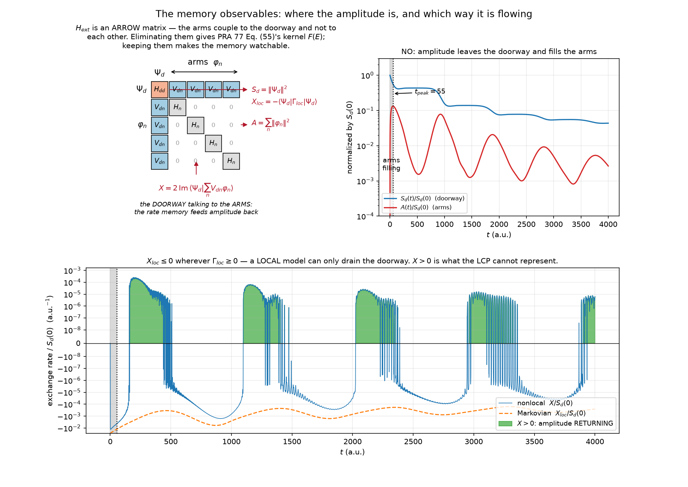
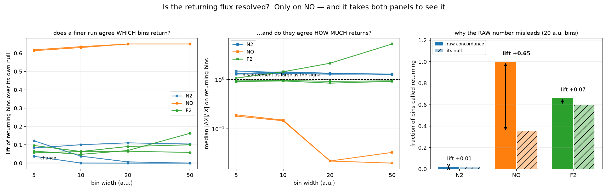
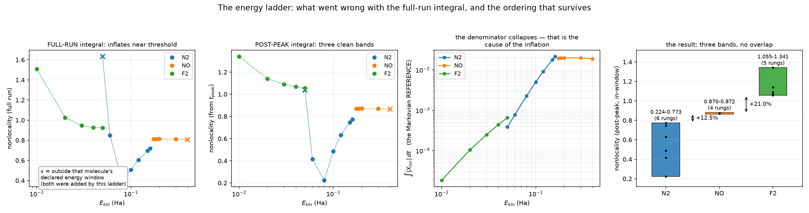

# Watching the nonlocal kernel run — a walkthrough

A companion to [`nrm-time-dependent.md`](nrm-time-dependent.md) §8, which is
written as a record and is dense on purpose. This one is written to be read once,
in order, to understand what was built and what it found.

Everything here is measured. Where a claim was made and later withdrawn, the
withdrawal is part of the story rather than an erratum — three of them were, and
the sequence is the most useful thing in this document.

---

## 1. The idea

The nonlocal resonance model replaces the LCP's local width $-i\Gamma(R)/2$ with
an energy-dependent, nonlocal kernel $F(E,R,R')$. The time-independent route
solves with that kernel and returns a cross section. It tells you nothing about
*how* the answer came about.

The time-dependent route does, because of how the kernel is represented. Writing

$$
F(E) \;=\; \sum_n \mathrm{diag}(V_{dn}) \,(E - H_n)^{-1}\, \mathrm{diag}(V_{dn})
$$

and giving each term its own auxiliary nuclear packet $\varphi_n$ turns the
memory integral into time-local propagation under a sparse **arrow** matrix
$H_{\mathrm{ext}}$: the doorway state $\Psi_d$ couples to every arm, the arms
couple to nothing else. Eliminating the arms reproduces PRA 77 Eq. (55) exactly
(gated at $4.4\times10^{-14}$).

**The arms *are* the memory.** So they can be watched.



Three series are recorded during the same propagation that produces the cross
section, at a measured cost of +0.33 %:

| | what it is | what it means |
|---|---|---|
| $A(t) = \sum_n \lVert\varphi_n\rVert^2$ | `arm_norm` | where amplitude sits, by channel |
| $X(t) = 2\,\mathrm{Im}\langle\Psi_d\lvert\sum_n V_{dn}\varphi_n\rangle$ | `exchange` | the rate memory feeds the doorway |
| $X_{\mathrm{loc}}(t) = -\langle\Psi_d\lvert\Gamma_{\mathrm{loc}}\rvert\Psi_d\rangle$ | `exchange_local` | the same rate in the **local** limit |

**The comparison is the whole point.** $X_{\mathrm{loc}} \le 0$ wherever
$\Gamma_{\mathrm{loc}} \ge 0$: a local model can only *drain* the doorway. So
**$X > 0$ is amplitude coming back** — the thing the LCP cannot represent at all,
made visible as a sign.

The bottom panel above is NO, and the green regions are exactly that: five
distinct bursts of returning amplitude, on a molecule whose LCP is known to be
badly behaved.

### One thing `arm_norm` is not

It is **not** a population. Under ECS $H_{\mathrm{ext}}$ is complex symmetric, so
no conjugating norm is conserved. The size of the gap was measured rather than
assumed: the coupling's two one-sided rates differ by a **median 0.822 of the
larger**. That is the same size as the transfer, not a correction to it. So
`arm_norm` is a *relative channel decomposition* — read across channels and
against itself over time — and the figure's curves are not drawn as if they
summed to anything.

---

## 2. The first result, and why it needed three attempts

The obvious next step is to count returning steps per molecule and rank them.
That is what the sub-project first did, and it was wrong three times before it
was right. The corrections are worth more than the original claim.

### 2.1 The pointwise sign of the exchange rate is not converged — on any molecule

Refine $dt$ and the sign-flip period does **not** lengthen in atomic units. It
shrinks, staying at roughly two steps whatever the step is:

| | $dt = 1$ | $dt = 0.5$ | $dt = 0.25$ |
|---|---|---|---|
| F₂ | 2.09 a.u. | 0.84 | 0.52 |
| N₂ | 7.33 | 1.34 | 0.72 |
| NO | 34.5 | 3.19 | — |

A structure that sits at the step scale at *every* step size is being measured at
the wrong resolution. That this is time discretisation and nothing else was
checked rather than assumed: each campaign deck was re-propagated on a different
CPU, BLAS and sparse factorisation (x86 + MUMPS against arm64 + SuperLU) and
reproduces to $\sim10^{-13}$ with 100 % sign agreement.

### 2.2 So the returns are compared on time-averaged bins

Bursts hundreds of a.u. long are the physical object; single steps are not. The
comparison is made on binned averages at four widths, so the width cannot be
doing the work.



**Two columns are needed, and the middle panel is why.** Agreeing about the
*sign* of a bin says nothing about its *size*. NO's binned returns agree to
2–19 %; N₂'s and F₂'s differ by more than they are worth.

**The right-hand panel is the correction that mattered most.** The concordance is
*conditional* — "of the bins this run calls returning, how many does the finer
one?" — so its null is the finer run's **own positive-bin rate**, not one half.
That rate is ~0.59 on F₂ and ~0.35 on NO. Read raw, F₂ scored 0.65 and looked
like a middle band; read against its null it is a lift of **+0.07**, essentially
chance. NO's 1.00 is a lift of **+0.65**.

**Verdict: two bands, not three.** The returning flux is readable on **NO alone**.
N₂ and F₂ are both at chance and are *not* ranked against each other — which of
the two looks larger even reverses between the pointwise and binned metrics.

> The bin metric was introduced *after* the pointwise one failed, which is the
> classic shape of rescuing a claim. Note which way it cut: it did not save N₂,
> and once its null was supplied it removed F₂ as well.

---

## 3. The comparative question, and the trap in it

The question the campaign existed to answer: **in the energy domain the LCP's
failures are ordered N₂ (mild) then F₂ (sweeping through unity), with NO
undetermined — its pole walk does not converge. Does the time domain reproduce
that, and can it place NO?**

The returning flux cannot carry a three-way comparison, being readable on one
molecule. So the ordering was read from `nonlocality`,

$$
\frac{\int \lvert X - X_{\mathrm{loc}}\rvert \, dt}{\int \lvert X_{\mathrm{loc}}\rvert \, dt},
$$

which is measurable on all three and converges under refinement (N₂ 0.6 % over
four runs, NO 0.04 %, F₂ 1.9 %). At the campaign energies it reads N₂ 0.507 <
NO 0.813 < F₂ 0.946 — the ordering, with NO placed.

**But the three molecules run at three different energies**, each set by where
its own channel is open. So the comparison had to survive being a comparison in
energy. All three were laddered — seventeen propagations.



### 3.1 What the ladder found

Every column the campaign reads as a *return* is **frozen**: over a 4–6× change
in $\Gamma_{\mathrm{eff}}$ the onset does not move at all and
`max positive / peak` moves in the fifth figure. Those describe the molecule.

`nonlocality` is not frozen — and in its original form it was not even the right
integral. The left panel shows why: it blows up toward threshold on N₂ and F₂,
and N₂ becomes non-monotone, which is enough to destroy any ordering read from
single energies. **This is where the claim was retracted outright.**

### 3.2 The mechanism, and the fix that follows from it

The retraction was an over-reaction, and finding out why produced the real
result.

With the arms still empty, $X = 0$, so
$\lvert X - X_{\mathrm{loc}}\rvert = \lvert X_{\mathrm{loc}}\rvert$
**identically** and the ratio is pinned near 1 regardless of the kernel. Every
propagation passes through that window. Near a threshold it takes over, because
the **denominator collapses** — third panel: $\int\lvert X_{\mathrm{loc}}\rvert$
falls **46×** across N₂'s ladder and **35×** across F₂'s — while the numerator
cannot fall below that floor.

What collapses is $\Gamma_{\mathrm{loc}}$'s **magnitude** over the doorway
($\max\Gamma_{\mathrm{loc}}$ moves 5.5× on N₂, 11.8× on F₂), not its extent (the
nodes carrying it move only 89 → 95 of 153). An earlier version of the note said
the open window shrinks; that was wrong and is corrected.

**The contamination is a *window*, so the remedy is a window, not a cull.**
Integrating from the arm-norm peak onwards removes it from every rung, instead of
discarding whole propagations for containing it. $t_{\mathrm{peak}}$ is not a
tuned knob: it is identical at every energy within a molecule (18 / 55 / 40 a.u.)
and starting at $2t$ or $3t$ gives the same verdict.

An intermediate version *did* cull — four rungs, by a threshold invented after
the ladder was run. It worked, but it was open to the charge that a criterion had
been fitted to the answer, and it could not support `N₂ < NO` at all: N₂'s
in-window 0.06 Ha rung read 0.848 there, *above* NO. Post-peak that same rung
reads 0.416.

### 3.3 The result

The only exclusions are the two rungs the ladder added **outside the molecules'
own declared energy windows** — N₂ at 0.05 Ha and NO at 0.40 Ha — by a criterion
this module has carried since before the ladder existed, applied to both.

| | N₂ | NO | F₂ |
|---|---|---|---|
| in-window rungs | 6 | 4 | 5 |
| nonlocality (post-peak) | 0.224–0.773 | 0.870–0.872 | 1.055–1.341 |
| margin to next band | — | +12.5 % | +21.0 % |

$$
\boxed{\;\mathrm{N_2} \;<\; \mathrm{NO} \;<\; \mathrm{F_2}\;}
$$

**If only one inequality can be quoted, quote `NO < F₂`.** It holds on the *raw*
full-run column too, over all seventeen rungs (NO's max 0.8134 against F₂'s min
0.9246), needing no argument about windows at all. `N₂ < F₂` holds with a wide
margin. `N₂ < NO` is the narrowest at 12.5 % and is the first to re-examine.

Both inequalities are tightest at a window edge — N₂ rises with energy and its
top rung *is* the top of its window; F₂ falls and its lowest rung is its closest
approach to NO. Neither trend is extrapolated.

---

## 4. What this does and does not establish

**Reproduced.** The energy domain determines N₂ < F₂. The time domain agrees.

**Added.** NO, which the energy-domain route cannot rank at all because its pole
walk does not converge, is placed between them — by a route that never calls a
pole walk.

**Withdrawn, and this one is a genuine negative result.** "NO's memory is
energy-independent" is *not* supported. Its `nonlocality` is flat to 0.3 % across
its whole declared window — but so is everything feeding it:
$\Gamma_{\mathrm{eff}}$ spans 1.02× and the Markovian reference 1.06×, against
4–6× and 35–46× on the other two (visible as the flat orange line in the third
panel above). The perturbation that moved N₂ and F₂ was never applied to NO.
Flatness of an output under an input that did not move is not a measurement.

**Not established.** Any ranking of N₂ against F₂ *by the returning flux* — that
observable is readable on NO alone. And the ordering is a statement about ranges
over each molecule's declared window; outside those windows the observable stops
measuring the kernel, so it is not extrapolated.

**Not evidence for the model.** Every number here is read off a propagation whose
cross section is validated elsewhere (§3 and §7 of the main note). These are
diagnostics of a model already gated; none of them validates anything in turn.

---

## 5. Reproducing it

```bash
# one propagation per molecule per energy; F2 is the largest at H_ext = 81816
# and peaks at 5.82 GB (it fits on a laptop; MUMPS in Docker is ~10x faster)
uv run python -m validation.diatomic.memory_observables N2
uv run python -m validation.diatomic.memory_observables F2 --energy 0.02

# refinement checks behind §2
uv run python -m validation.diatomic.memory_observables NO --order 4
uv run python -m validation.diatomic.memory_observables NO --dt 0.5 --steps 8000
uv run python -m validation.diatomic.memory_observables resolution --against NO

# the campaign table, and this document's figures
uv run python -m validation.diatomic.memory_observables report
uv run python -m validation.diatomic.memory_observables explain
```

Every recorded number lives beside the code that produced it, in
`validation/diatomic/memory_observables.py`: `ENERGY_LADDER` (17 rungs),
`ENERGY_WINDOWS`, `RESOLVED_RETURN` and `COARSE_GRAINED_RETURN` (with their
nulls), `CROSS_PLATFORM`, `E_BOX_LADDER`, `DECK_COST`. The gates in
`test_memory_observables.py` assert the claims *and* the criteria they depend on,
so neither can drift without the other being re-examined.

---

## 6. The three retractions, in one place

Because they are the most transferable part of this work.

1. **N₂'s returning-flux claim.** Made on a run whose pointwise sign is not
   converged, and on an electronic box 22 % wrong in $\Gamma_{\mathrm{loc}}$.
   Withdrawn.
2. **F₂'s "middle band" of returning flux.** An artefact of quoting a
   *conditional* concordance against an unconditional null; F₂ has the highest
   positive-bin rate of the three, so it flattered itself most. Withdrawn.
3. **The ordering — retracted, then restored.** The retraction was made on the
   full-run integral with near-threshold rungs in it. Restoring it required
   understanding *why* those rungs inflate, and the understanding produced a
   better observable rather than a better excuse.

A fourth, smaller one: a correlation claimed to *reverse* inside the valid set
(evidence that a criterion was not circular) turned out to be small-sample noise
— it was measured on thirteen rungs and vanished at seventeen. Only the weakness
of the correlation survives, and that is all that is now claimed.
