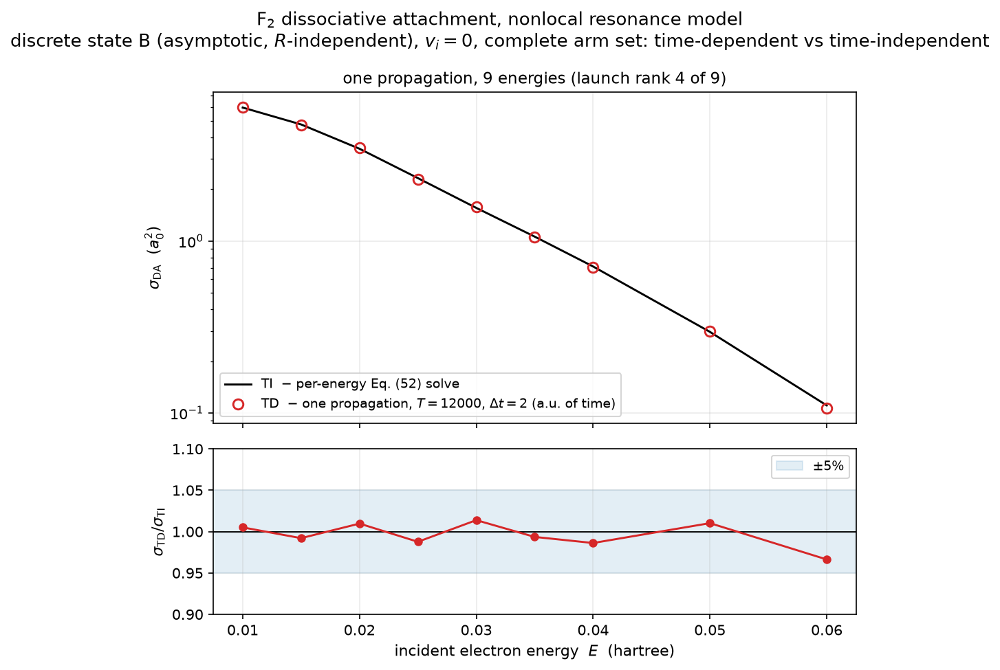
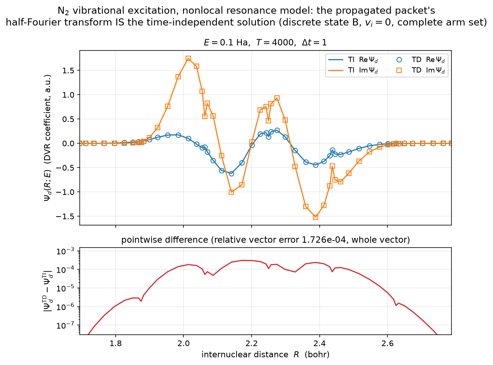
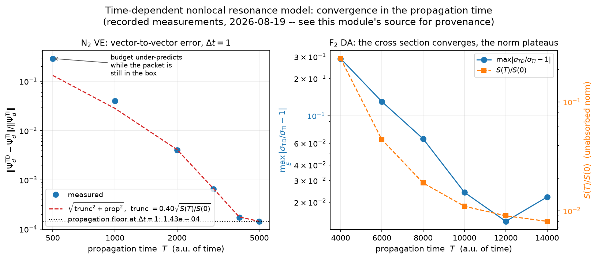
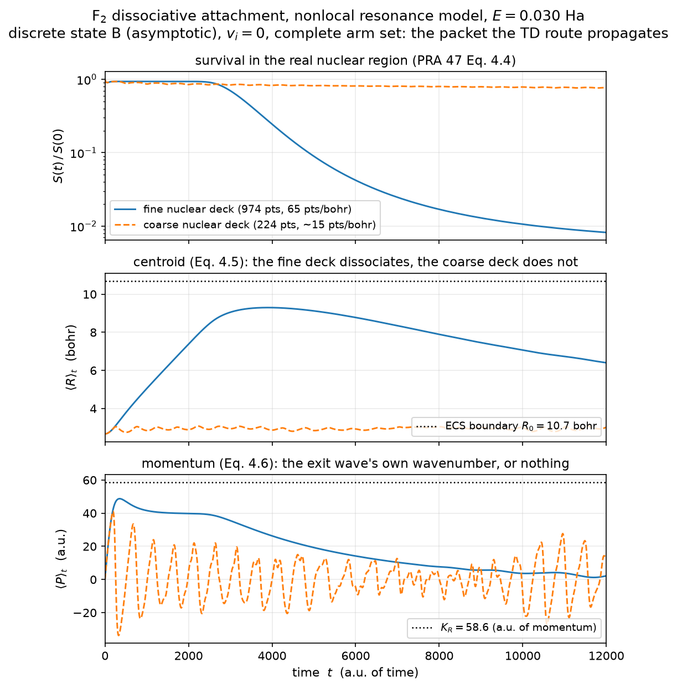
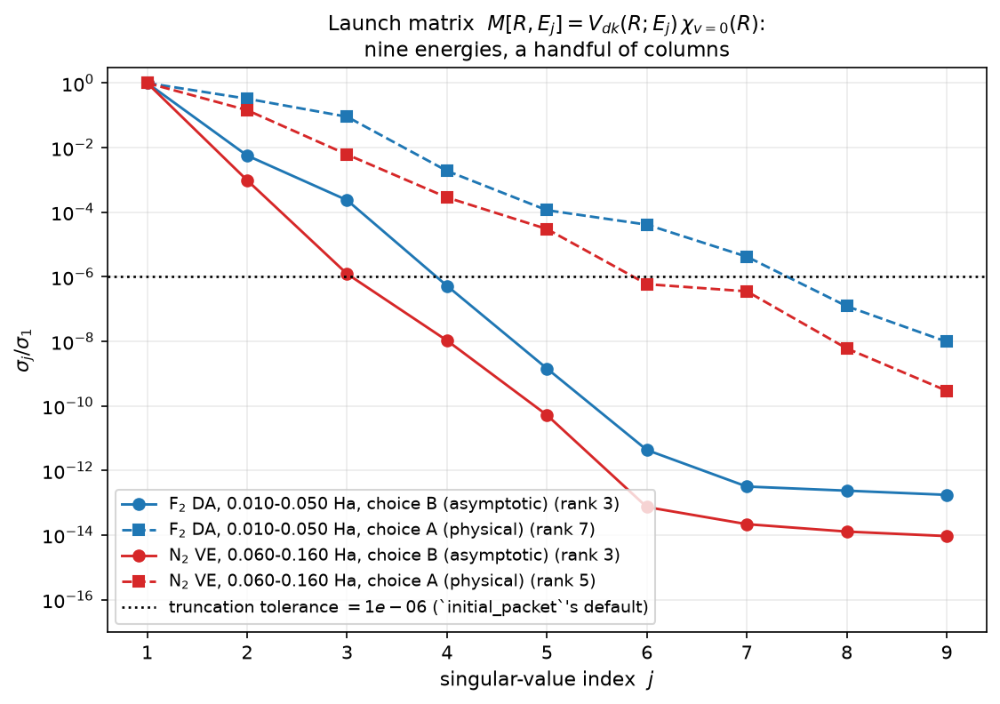
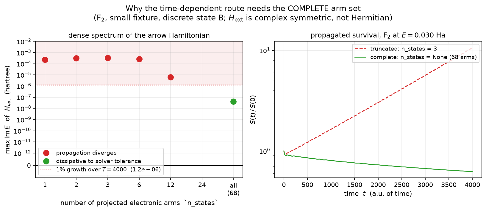
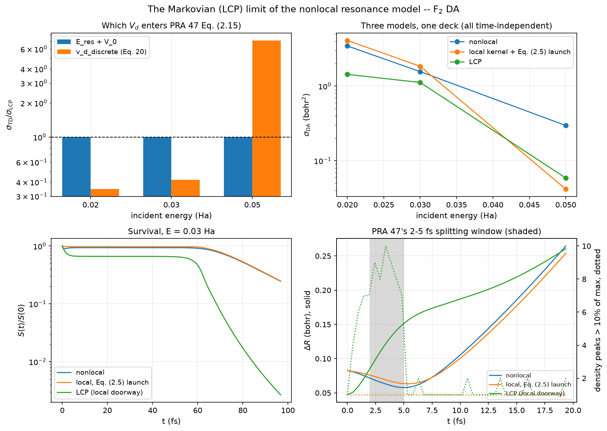

# The time-dependent nonlocal resonance model

The time-domain sibling of `docs/physics/nonlocal-resonance-model.md`. Same
model, same ingredients, same grids — a second, independent route to the same
`Ψ_d`, and a set of observables the first route cannot produce.

Method: Gertitschke & Domcke, Phys. Rev. A **47**, 1031 (1993)
(`reference/literature/gertitschke-1993-pra47-1031.md`), applied to the model of
Houfek, Rescigno & McCurdy, Phys. Rev. A **77**, 012710 (2008)
(`reference/literature/houfek-2008-pra77-012710.md`). Propagator: the order-3
diagonal Padé of van Dijk & Toyama, Phys. Rev. E **75**, 036707 (2007), already
shipped as `qscat.evolution.make_pade_stepper`.

## 1. Why, given that it is slower

It is slower — measurably. One F₂ propagation costs ~0.3–0.8 s per step over
~6000 steps; the resolvent answers the same energies in a fraction of that. The
time-dependent route is not justified on cost and this note does not claim it is.

It is justified because a resolvent returns `Ψ_d(R;E)` and says nothing about how
the collision complex reached it. A propagation returns `Ψ_d(R,t)`, and with it
the survival, the centroid and the mean momentum — the quantities that turn a
cross-section feature into a mechanism. Váňa & Houfek, Phys. Rev. A **95**,
022714 (2017) is built on exactly that: the correspondence between individual
peaks and quasibound states, the several time-separated contributions behind an
asymmetric peak, and the formation-time argument for NO's long-lived structure
(pp. 022714-13, -15). Gertitschke & Domcke's own headline result is of the same
kind — their explanation of why the LCP fails for H₂⁻ is a *temporary packet
splitting between ≈2 and ≈5 fs*, invisible in any energy-domain calculation
(p. 1041).

PRA 95 proposes this work in its closing paragraph: similar time-dependent
calculations "could be performed within the LCP approximation or the nonlocal
resonance model and thus interpret the results in the same way", offered as a
future direction and not executed there (p. 022714-16).

## 2. The formulation

### 2.1 The memory integral, and why it is not solved as one

PRA 47 Eq. (2.1) is non-Markovian:

```
i ∂_t Ψ_d(R,t) = [T_N + V_d(R)] Ψ_d(R,t)
                 + (1/i) ∫_0^t dt' ∫ dR' F(R,R',t−t') Ψ_d(R',t')
```

Evaluated literally this is `O(N_t²)` and needs the kernel at every lag. It does
not have to be. The kernel this repository builds
(`nrm.nonlocal_potential.nonlocal_operator`, PRA 77 Eq. 60–61) is already a sum
of resolvents:

```
F(E) = Σ_n diag(V_dn) · (E − H_n)^{-1} · diag(V_dn)
H_n  = T_R + V_0(R) + E_n(R)
```

### 2.2 The resummation

Introduce one auxiliary nuclear packet `φ_n` per projected electronic state. The
pair `(Ψ_d, {φ_n})` obeys a **time-local** system:

```
i ∂_t Ψ_d = (T_N + V_d) Ψ_d + Σ_n V_dn φ_n
i ∂_t φ_n = H_n φ_n + V_dn Ψ_d
```

i.e. propagation under one block Hamiltonian on `(1 + n)·N_R` unknowns:

```
        ⎡ T_N + diag(V_d)   diag(V_d1)           diag(V_d2)          … ⎤
H_ext = ⎢ diag(V_d1)        T_N + diag(V_0+E_1)   0                  … ⎥
        ⎣ diag(V_d2)        0                     T_N + diag(V_0+E_2)  ⎦
```

sparse (every off-diagonal block is diagonal), complex **symmetric** (ECS, never
Hermitian), and **energy-independent**.

**This is Eq. (2.1) resummed, not approximated.** Eliminating the auxiliary
blocks from the time-independent version, `φ_n = (E−H_n)^{-1} V_dn Ψ_d`, returns
PRA 77 Eq. (52) with exactly the `F(E)` above. Verified numerically: the
`d`-block of `(E − H_ext)^{-1}` matches `(E − T_N − V_d − F(E))^{-1}` to
**4.4e-14** relative (F₂, `N_R = 584`, `cond ≈ 1.1e6`).

### 2.3 Back to the frequency domain

For `i ∂_tΨ = H_ext Ψ` with `Ψ(0)` given, integrating `∫_0^∞ dt e^{i(E+i0)t}` by
parts and killing the `t→∞` boundary term by ECS absorption,

```
(E − H_ext) Ψ̂(E) = i Ψ(0)      ⟹      Ψ̂(E) = i (E − H_ext)^{-1} Ψ(0)
```

With `Ψ(0) = (ξ, 0, 0, …)` and `ξ = V_dk_i(R) χ_vi(R)` — PRA 47 Eq. (2.5), and
byte-identical to the right-hand side the time-independent route already builds
for Eq. (52) — the `d`-block gives

```
Ψ_d^TI(R;E) = −i ∫_0^∞ dt e^{iEt} Ψ_d(R,t)
```

The `−i` is derived here and confirmed independently by PRA 47 Eq. (2.6), whose
`(1/i)` makes `T_{v'v}(E) = ⟨χ_v' V_dk_f | Ψ_d^TI⟩` — precisely the shipped
`vibrational_excitation.t_resonant`.

**The consequence is the design.** The time-dependent route produces *the same
nuclear vector* the time-independent route produces, so every downstream step is
existing, tested code: `dissociation.da_sigma_from_psi` for DA, `t_resonant` +
`t_background` for VE. No cross-section normalization is re-derived, and the
conjugation conventions settled for the TI route (PRA 77 Eq. 34/35 collapsing
`V^{−*}_{dk}` to a non-conjugated `V^+_{dk}`; Eq. 37's bra carrying `φ⁺` at the
final channel energy) are inherited rather than re-litigated.

### 2.4 One propagation for every energy

`ξ` depends on the incident energy through `V_dk_i`, so exact algebra says one
launch state per energy. PRA 47 Eq. (2.17) removes that by rescaling with
`[Γ(E_i)/2π]^{−1/2}`, under the separability `Γ(E,R) = Γ(E) g(R)²` of Eq. (2.16)
— which the Houfek models do not satisfy exactly.

They satisfy it *numerically*. Because `α_c` is a constant in
`V_int(r,R) = −λ(R)e^{−α_c r²}`, the whole `R`-dependence of the electronic
problem enters through the single scalar `λ(R)` — `H_el(R) = H_0 + λ(R)W` — so
`V_dk⁺(R;E) = g(λ(R), E)`, a smooth function of two scalars. The launch matrix
`M[R,E_j] = ξ(R;E_j)` is therefore numerically low rank, and the scheme is to
SVD it, propagate the left singular vectors, and reconstruct every energy by
linearity of the resolvent:

```
M = U Σ Vᴴ,        Ψ_d(:,j) = Σ_m (σ_m V*_{mj}) · Ψ̂_m(:,j)
```

exact given the truncation, because `H_ext` is energy-independent so the
superposition commutes with the propagator. **`r = 1` is Eq. (2.17) exactly**;
higher ranks are its controlled generalization, with a measured rather than
assumed error. See §4.3 for the measured ranks — and note the rank is a property
of the discrete-state choice, not of the model.

## 3. What is verified

| Claim | Measured | Where |
|---|---|---|
| Elimination identity ⇒ `nonlocal_operator`'s `F(E)` | **4.4e-14** relative | `test_nrm_extended.py` |
| Half-Fourier transform vs closed-form finite-`T` | **1.8e-13**, converging as `dt⁶` | `test_nrm_propagation.py` |
| `⟨P⟩_t` vs analytic Gaussian (`p = 1.7`) | **1.6999999999999842** | `test_nrm_propagation.py` |
| **`Ψ_d^TD(R;E)` vs `Ψ_d^TI(R;E)`, vector to vector** (N₂) | **1.73e-04** | `test_nrm_propagation.py` |
| **`σ_TD/σ_TI`, F₂ DA, E = 0.02/0.03/0.05 Ha** | **1.0097 / 1.0138 / 1.0102** | `test_nrm_td_cross_section.py` |
| **Markovian limit vs `qscat.core.lcp`, same F₂ deck** | **1.000215 / 1.000198 / 0.999892** | `test_nrm_td_cross_section.py` |
| **`σ_TD/σ_TI`, N₂ VE, 0.06/0.10/0.15 Ha, v' = 0/1** | **envelope ≤2.5e-3** (2.7e-4 at T = 4000, a null — §7.1.1) | `test_nrm_td_cross_section.py` |
| **`σ_TD/σ_TI`, F₂ VE, 0.03/0.05 Ha, v' = 0/1** | **5.9e-5, flat over T = 1600–2400** | `test_nrm_td_cross_section.py` |
| **Markovian VE vs the LCP VE route, same F₂ deck** | **within 3.3e-6** | `test_nrm_td_cross_section.py` |





The N₂ vector error decomposes exactly. Fitting the measured `rel(T)`:

```
truncation(T) = 0.40 · sqrt(S(T)/S(0))        propagation(dt=1) = 1.43e-4
rel = sqrt(truncation² + propagation²)         (in quadrature, not linearly)
```

reproduces the convergence table to within 3% **from `T = 2000` onward**
(measured/budget 1.03, 1.03, 1.02, 1.00), which is what makes "this is
convergence, not a bug" a demonstration rather than an argument.

It does **not** hold at short times — 2.2× at `T = 500`, 1.4× at `T = 1000`.
The budget is asymptotic: `truncation ∝ √(S(T)/S(0))` assumes the tail
`−i∫_T^∞ e^{iEt}Ψ(t)dt` is dominated by a decaying remainder, and while the
packet is still inside the box that premise does not apply. The shipped gate
sits at `T = 4000`, well inside the regime where the budget is valid.



## 4. What the time domain shows that the resolvent cannot

### 4.1 The packet leaves — and on a coarse grid it does not



On F₂'s fine production nuclear deck (65 points/bohr over R = 3–10.7, largest
node spacing 0.023 bohr) the DA packet dissociates: `⟨R⟩_t` climbs monotonically
**2.66 → 9.33 bohr**, `⟨P⟩_t` rises toward `K_R ≈ 58`, and `S(t)` falls
**0.94 → 0.007** as the wave crosses the ECS absorber at R = 10.7.

`⟨R⟩_t` then **turns over** near `t ≈ 4000` and falls back to ~6.4 bohr while
`⟨P⟩_t` decays toward zero. That is not the packet returning: it is the fast
dissociating flux being absorbed at the boundary, leaving the bound remnant of
§4.2 to dominate what is left inside the box. The turnover and the `S(t)`
plateau are the same fact seen twice — which is also why `⟨P⟩_t` peaks near 48
rather than reaching `K_R = 58.6`, since it averages the outgoing wave together
with a slow bound population.

On a coarse deck it does none of this — the centroid creeps to 2.77 bohr and
oscillates, survival plateaus at 0.673. The outgoing wavelength is
**0.107 bohr** against ~15 points/bohr, so the flux cannot propagate to the
absorber and rattles in place. It *looks* bound and is not. Only the time-domain
diagnostics distinguish the two; a resolvent returns a plausible number in both
cases.

### 4.2 `S(t)` plateaus on F₂, and σ converges anyway

F₂'s `V_d(R)` has a well — minimum **−0.149264 Ha at R = 3.363** against the
F+F⁻ asymptote **−0.126931**, a depth of **0.0223 Ha** — supporting **≥24**
near-real modes with `|Im E| = 1.5e-7 … 7.7e-6`. The launch populates them with
**5.08e-3** of its real-region norm, so `S(t)` flattens at 0.006–0.009 from
`T ≈ 12000` and **no absolute survival floor is reachable on this molecule**;
removing their ≈2e-2 contribution to the transform would need `T ≳ 1e7`.

`σ_DA` converges regardless, because it reads the wavefunction *value* at the
outermost real node, where those well-localized modes have almost no amplitude.
**The observable converges while the norm does not**, so convergence here is
defined as `σ_DA` stationary in `T` — not as `S(T)/S(0)` below a threshold. A
convergence check written the obvious way would warn permanently on every F₂ run.

### 4.3 The launch basis, and what it says about the two discrete states



| window | choice | σ₂/σ₁ | σ₃/σ₁ | σ₄/σ₁ | rank @1e-6 |
|---|---|---|---|---|---|
| F₂ DA, 0.010–0.050 Ha | B | 5.7e-3 | 2.4e-4 | 5.3e-7 | **3** |
| F₂ DA, 0.010–0.050 Ha | A | 3.3e-1 | 9.0e-2 | 1.9e-3 | **7** |
| N₂ VE, 0.060–0.160 Ha | B | 9.8e-4 | 1.2e-6 | 1.1e-8 | **3** |
| N₂ VE, 0.060–0.160 Ha | A | 1.5e-1 | 6.2e-3 | 3.3e-4 | **5** |

PRA 47's "single energy-independent wave packet" is essentially exact for choice
B and materially approximate for choice A. The reason is structural: an
R-independent `φ_d` lets the launch state's R-dependence enter only through
`λ(R)`, while choice A's `φ_d(·;R)` injects genuine two-variable structure. This
is an independent symptom of the same R-dependence that degrades choice A in the
TI campaign (F₂ DA ratio 0.29–0.90; VE 0.565–1.140) and that PRA 77's Sec. VI A
predicts.

## 5. The arm set cannot be truncated

Truncating the sum over projected electronic states makes `H_ext`
**non-dissipative**: modes acquire `Im(E) > 0` and the propagation diverges
exponentially in `t`. Dense `eig` gives `max Im(E) = +2.787e-3` at `n_states=3`
on the N₂ gate deck and `+5.84e-4` on the F₂ production fixture. That the
divergence is identical to five digits across `dt = 4/2/1/0.5/0.25` and Padé
order 3 and 4 proves it is the operator, not the propagator.

**The asymmetry with the time-independent route is the point.** Truncating `F(E)`
perturbs a **resolvent** by a bounded amount — which is why the TI campaign runs
happily at `_N_STATES = 100` — whereas a single eigenvalue crossing into the
upper half-plane grows without bound in a **propagator**. The same approximation
is benign in one route and fatal in the other, so the TI precedent does not
transfer and an `n_states` convergence study is unavailable here.

The effect is **non-monotonic** — on one small F₂ fixture `max Im(E)` runs
+1.60e-4 / +2.02e-4 / +1.96e-4 / +9.03e-6 at `n_states` = 1/2/3/8, then ≤0 from
12 onward, and +2.4e-12 for the complete set. So the rule is not "more arms is
safer": *any* truncation may leave growing modes, and establishing that a
particular one does not requires a dense spectral check. `n_states=None` is the
only value needing no check. `propagate_nrm` warns at runtime when a packet grows.

**Spectral claims here require a dense eigensolver.** These matrices are strongly
non-normal and ARPACK `eigs(which="LI")` under-reports the largest imaginary
part — `+4.639e-4` against dense `eig`'s `+2.787e-3` on the same
716-dimensional matrix, six times low. Sparse results are lower bounds.

**The complete set's own `max Im(E)` was an under-resolved ECS tail, and that is
now settled.** On three decks it sits at `+1.4e-12 … +5.0e-13` — marginal
stability, which is correct, since genuinely bound nuclear states do not decay
(that is what §4.2 is). A small 68-arm F₂ fixture returned `+6.98e-5` instead,
five orders larger, while the propagation launched from `ξ` on that same fixture
**decayed**. Neither of the two explanations first offered (a real but unpopulated
mode; dense-eigensolver backward error) was right. Measured 2026-08-24 by
refining that fixture's **nuclear ECS tail** and nothing else:

| nuclear tail elements (6 → 20 bohr) | complete set `max Im(E)` | `Re E` there | `n_states=3` `max Im(E)` | `Re E` there |
|---|---|---|---|---|
| 2 | +6.98e-5 | +958 Ha | +3.305e-4 | −0.0754 Ha |
| 4 | +4.15e-8 | +666 Ha | +3.305e-4 | −0.0754 Ha |
| 6 | +4.71e-8 | +4806 Ha | +3.305e-4 | −0.0754 Ha |

Two things separate at once. The complete set's large value **moves four orders
under refinement and converges**, and the eigenvalue carrying it sits at
`Re E` of hundreds to thousands of hartree — a high-energy mode of the rotated
continuum, at an energy the packet never occupies. It was a discretisation
artifact of a tail spanning 14 bohr in two elements. The truncated set's value
**does not move at all**, on any tail, and sits at `Re E = −0.0754 Ha`, inside
the packet's own energy range. Artifact versus real growing mode is exactly this
contrast, and it is why figure `nrm-td-truncation-diverges.png` classifies by a
threshold rather than by the sign of `Im E`: the line it draws is where a mode
would grow the packet by 1% over the propagation (`ln 1.01 / 2T`), which the
truncations clear by four orders and the complete set misses by four.

Even so, **a spectral argument is not what makes a propagation safe here — the
runtime survival guard is.** `propagate_nrm`'s check that the packet does not
grow tests the thing that actually matters (is a growing mode populated?) rather
than a sufficient condition on the operator, and it needs no dense `eig` at
production size. Truncation is ruled out on both counts: the growing modes are
real under refinement AND demonstrably populated — on this fixture `S(t)/S(0)`
reaches 10 by `T = 4000` at `n_states = 3` while the complete set falls to ~0.6.




## 6. The Markovian limit — and which `V_d` it takes

PRA 47 Eq. (2.11): in the Markovian limit the memory kernel of Eq. (2.1)
collapses to `i[Δ_L(R) − (i/2)Γ_L(R)] δ(R−R') δ(t)`, i.e. **the local complex
potential *is* the Markovian approximation to the nonlocal model**. What
remains is Eq. (2.15),

```
i ∂_t Ψ_d = [T_N + V_d(R) + Δ_L(R) − (i/2)Γ_L(R)] Ψ_d
```

with no arms at all, so the propagated matrix is `N_R` square — 974 on F₂'s
production nuclear deck, against 53570 for the nonlocal one — and a converged
run costs **4 s** against ~30 min. `td_nrm_da_cross_section(..., markovian=True,
Vd=…, Gamma=…)` selects it; `nrm.extended.lcp_limit_hamiltonian` and
`nrm.extended.lcp_initial_packet` are the two pieces.

Everything measured in this section is reproduced end to end by

```
uv run --no-sync python -m validation.diatomic.td_nrm_figures markovian
```

(~9 min, almost all of it the two nonlocal propagations), which writes
`figures/nrm-td-markovian-vs-lcp.png` and its `.npz`.



(In its lower-right panel the nonlocal peak-count trace lies exactly under the
local one at 1 — that coincidence is §6.4's result, not a missing curve.)

### 6.1 Which `V_d` enters Eq. (2.15) — measured, not argued

The repository has two candidates and they are not interchangeable:
`NrmIngredients.v_d_discrete` (PRA 77 Eq. 20, `V_0 + ⟨φ_d|H_el|φ_d⟩`) and
`qscat.core.lcp`'s `Vd` (`E_res(R)`, with `V_0` already inside `model.surface`).
Eq. (2.14), `E_res − V_d + V_0 − Δ_L = 0`, rearranges to `V_d + Δ_L = E_res +
V_0` — so Eq. (2.15)'s bracket is the *second* one, and the first is short by
the level shift `Δ_L`. Both were run against the shipped
`lcp_da_cross_section` on the F₂ fixture deck (`dt = 2`, `T = 12000`):

| `V_d` in Eq. (2.15) | `σ/σ_LCP` at E = 0.02 | 0.03 | 0.05 Ha |
|---|---|---|---|
| `qscat.core.lcp`'s `Vd` = `E_res + V_0` | **1.000215** | **1.000198** | **0.999892** |
| `NrmIngredients.v_d_discrete` (Eq. 20) | 0.346 | 0.419 | 7.14 |

Decisive, and the failure of the second is not a normalization anyone could
absorb — it changes sign of direction with energy. `E_res + V_0` is what is
shipped.

The difference between the two decays over the same `R`-range as `Γ` — measured
on this deck:

| R (bohr) | 3.99 | 3.50 | 3.01 | 2.49 | 2.20 | 1.51 |
|---|---|---|---|---|---|---|
| `V_d(Eq.20) − V_d(LCP)` (Ha) | 2e-6 | 4.1e-5 | 9.5e-4 | 0.0423 | 0.268 | 1.171 |
| `Γ` (Ha), **frozen below R = 2.5033** | 0 | 0 | 0 | 0.0095* | 0.0095* | 0.0095* |

It does **not** vanish wherever `Γ` does — R = 3.01 has `Γ = 0` and a difference
of 9.5e-4 Ha, 500× the R = 3.99 value — and that is expected, not anomalous:
`Γ_L(R)` is `Γ` at *one* energy while
`Δ_L(R) = P∫(dE′/2π) Γ(E′,R)/(E_res−E′)` (Eq. 2.12a/2.13b) integrates `Γ` over
*all* `E′`, so `Δ_L` is free to be nonzero where `Γ_L` vanishes.

**The starred `Γ` values are a frozen extrapolation, not F₂'s width.**
`qscat.core.lcp.resonance_pole_walk` freezes the last accepted `(shift, Γ)` when
the pole finder breaks down. On this reduced 55-point electronic deck it breaks
at **R = 2.5033** and holds `Γ = 0.00949256` over the inner **198 of 819** real
nodes; the 132-point production deck runs on to R = 1.8657 and gives
`Γ` = 0.0104 / 0.140 / 0.539 at R = 2.49 / 2.20 / 1.51 — **57× the frozen value**
at the innermost. The LCP doorway peak at R = 2.4864 is just *inside* the
freeze, so on this deck the local kernel driving §6.3 and §6.4 is a frozen
extrapolation across the whole region where the dynamics happen. Every
comparison in §6 is differential — both sides consume the same curve — so no
verdict here depends on it, but nothing in §6.3/§6.4 should be read as F₂'s
converged physics. The walk now warns when it freezes.

### 6.1.1 "The doorway peak" names two different points

§4 of `nonlocal-resonance-model.md` records `|V_d(Eq.20) − V_d(LCP)|` = 0.0053 Ha
for F₂ "at the doorway peak", and §6.1 above reads 0.0423 Ha at "the doorway
peak". Both are right; the phrase is overloaded, and *which point* is worth a
factor of 70 while the electronic deck is worth 1.3×:

| `|V_d(Eq.20) − V_d(LCP)|` at | reduced elec (55) | production elec (132) |
|---|---|---|
| `argmax √(Γ/2π)·|χ₀|` — the **LCP** doorway (R = 2.486 / 2.478) | 0.04231 | 0.03283 |
| `argmax |χ₀|` ≡ `argmax |V_dk⁺χ₀|` — the **NRM** doorway, R = 2.745 | 0.00535 | 0.00534 |

The two points are 0.26 bohr apart, and over the region where `|χ₀|` exceeds 5%
of its maximum the difference sweeps **0.00095 → 0.067 Ha**. §4's number is the
NRM doorway and is deck-stable to three significant figures; §6.1's is the LCP
doorway. Neither is a statement about `Δ_L` being deck-sensitive — it is not.

### 6.2 The gate, and why it is tighter than the nonlocal one

`σ_TD/σ_LCP` = 1.000215 / 1.000198 / 0.999892 at E = 0.02/0.03/0.05 Ha. The
residual is transform truncation **and nothing else** — `dt` = 1, 2 and 4
reproduce all three ratios to six digits, so the `dt⁶` propagation error is far
below it:

| T | 4000 | 8000 | 12000 | 16000 | 20000 |
|---|---|---|---|---|---|
| max\|ratio−1\| | 2.4e-2 | 1.3e-3 | **2.2e-4** | 3.6e-4 | 7.7e-5 |

The gate sits at **5e-3**, an order tighter than the nonlocal route's 5e-2,
because there is no model difference in this comparison at all: same deck, same
`(V_d, Γ)`, same Eq. (54) extraction, only the frequency-domain solve replaced
by a propagation.

### 6.3 The doorway, not the kernel, is most of the LCP's error on F₂

Eq. (2.11) localizes the *kernel*. Read strictly it leaves Eq. (2.5)'s launch
state `V_dk_i(R) χ_v(R)` alone, while the LCP this repository ships launches
`√(Γ_L(R)/2π) χ_v(R)` — `Γ_L = Γ(E_res(R), R)`, evaluated at the resonance
position rather than the incident energy, and therefore energy-independent.
Those are not the same vector: measured overlap **0.569**, norm ratio **4.03**.
So there are three models, not two, and running all three on one deck separates
what the kernel costs from what the doorway costs (TI values, `σ_DA` in bohr²):

| E (Ha) | nonlocal | local kernel + Eq. (2.5) launch | LCP (local kernel + local doorway) |
|---|---|---|---|
| 0.02 | 3.443 | 4.082 | 1.433 |
| 0.03 | 1.559 | 1.837 | 1.116 |
| 0.05 | 0.296 | 0.0415 | 0.0586 |

All three are **time-independent** — the middle column is `solve_nuclear` with
`F → diag(−iΓ/2)` and the Eq. (2.5) right-hand side, not a propagation. (Its TD
counterpart reads 4.118 / 1.862 / 0.0423, i.e. 1.0087 / 1.0139 / 1.0188 of these
— this route's own transform-truncation offset at `T = 12000`, and the reason
the columns must not be mixed.)

At 0.02 and 0.03 Ha, localizing the kernel alone moves `σ` by ~18–19% while the
full LCP is off by 2.4× and 1.4× — i.e. **most of the LCP's error on F₂ comes
from the local doorway, not from the Markovian kernel**. At 0.05 Ha the ordering
inverts and both approximations are wrong in different directions. This is a
one-deck, one-molecule measurement on a reduced electronic grid, not a general
claim.

**What this is measured *against* matters.** The reference column here is the
*nonlocal* model, not the exact 2-D oracle, so strictly this decomposes the
LCP's error relative to the NRM. That is legitimate on F₂ only because NRM
choice B tracks the exact oracle to 0.06–0.33% there
(`nonlocal-resonance-model.md` §7.1) — on NO, where the NRM's DA collapses by
5–8 orders (§7.2), the same decomposition would be measured against a broken
reference and would mean nothing.

`lcp_initial_packet` implements the LCP doorway, because reproducing
`qscat.core.lcp` is what `markovian=True` is *for*; the hybrid above is a
measurement, not a shipped option.

### 6.4 The packet: no splitting on F₂

PRA 47's mechanism for the H₂⁻ LCP failure is a **temporary splitting of the
nonlocal packet between ≈2 and ≈5 fs** that a single complex curve cannot
reproduce (p. 1041). On F₂ at E = 0.03 Ha, propagating the nonlocal and the
local Hamiltonians **from the same Eq. (2.5) launch state** — the comparison
that isolates the kernel — there is no such thing:

| t (fs) | 0 | 2.4 | 2.9 | 3.4 | 3.9 | 4.8 | 6.8 | 9.7 |
|---|---|---|---|---|---|---|---|---|
| nonlocal, density peaks >10% of max | 1 | 1 | 1 | 1 | 1 | 1 | 1 | 1 |
| local, density peaks >10% of max | 1 | 1 | 1 | 1 | 1 | 1 | 1 | 1 |
| nonlocal, `ΔR` (bohr) | 0.083 | 0.069 | 0.066 | 0.063 | 0.061 | 0.058 | 0.066 | 0.101 |
| local, `ΔR` (bohr) | 0.083 | 0.074 | 0.072 | 0.069 | 0.067 | 0.064 | 0.067 | 0.096 |

Two different weightings are in play here and only one is right for each row.
The peak count is taken on the density in **wavefunction-value** space
(`|ψ_i|² = |c_i|²/w_i`), which is what a shape looks like on a non-uniform grid —
counting peaks in coefficient space would find element boundaries. `ΔR` is
`√(⟨R²⟩−⟨R⟩²)` on the probability density in **DVR coefficient** space, where
`|c_i|²` already carries the quadrature weight, the same convention
`propagation._record` uses for `⟨R⟩` and `⟨P⟩`; taking that moment in value
space instead drops `w_i` from the integrand and produces a *different and
inverted* trend (an earlier draft of this table did exactly that).

Both stay unimodal, and both **contract** monotonically to ≈4.8 fs before
re-expanding — one breathing packet, not two, and the nonlocal and local widths
never differ by more than 0.007 bohr. Over the full run the two are nearly
indistinguishable in the
Eq. (4.5)/(4.6) moments — `⟨R⟩` agrees to ≤0.01 bohr and `⟨P⟩` to ≤0.15 a.u. at
every sample through T = 4000 — and differ only in an early, one-off norm loss:
`S(t)/S(0)` plateaus at **0.9368** for the nonlocal against **0.9733** for the
local, the whole gap opening inside the first ~4 fs and nothing changing after.

The shipped LCP's packet *does* look different — `S/S₀` drops to 0.663 at once,
`⟨P⟩` runs ~55 against ~40, and it reaches the absorber ~10 fs earlier — but
that is the doorway of §6.3, not the kernel.

**And it is not unimodal**: 9 / 8 / 10 / 9 / 7 peaks at t = 2.4 / 2.9 / 3.4 /
3.9 / 4.8 fs, collapsing back to 1 by 6.8 fs, with `ΔR` climbing monotonically
0.047 → 0.185 bohr. The claim above is about (a) and (b) only. This transient
structure is almost certainly the launch state ringing off the step in `√Γ` at
§6.1's freeze boundary (R = 2.5033, essentially on top of the LCP doorway peak
at 2.4864), not a physical splitting — it is a reason to distrust that packet on
this deck, not evidence for PRA 47's mechanism.

**This is a negative result about F₂, not about PRA 47.** F₂ is the molecule
where the nonlocal model reproduces the exact oracle to 0.06–0.33%
(`nonlocal-resonance-model.md` §7.1); a mechanism the paper found in a system
whose LCP fails by 14× is not expected to show up here, and the honest reading
is that F₂ is a poor place to look for it.

## 7. Vibrational excitation

`td_nrm_ve_cross_section` is the second consumer of the same `Ψ_d`, and all of
it is a contraction. `T^res` is `vibrational_excitation.t_resonant(χ_f,
V⁺_dk_f, Ψ_d)` and `T^bg` is `t_background`, both called **unchanged**, so
PRA 77 Eq. (34)/(35)'s non-conjugated `V⁺_dk` and Eq. (37)'s `φ⁺` at the
*final* channel energy are inherited from the time-independent route rather
than re-derived. `T^bg` contains no `Ψ_d` at all — it is energy-domain and
static — so it is bit-identical between the two routes. That is what makes
running both `include_background` settings a diagnostic rather than a
duplicate: a discrepancy appearing *only* with the background could not be a
background error, it would mean the resonant term is being combined with it
wrongly.

One propagation serves every energy *and* every final channel: `H_ext` is
energy-independent (§2.4) and `Ψ_d^+` does not depend on `v'`.

### 7.1 VE converges long before DA does, and the observable is why

`T^res` weights `Ψ_d` by `χ_f`, which lives in the interaction region, so the
transform converges once the amplitude **there** has decayed — whether by
autodetachment or by simply moving outward. `σ_DA` reads the wavefunction
*value* at the outermost real node, so its packet has to cross the whole box
first (§4.1). The clean measurement is F₂, where **both observables run on one
deck, from one propagation**:

| deck | observable | dt | T | max\|σ_TD/σ_TI − 1\| |
|---|---|---|---|---|
| F₂, 974 nuclear × 55 electronic | VE, 0.03/0.05 Ha, v' = 0/1 | 2 | 2000 | **5.9e-5** |
| F₂, same deck | DA, 0.02/0.03/0.05 Ha | 2 | 4000 | 0.29 |
| F₂, same deck | DA, same energies | 2 | 12000 | 1.4e-2 |
| N₂, 179 nuclear × 74 electronic | VE, 0.06/0.10/0.15 Ha, v' = 0/1 | 1 | 4000 | 2.7e-4 *(a null — below)* |

VE is converged at a sixth of DA's `T`, on the same packet, while **93.8%** of
it is still in the real region. Nothing has left; what decayed is the amplitude
under `χ_f`. A molecule whose DA channel is open therefore does **not** pay the
DA cost for a VE observable.

### 7.1.1 Both residuals have an oscillatory floor — and sampling `T` coarsely hides it

Neither molecule converges monotonically to round-off, and neither single
number above should be quoted as "the accuracy". §4.2's long-lived components
of `Ψ_d` — anything under `χ_f` that does not decay within the propagation —
each contribute a term that **oscillates in `T`** instead of decaying. Where a
given run lands on that oscillation is a matter of phase.

**N₂, dt = 1, worst of six channels.** Coarse sampling looks like clean
convergence (4.2e-1 → 5.0e-2 → 2.7e-4 at T = 1000/2000/4000, and the same to
one figure without the background). A fine scan says otherwise:

| T | 3600 | 3640 | 3680 | 3720 | 3760 | 3800 | 3840 | 3880 | 3920 | 3960 | 4000 |
|---|---|---|---|---|---|---|---|---|---|---|---|
| max\|ratio − 1\| | 2.43e-3 | 1.21e-3 | 1.01e-3 | 1.15e-3 | 1.96e-3 | 2.40e-3 | 2.45e-3 | 2.15e-3 | 1.60e-3 | 9.11e-4 | **2.71e-4** |

The E = 0.06, v' = 1 channel traces a clean sinusoid (1.002433 → 0.997553 →
0.999793) of period ≈450–500 a.u. and amplitude ≈2.4e-3 which crosses 1 almost
exactly at T = 4000. **The honest N₂ statement is an envelope, ≤2.5e-3**, and
the shipped gate is 5e-3 — twice it. (A 1e-3 gate passes at T = 4000 and fails
by 2.4× at T = 3800; the T = 3800 point was re-run independently and reads
2.399e-3.) The T = 4000 value coinciding with the vector-to-vector identity
gate's 1.73e-4 (§3) is likewise a coincidence of phase, not a confirmation.

**F₂, dt = 2, worst of four channels.** Where its gate operates the residual is
a *plateau*, not a phase:

| T | 1600 | 1680 | 1760 | 1840 | 1920 | 2000 | 2080 | 2160 | 2240 | 2320 | 2400 |
|---|---|---|---|---|---|---|---|---|---|---|---|
| max\|ratio − 1\| | 7.21e-5 | 7.04e-5 | 6.31e-5 | 6.34e-5 | 5.98e-5 | **5.95e-5** | 6.61e-5 | 6.70e-5 | 5.75e-5 | 4.88e-5 | 7.47e-5 |

and all four channel ratios carry the **same sign** there (+3e-5 … +7e-5) — a
systematic discretisation offset, not a zero crossing. F₂'s oscillation starts
later and **grows**: 1.9e-4 (T = 2800), 3.2e-4 (3000), 9.6e-4 (3400), 1.5e-3
(3800), 2.5e-3 (4000). So the shipped F₂ gate is 1e-3, 17× the plateau it
actually runs on, rather than a multiple of an envelope the test never reaches.

The general lesson is the one this section exists for: **a `T`-convergence
claim from three sampled points is not a convergence claim.** Sample finely
enough to see the period, then gate on the envelope if you are on one and on
the plateau if you are on that.

### 7.1.2 `dt = 1` on N₂, `dt = 2` on F₂

The N₂ deck's dt = 2 residual is **1.52e-2** at T = 4000 and flat at that value
across T = 3000–4000 — an order above the dt = 1 envelope and *not* oscillating,
i.e. a genuine propagation error rather than a phase. dt = 2 is inadequate
there. Do **not** read 1.52e-2 / 2.71e-4 = 56 as `dt⁶`'s predicted 64 confirmed:
the denominator is the null of §7.1.1, and the agreement is arithmetic on a
coincidence. Neither F₂ run needs the correction — the DA gate's truncation
floor is 1.4e-2, two orders above its own propagation error, and the VE run's
*total* dt = 2 error is 5.9e-5 on the plateau, which bounds its propagation term
below that.

### 7.2 The Markovian VE limit substitutes the doorway at BOTH ends

Eq. (2.11) localizes the kernel; §6.3's point was that the shipped LCP also
replaces the *doorway*. For VE that doorway appears **twice** — as the launch
state and as the coupling the exit channel is contracted against — and
`markovian=True` replaces both with `√(Γ_L/2π)`, which is exactly the
`S_{v'←v} = ⟨√(Γ_L/2π)·χ_v' | Ψ_d⟩` the repository's own LCP VE route
(`projects/n2_ti_cross_section/cross_section.py`) computes. Keeping the
nonlocal `V⁺_dk_f` at the exit while localizing the kernel would be a third
model, so it is not offered. `include_background=True` is **refused** with
`markovian=True` for the same reason: Eq. (37)'s background is built from `φ_d`
and the P-space scattering states, which the local model does not have.

Measured against that route on the F₂ fixture deck of §6 (`dt = 2`, v = 0,
E = 0.02/0.03/0.05 Ha, v' = 0/1):

| T | 2000 | 4000 | 12000 |
|---|---|---|---|
| max\|σ_TD/σ_LCP − 1\| | 5.6e-6 | **3.3e-6** | 4.3e-6 |

Converged by T = 2000 and flat thereafter — on the same deck whose *DA*
Markovian comparison needed T = 12000 to reach 2.2e-4 (§6.2). Same model, same
packet, same propagation, two observables: §7.1's argument with every model
difference removed.

### 7.3 The `unabsorbed` warning is a DA criterion, and it over-warns on VE

`td_nrm_ve_cross_section` applies the same `unabsorbed/S(0) > 1e-2` test
`td_nrm_da_cross_section` uses, and on VE it fires while the cross section is
already converged — F₂ at T = 2000 warns at 0.938 and is right to 6e-5. Read
it as what it says, "the packet is still in the box"; it is not evidence that
`σ_VE` is wrong. Convergence here is `σ_VE` stationary in `T`, exactly as in
§4.2. The threshold is not retuned for VE: a warning that is conservative for
one observable and calibrated for the other is better than two thresholds, and
`_UNABSORBED_TOL`'s calibration is a DA measurement (`td_cross_section.py`).

## 8. Limits — what this does not establish

- **The TD/TI agreement validates the propagation, not the model.** Both routes
  run on the same grids with the same ingredients, so shared discretisation error
  cancels. Absolute scale is anchored elsewhere (`validation/n2/exact2d.py`
  against Houfek at `GATED_RTOL=1e-3`).
- **DA is F₂ only.** NO's DA channel is a known open failure for the TI route
  (`docs/physics/nonlocal-resonance-model.md` §7.2), so a TD run there would be
  measuring an already-broken oracle.
- **The DA fixture uses a reduced 55-point electronic grid.** The TD/TI ratio is
  insensitive to it (3–4 significant figures), but the fixture's absolute `σ_TI`
  is **not** the converged F₂ cross section.
- **No production-electronic-deck data point exists** on any molecule yet.
- **VE is N₂ and F₂, choice B, 0→0 and 0→1.** NO is not run — its
  time-INDEPENDENT VE is not run either (`nonlocal-resonance-model.md` §8.5) —
  no higher final channel is, and choice A is not: every VE number here is
  `AsymptoticDiscreteState`.
- **The VE agreement is differential, like every other number in this note.**
  It says the propagation reproduces the resolvent on one deck; how well the
  nonlocal model reproduces the *exact* VE cross section is
  `nonlocal-resonance-model.md` §8.4's measurement (better than 0.7%), not
  this one's.
- **§6's packet comparison is F₂ at one energy on the reduced electronic deck.**
  It says what the Markovian collapse does *there*; PRA 47's H₂⁻ is a different
  molecule with a 14× LCP failure, and nothing here contradicts or reproduces it.
- **The Markovian gate validates the propagation, not the LCP.** It shows the
  time-domain and frequency-domain routes to `qscat.core.lcp`'s own model agree;
  how good that model is remains
  `docs/physics/nonlocal-resonance-model.md`'s question.

## 9. Literature

- **PRA 47, 1031 (1993)** — `reference/literature/gertitschke-1993-pra47-1031.md`.
  The time-dependent nonlocal equation of motion Eq. (2.1)–(2.5), the amplitude
  transforms Eq. (2.6)/(2.8)/(2.9), the LCP limit in the time domain
  Eq. (2.11)–(2.15), and the packet diagnostics Eq. (4.4)–(4.6).
- **PRA 77, 012710 (2008)** — `reference/literature/houfek-2008-pra77-012710.md`.
  The model: Eq. (52), Eq. (60)–(61), Eq. (31)/(37)/(38), Eq. (54).
- **PRA 95, 022714 (2017)** — `reference/literature/vana-houfek-2017-pra95-022714.md`.
  What time-dependent formulations of these models are *for*, and the closing
  proposal this sub-project executes (p. 022714-16).
- **PRE 75, 036707 (2007)** — `reference/literature/vandijk-2007-pre75-036707.md`.
  The diagonal-Padé propagator.
