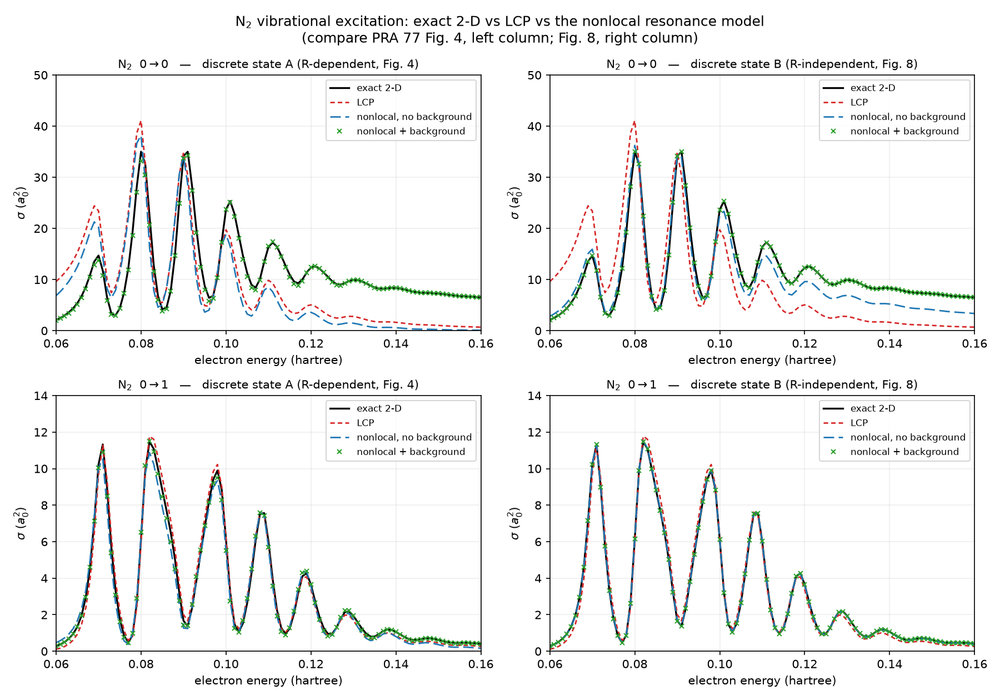

# NRM vibrational excitation

**Location:** `qscat.core.nrm.vibrational_excitation` (`j_dk`, `t_resonant`,
`t_background`, `nrm_ve_cross_section`) and `qscat.core.nrm.scattering`
(`scattering_state_minus`); `libs/qscat/tests/test_nrm_ve.py`,
`test_nrm_scattering.py`; `validation/diatomic/ve_nrm.py` + `test_ve_nrm.py` +
`ve_nrm_figure.py`; `apps/qscat-run`'s `nrm` method on a `ve` observable.
**Source:** K. Houfek, T. N. Rescigno, C. W. McCurdy, *Phys. Rev. A* **77**,
012710 (2008) — `reference/literature/houfek-2008-pra77-012710.md`. Split out
of [`nonlocal-resonance-model.md`](nonlocal-resonance-model.md), which holds
the method core (the kernel $F(E)$, the discrete-state choices, the
ingredients) and the dissociative-attachment side; this note's §1–§10 were
that note's §8.1–§8.10.
**Units:** atomic units throughout (hartree, bohr).

## Key result

Vibrational excitation is the channel PRA 77 plots for every molecule in
its study, so it is where the nonlocal model can be checked against the
exact solver most broadly — and choice B plus the background term
reproduces the exact `driven.ve_cross_section` oracle to better than 0.7%
on both N₂ (11 energies, 0.06–0.16 Ha) and F₂ (6 energies, 0.02–0.09 Ha),
elastic and first-inelastic alike (worst ratio 0.99623–1.00692 over all
four molecule/transition pairs), while choice A degrades to 0.565–1.140.
The reason B is that good is physics, not luck: an R-independent
$\phi_d$ carries no derivative couplings, so the model is formally exact
and the residual is discretization error. The comparison is differential
(both routes on the same grids): it validates the model reduction, not
the grid.

## 1. The decomposition, and which coupling it carries

Everything expensive is shared with DA: the same `NrmIngredients`, the same
`nonlocal_operator`, the same $\Psi_d^{+}(R)$ nuclear solution. What VE adds is a
different way of reading $\Psi_d^{+}$ out, plus a second, non-resonant term.

The paper's starting point is the **two-potential formula** (p. 012710-3, Eq. 28), not
a numbered $T = T^\mathrm{bg} + T^\mathrm{res}$ identity:

$$
T^\mathrm{VE}_{v_i\to v_f} = \langle\chi_{v_f}\phi_{k_f}^{-}|V_1|\chi_{v_i}J^l_{k_i}\rangle
  + \langle\chi_{v_f}\phi_{k_f}^{-}|V_2|\Psi^{+}\rangle
\tag{28}
$$

Its second term "corresponds to the resonant part of the T matrix" and its first "is
generally called the background scattering T matrix" — both identifications are
**prose** on p. 012710-4, which is why $T^\mathrm{VE} = T^\mathrm{res} + T^\mathrm{bg}$
is a consequence of Eq. (28) rather than an equation with a number. Developing them
gives the two objects this package computes:

$$T^\mathrm{res}_{v_i\to v_f} = \langle\chi_{v_f}|V_{dk_f}^{-*}|\Psi_d^{+}\rangle \tag{31}$$

$$
T^\mathrm{bg}_{v_i\to v_f} = \langle\chi_{v_f}\phi_{k_f}^{-}|V_\mathrm{int}|\chi_{v_i}J^l_{k_i}\rangle
  - \langle\chi_{v_f}|V_{dk_f}^{-*}\,J^l_{d k_i}|\chi_{v_i}\rangle
\tag{37}
$$

$$J^l_{d k_i}(R) = \int \mathrm{d}r\,\phi_d^{*}(r;R)\,J^l_{k_i}(r) \tag{38}$$

$\sigma = 4\pi^3|T^\mathrm{res} + T^\mathrm{bg}|^2/(2E)$, on `qscat.core.driven`'s own
normalization so the exact and nonlocal curves compare directly rather than through
two conventions that happen to agree.

**The coupling in Eq. (31) is $V^{-*}_{dk_f}$, not $V^{*}_{dk_f}$, and that distinction
is the paper's own correction to Domcke.** $V^{-}_{dk}$ (Eq. 23) is built on the
**incoming** background continuum state; Domcke's unsuperscripted $V_{dk}$ is the
**outgoing** $V^{+}_{dk}$ of Eq. 21, which PRA 77 says "was, in our opinion, used
incorrectly" (p. 012710-4).

*(A naming note, since `qscat.core.nrm.scattering`/`vibrational_excitation.py` call
$\phi_k^{+}$ OUTGOING while PRA 77's own text calls its boundary condition "determined
by the incoming wave $J^l_k$" -- both are standard scattering-theory usage for the same
object, naming different aspects of it: the paper names $\phi_k^{+}$ by its SOURCE term
(the incident wave $J_k$ that drives it), the code by its asymptotic SCATTERED
behavior, $\phi^{+} = J_k + \text{(outgoing scattered wave)}$. Not a disagreement.)*

What makes the paper's form implementable here is
**Eq. (34)**, whose condition is printed as "a special case of the real discrete state
and … for the radial case": there $\phi_k^{-} = (\phi_k^{+})^{*}$, and **Eq. (35)**
then collapses the matrix element,

$$
\langle\phi_{k_f}^{-}|P H_\mathrm{el} Q|\phi_d\rangle
  = \langle\phi_d|H_\mathrm{el}|\phi_{k_f}^{+}\rangle = V_{dk_f}^{+}
\tag{35}
$$

"where we assumed that $H_\mathrm{el}$ is a Hermitian operator. Note that in this
special case we can use the matrix element $V_{dk}^{+}$ but **without complex
conjugation**" (the paper's own emphasis). qscat's model is radial, single fixed $l$,
real $\phi_d$ — exactly that branch — so the implemented contraction is the
**non-conjugating** one over `v_dk_plus`'s output. Eq. (36)'s three-dimensional
replacement does not apply.

Two independent arguments land on the same non-conjugated contraction, and the
docstrings keep them apart because they rest on different premises:

| the claim | the reason | the locator |
|---|---|---|
| Eq. (34) applies at all | radial case, real $\phi_d$ | p. 012710-4, Eq. (34) |
| the coupling factor loses its conjugate | $H_\mathrm{el}$ is Hermitian (unscaled theory) | p. 012710-4, Eq. (35) |
| the *scalar product* is bilinear | $P H_\mathrm{el} P$ is complex **symmetric** under ECS | p. 012710-6 |

One citation must not do both jobs. The ECS argument is about `qscat.linalg.c_product`
— why an inner product over complex-scaled states carries no conjugation at all — and
it would hold even if Eq. (35) did not. Eq. (35) is about which matrix element the
theory puts there in the first place. `t_resonant` and `t_background` use the same
convention because they must: the paper warns that the Domcke discrepancy "becomes
important when the background terms … are added to the resonant T matrix, since the
coupling matrix elements $V_{dk}^{\pm}$ are in general complex even when the discrete
state is real" (p. 012710-4). A mismatch between the two terms is invisible in either
term alone and wrong in their sum.

## 2. φ⁻, and the gate that checks it

`scattering.scattering_state_minus` builds the incoming-boundary continuum state as
$\overline{\phi^{+}}$ masked to the real region, per Eq. (34). It is **not** consumed
by the shipped assembly, and that is the correct outcome rather than dead code by
accident: Eq. (37)'s first term is a *bra*, $\langle\chi_{v_f}\phi_{k_f}^{-}|$, so the
object a non-conjugating c-product must carry is $(\phi^{-})^{*} = \phi^{+}$ —
evaluated at the **final** channel energy. `t_background` therefore calls
`scattering_state(PHP, …, e_kin_f, ℓ)` directly. The $\phi^{-}$ route would need the
ECS tail zeroed by hand; the $\phi^{+}$ route is analytic on the whole contour.
`scattering_state_minus` remains as a gated, tested primitive because Eq. (34) is the
identity the choice rests on — it is the repo's executable statement of that identity,
kept and gated even though nothing in the shipped assembly calls it. (A future 3-D
branch would need Eq. (36), $\phi_{\vec{k}}^{-} = (\phi_{-\vec{k}}^{+})^{*}$ —
conjugation at the *reversed* wavevector, not the same-k conjugation
`scattering_state_minus` computes — so it would need a different function, not a
reuse of this one.)

**The gate on it is a Hankel decomposition, not a time-reversal comparison, and the
first attempt at one was circular.** Comparing $\overline{\phi^{-}}$ against
$\phi^{+}$ through the same outgoing-referenced S-matrix extraction is algebraically
forced to succeed:
the assertion reduces to `Im T == 0`, true only when nothing scatters. Measured on
that broken gate, `s_plus` and `s_minus` came out **identical** rather than conjugate,
and `(H − H_free)@plus` and `(H − H_free)@conj(minus)` differed by exactly 0.0.

What replaced it tests the actual content of Eq. (34) against analytic asymptotics.
Beyond the potential's support $\phi^{+}$'s scattered part must be purely
**outgoing** and $\phi^{-}$'s purely **incoming**, since
$(j + a h^{(1)})^{*} = j + \bar{a} h^{(2)}$ for real $j$ on real $r$.
`test_nrm_scattering.py` decomposes $\phi_\mathrm{sc} = \phi - J$ onto
$h^{(1)}$/$h^{(2)}$ at two real points outside the well and inside `R0` (converting
DVR coefficients to values via $1/\sqrt{w_j}$), then asserts the wrong component is
absent. Measured `|b₊/a₊| = |a₋/b₋| = 2.9479e-07` at `r = (8.19, 13.61)` bohr, where
the well is ~1e-87 and ~1e-241 and `cond(M) = 3.74`; tolerance 1e-5, chosen for ~34×
margin. Dropping the conjugation gives `|a₋/b₋| = 3.39e6` — eleven orders past the
tolerance — and dropping the $1/\sqrt{w}$ conversion moves `|b₊/a₊|` from 2.95e-7 to
0.095, so neither bug cancels in the ratio.

## 3. The state sum, for VE

`n_states = 100` carries over from DA, but it was **re-laddered** for VE rather than
inherited, because [`nonlocal-resonance-model.md`](nonlocal-resonance-model.md) §6.2's lesson is that the convergence *shape* is molecule- and
choice-dependent. Worst relative change per rung, over two energies per molecule, both
channels, with the background included:

| combo | n = 40 | 55 | 70 | 85 | 100 |
|---|---|---|---|---|---|
| N₂ / A | 2.1e-2 | 1.0e-4 | — | 3.0e-12 | 2.6e-15 |
| N₂ / B | **1.9** | 1.1e-1 | 1.2e-5 | 1.8e-11 | 5.3e-15 |
| F₂ / A | 2.0e-1 | 6.2e-4 | 5.5e-6 | — | 1.0e-10 |
| F₂ / B | 1.1e-1 | 7.2e-2 | 2.5e-2 | 1.4e-3 | 5.3e-7 |

(`—` means that rung was not recorded, not that it was zero; F₂/B was carried one rung
further, to 1.2e-14 at `n = 120`.)

N₂/B **overshoots by 190 %** at `n = 40` before collapsing to 1e-11 by 85; F₂/B is
still at 1e-3 where N₂/B has finished. 100 is the smallest round value at which all
eight (molecule × choice × background) combinations sit within 1e-6 of their own
untruncated sum, and it fits inside N₂'s 106-state ceiling (`elec.n = 107`). At 100,
N₂ is within 5e-15 of the untruncated sum.

## 4. Measured: the nonlocal model reproduces the exact VE cross section

`v_init = 0`, `n_states = 100`, SuperLU. The oracle is
`qscat.core.driven.ve_cross_section`. **The decks are not both [`nonlocal-resonance-model.md`](nonlocal-resonance-model.md) §7's.** F₂ runs [`nonlocal-resonance-model.md`](nonlocal-resonance-model.md) §7's
own deck exactly — `validation.diatomic.config`'s `da_grid()`, electronic
`r_max = 16, order = 8, n_complex = 6` (n = 132) × the 974-point nuclear deck. N₂ has
no `validation/` deck of its own and runs `qscat_run.presets`' `N2:emoscat` TI grid
instead: electronic `r_max = 16, order = 7, n_complex = 5` (n = 107) × 251 nuclear
points — a coarser electronic factor than [`nonlocal-resonance-model.md`](nonlocal-resonance-model.md) §7's. Both are read off
`validation/diatomic/ve_nrm.py`'s `_ELEC_PARAMS`/`_deck`, and `setup` asserts the
second-ECS-angle rebuild reproduces each deck's electronic factor node-for-node, so a
drift between the two cannot pass silently.

N₂ was run at 11 energies over 0.06–0.16 Ha and F₂ at 6 over 0.02–0.09 Ha, both inside
the paper's own plotted windows (N₂ VE is plotted over 0.05–0.17 Ha in Fig. 4; F₂ VE
0→1 over 0–0.10 Ha in Fig. 6). The bands below are what those runs recorded; the gate
reruns all 11 of N₂'s but only the two of F₂'s six that bind its band (§9).

$\sigma_\mathrm{route}/\sigma_\mathrm{exact}$, as a band **over those energies** — not over every energy in the
window; the denser figure grid widens two of them, and §9 says by how much:

| route | N₂ 0→0 | N₂ 0→1 | F₂ 0→0 | F₂ 0→1 |
|---|---|---|---|---|
| **B (R-independent) + bg** | **0.99883–1.00019** | **0.99706–1.00065** | **0.99805–1.00044** | **0.99623–1.00692** |
| A (physical) + bg | 0.93356–1.01208 | 0.85398–1.05868 | 0.82841–1.00192 | 0.56528–1.14013 |

and the two contrast routes, pooled over both channels because that is how they were
recorded:

| route | N₂ | F₂ |
|---|---|---|
| B, **no** background | 0.51715–1.33786 | 0.04227–0.90109 |
| LCP | 0.10629–4.56775 | 0.000177–0.35574 |

**Choice B with the Eq. (37) background reproduces the exact 2-D solver to better than
0.7 % on both molecules, in the elastic and the first inelastic channel.** Unlike the
DA result of [`nonlocal-resonance-model.md`](nonlocal-resonance-model.md) §7.1 that is not a one-molecule claim.

**Why choice B reaches sub-0.7 %, as physics rather than luck.** With an
R-**independent** $\phi_d$, the Feshbach partitioning carries no $\partial_R\phi_d$
derivative couplings. The nonlocal model with the full state sum and the Eq. (37)
background is then **formally exact**, and the 0.1–0.7 % residual is discretization
error, not model error. That is precisely why choice A degrades: an R-dependent
$\phi_d$ reintroduces the neglected derivative terms, which is the paper's own Sec.
VI A point (p. 012710-9) and
the same Born–Oppenheimer breakdown [`nonlocal-resonance-model.md`](nonlocal-resonance-model.md) §7.1 recorded in DA. Choice A's worst error is
0.146 (N₂) and 0.435 (F₂), and it is worst in the *inelastic* channel — the harder one
for a Born–Oppenheimer-flavoured approximation.

**The comparison is differential, and here is what it does not prove.** Both routes run
on the *same* grids, so their shared discretization error cancels; what the ratio
measures is the model reduction, not the grid. The absolute normalization is anchored
separately, by `validation/n2/exact2d.py` at `GATED_RTOL = 1e-3` against Houfek's
published data. **This result validates the model reduction, not the discretisation.**
The two routes are otherwise genuinely independent — `driven.ve_cross_section` is a 2-D
sparse driven Lippmann–Schwinger solve; the NRM is a 1-D nuclear solve with a kernel
built from per-`R` electronic eigenproblems. No solver is shared.

## 5. Which pairs have a published anchor, and which do not

From PRA 77's own panel inventory (`reference/literature/houfek-2008-pra77-012710.md`):

| pair | choice A | choice B | external anchor? |
|---|---|---|---|
| N₂ 0→0 | Fig. 4 | Fig. 8 | yes, both |
| F₂ 0→1 | Fig. 6 | Fig. 8 | yes, both |
| N₂ 0→1 | Fig. 4 | **omitted from Fig. 8** | choice A only |
| F₂ 0→0 | — | — | **none — not plotted at all** |

All four are gated here against *our* exact 2-D solver, which exists for every
transition. What **F₂ 0→0 lacks is external corroboration, not an oracle**, and this
note does not claim otherwise for it.

## 6. The N₂ 0→1 LCP departure does not contradict Fig. 8

Fig. 8 omits the N₂ 0→1 panel "because results of all calculations are practically the
same in this particular case" (p. 012710-10, Fig. 8 caption). Its caption opens
"Comparison of the cross sections as in Figs. 4–6", and Fig. 4's caption defines
exactly four curves — exact 2-D, LCP, nonlocal without background, nonlocal with
background — so **"all calculations" genuinely includes the local one.** That is a
testable claim, and our LCP ratio wanders — at the gate's 11 energies: 0.379, 0.948,
0.955, 1.202, 1.009, 0.963, 0.924, 0.869, 0.801, 0.729, 0.659; over the 101 energies
the figure is drawn on, 0.379–1.329.

It is not a contradiction, because **the caption is a statement about a linear axis,
not about a ratio.** The numbers below are measured on the **101-energy figure grid**,
because this section is an argument about how the *printed panel* looks and that is the
grid the printed panel is drawn on. The 11-energy gate values are given alongside; they
are systematically milder, because a coarse sweep straddles the boomerang peaks rather
than landing on them.

Fig. 4's 0→1 panel runs 0…14 `a₀²` (p. 012710-8), and there the LCP's worst
**absolute** deviation is **0.707 bohr²** (11-energy gate: 0.531), about 5 % of the
axis, against the elastic channel where the same quantity is **11.65 bohr²** (gate:
8.714) on a panel whose peak $\sigma$ is 35 — a factor of **16** in visibility either
way. The honest cut is **by $\sigma$, not by energy interval**: over the 23 dense
energies where $\sigma$ exceeds half its 11.48 bohr² peak, the LCP is within **9.9 %**
(worst at `E = 0.073`). The 11-energy gate reports 5.2 % over that same criterion on
its own coarser sample of the peaks, and **5.2 % is an anchor-grid figure, not a
window-wide bound** — 9.9 % is what a reader looking at the figure should carry. The
0.379 outlier sits at `E = 0.06`, where $\sigma_\mathrm{exact}$ is 0.287 bohr² — 2.5 %
of peak — so the absolute miss there is 0.18 bohr², about 1 % of the panel. The
mechanism is the one the paper names at p. 012710-9: the bare LCP's width $\Gamma(R)$
is energy **independent**, so it degrades where the channel energy is far from
$E_\mathrm{res}$ — i.e. in the wings, which is exactly where $\sigma$ is small.

**Contrast the elastic channel**, which is the counter-example that keeps the above
from being an excuse: there the LCP drifts 4.57 → 0.106 monotonically **at large
$\sigma$**, worst absolute deviation 11.65 bohr² against a 35 bohr² peak — and on the
same "$\sigma$ above half its peak" cut it is off by **61 %**, against the 0→1
channel's 9.9 %.
That is plainly visible in print, and it is this paper's own missing-background claim
seen from the side of the model that omits the background. A single ratio band cannot
tell those two failures apart; `test_n2_0to1_agrees_on_the_scale_fig_8_asserts` asserts
the 0→1 deviation below a ceiling **and** the elastic one above a floor, so neither
half can go vacuous.

None of this is an artifact of the driver: rebuilding the LCP through the project's own
independent N₂ route (`projects.n2_ti_cross_section.vres.vres_on_grid` on its own
428-point nuclear grid) reproduces it to ~0.1 %.

## 7. The background matters more for elastic than inelastic — pointwise

PRA 77 states the background terms are nonzero for inelastic VE too "but generally
small when compared to the resonant part" (p. 012710-4), and largest for the broadest
resonance (p. 012710-1, 012710-10). The ordered, stronger form — that the background's
importance *decreases* with increasing inelasticity (p. 012710-8) — is measured here as
the median relative change from dropping $T^\mathrm{bg}$:

| combo | 0→0 | 0→1 | ratio |
|---|---|---|---|
| N₂ / A | 0.7102 | 0.10655 | 6.7× |
| N₂ / B | 0.2221 | 0.007233 | **30.7×** |
| F₂ / A | 0.99844 | 0.93392 | 1.07× |
| F₂ / B | 0.86964 | 0.23393 | 3.7× |

It holds in all four combinations, and on N₂ it holds **pointwise at 10 of the 11
energies** for both choices — it is not a median artifact. The magnitudes carry the
second claim too: F₂'s background is essentially the whole cross section (dropping it
costs 87 % of the elastic answer) while N₂'s costs 22 %.

## 8. The N₂ `min_overlap` warning is benign, and the reason is specific

`nrm_ingredients` warns on N₂'s deck (`min_overlap = 0.0148 < 0.5`, both choices) that
`_sign_align` paired different P-space states between adjacent nuclear nodes. **This is
not NO's choice-A pathology of [`nonlocal-resonance-model.md`](nonlocal-resonance-model.md) §11, and N₂'s numbers are quotable.** Measured: the
mispairing is **three R-steps involving five states, swapped in pairs** — $n$ = (77, 78)
at `R = 1.7608 → 1.7374`, (62, 63) at 1.3695 → 1.2913 and (63, 64) at 0.9799 → 0.9347
bohr, identical for both discrete-state choices. Three independent reasons it cannot
move the numbers above:

1. Those states are **essentially decoupled**. Their largest $|V_{dn}|$ anywhere on the
   walk is 1.04e-4 (choice A) / 7.08e-4 (choice B) against deck maxima of 0.341 /
   0.683. Eq. (60) is bilinear in $V_{dn}$, so they enter $F$ at the ~1e-6 relative
   level, orders below the agreement asserted in §4.
2. Each swapped pair is **near-degenerate** — $E_n$ = 212.6833/212.7180 and
   41.2234/41.2333 and 41.5195/41.5493 hartree. Relabelling the two members of a
   degenerate pair is very nearly a no-op in $F(E)$, which sums over the pair; only the
   split can matter, and it is 1.6e-4 relative.
3. Those $E_n$ sit at 41–213 hartree against collision energies of 0.06–0.16 — 260× to
   3500× — so $F(E)$'s energy denominators suppress them further.

$\phi_d$ itself is continuous across N₂'s whole walk (minimum adjacent overlap 0.9895
for choice A, exactly 1.0 for choice B). NO's failure was a genuinely
**discontinuous** $\phi_d$ at a branch switch; this is not that.

## 9. The figure



Rows are the transitions (0→0 top, 0→1 bottom); columns are the discrete-state choice —
**left is choice A, which is what Fig. 4 plots; right is choice B, which is what Fig. 8
plots.** The four curves per panel are the four Fig. 4's caption defines, in its line
styles, on a **linear** axis with Fig. 4's own ticks (0…50 `a₀²` for 0→0, 0…14 for
0→1) over its own 0.06–0.16 Ha range, so the panels can be laid directly next to the
printed ones. Fig. 8 has no N₂ 0→1 panel, so the bottom-right panel has no published
counterpart — read it against the exact 2-D curve in the same panel.

**The line *styles* match the print; the colours do not.** PRA 77 draws the LCP blue
short-dashed, the nonlocal-without-background green long-dashed and the +background
crosses red; here they are red, blue and green respectively. Pair the curves by dash
pattern and marker (and by the legend), not by colour.

101 energies at 0.001 Ha, ten points per boomerang oscillation. Regenerate with

```bash
uv run python -m validation.diatomic.ve_nrm_figure
```

which writes both the PNG and the `.npz` of all six curves (~14 min; the exact 2-D
sweep dominates). The `.npz` is gitignored, like every other figure's data in this
repo — rerun the driver to regenerate it.

**Every recorded band in `test_ve_nrm.py` is measured on an anchor grid, not on every
energy in the window**, and two of them are visibly tighter than the dense sweep. The
anchor grid is not the same for both molecules: N₂'s bands are measured on the 11
energies the gate runs, but F₂'s were recorded on the original six-energy sweep and the
gate now runs only the two anchors that bind them (`E = 0.02`, choice B's band maximum
and choice A's worst error; `E = 0.04`, choice B's band minimum — the other four sat
strictly inside, so dropping them removed cost and no constraint, and cut the run from
1818 s to 705 s). Widening `_ENERGIES["F2"]` back to six is a deliberate act.

Choice B widens from `_BANDS["N2"] = (0.995, 1.005)` to **0.99454–1.00065** —
still inside the 0.7 % headline. Choice A's 0→1 ratio reaches **1.13260** densely,
outside the recorded `_BAND_N2_01 = (0.80, 1.10)`. Both are grid-sampling differences,
not regressions: a coarse sweep straddles the boomerang peaks where the approximations
are worst. The gate deliberately keeps its 11 energies — the bands are sharp there, and
re-recording on 101 would cost ~14 min inside a test for no gain in detection — so both
dense values are carried as comments next to those two constants. The LCP's absolute
deviations behave the same way (§6).

## 10. Cost

On the 12-core laptop, one `validation.diatomic.ve_nrm.compare` call — all six curves,
both choices, both background settings — costs **94.9 s for N₂** at 11 energies (exact
2-D sweep ~63 s, LCP pole walk 4 s, ~2.1–2.6 s per energy per NRM curve) and, for F₂,
**705 s at the two anchors the gate runs** against **1818 s** for the full six-energy
sweep. (An earlier 745.9 s figure for that six-energy sweep is **superseded**: it did
not reproduce when `test_ve_nrm.py` re-measured both grids back to back on the same
idle machine, and `_ENERGIES` records 1818 s as the current cost on this hardware.
That decomposes as ~278 s per energy against ~149 s of fixed setup, so the saving
really does scale with the energy count.) F₂'s cost is dominated by the exact 2-D
sweep at 128,568 unknowns and ~10 GB peak RSS, on top of a 22 s LCP pole walk, 33 s
of grid setup, 2 × 14 s of ingredients and ~10–12 s per energy per NRM curve.
Measured on the figure's own 101-energy run: 10.5 s of fixed setup plus 8.0 s per
energy for all six curves. As with DA, the exact solve dominates and
sets peak RSS; run the two molecules serially.

