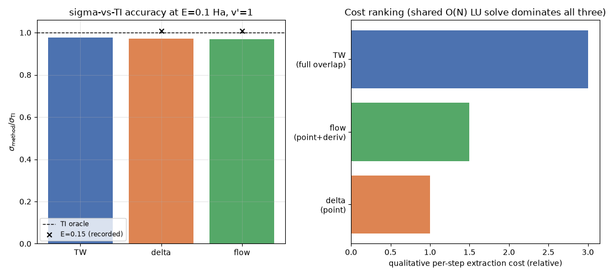

# Alternative TD energy extractors: Dirac (delta) and Flux (flow)

**Location:** `qscat.core.time_dependent` (`propagate`, `Extractor` protocol,
`td_ve_cross_section(method=...)`, `td_ve_cross_sections_all`),
`qscat.core.td_extractors` (`TannorWeeks`, `Dirac`, `Flux`),
`qscat.dvr.dvr_first_derivative_at_node` (the DVR first-derivative-at-a-node
primitive `Flux` needs), `validation/n2/td_extractors.py` +
`validation/n2/test_td_extractors.py` (the N₂ three-way validation).
**Origin:** sub-project "alternative TD extractors" (branch
`td-alternative-extractors`), the SP1 half of a two-part plan (SP2 —
outgoing nuclear flux for TD dissociative attachment/recombination — reuses
this same infrastructure and is out of scope here).
**Units:** atomic units throughout.

## What this is

`docs/physics/n2-2d-td-cross-section.md` established one route to the
time-dependent (TD) vibrational-excitation cross section: propagate a
Gaussian wavepacket under the full 2-D Hamiltonian, correlate it against a
propagated OUTGOING Gaussian test packet per channel (`c_{v'}(t) =
c_product(Phi_{v'}, Psi(t))`), and Fourier/Tannor-Weeks-transform the
correlation function into `sigma(E)`. eMoScat's C++ reference implements
**three** distinct ways to extract the same energy-domain information from
one propagated trajectory, differing only in what the "test function" is:

- **`TannorWeeks`** (`TestFunction2d.cpp`): the propagated Gaussian test
  packet, already covered above — a VOLUME overlap.
- **`Dirac`** (`DiracTestFunction2d.cpp`): a delta-distribution test
  function at a FIXED electronic point — a POINT projection, no test-packet
  propagation needed.
- **`Flux`** (`FluxTestFunction2d.cpp`): the probability flux (a Wronskian
  of the wavefunction and its spatial derivative) through a FIXED
  electronic surface — a SURFACE-CURRENT measurement.

All three are legitimate, independent ways to read off the same asymptotic
S-matrix from the identical propagated `Psi(t)`; they are not three
different approximations of the physics, they are three different
**instruments** pointed at the same trajectory. This sub-project promotes
all three into `qscat.core` as siblings behind one `Extractor` protocol, and
validates that they agree with each other and with the exact TI oracle on
N₂.

## The `Extractor` architecture: propagate-once, record-all

```text
propagate(tgrid, psi0, out_channels, *, dt, n_steps, hamiltonian, order,
          extractors=[ex1, ex2, ex3])
```

runs the SAME order-3 diagonal-Padé trajectory once; at every step it calls
`ex.record(psi)` on every extractor in the list (in addition to the legacy
`out_channels` correlation bookkeeping kept for backward compatibility).
Each `Extractor` accumulates whatever per-step datum its own transform
needs, and exposes `sigma(E, *, free=...)` to turn the accumulated series
into a cross section once the trajectory is done:

| Extractor | records, per step | transform |
|---|---|---|
| `TannorWeeks` | `c_{v'}(t) = c_product(Phi_{v'}, psi)` (propagated outgoing test packet) | eta-deconvolution (`sigma_from_correlations`) |
| `Dirac` | `b_{v'}(t) = c_product(chi_{v'}, psi(position,·)) / sqrt(w[position])` (point VALUE) | TW's transform with `eta_out -> hankel_point_value(...)` |
| `Flux` | `b_{v'}(t)` AND `d_{v'}(t) = c_product(chi_{v'}, d/dr psi(surface,·))` (value + normal derivative) | Wronskian-like flux transform |

This is the reason `td_ve_cross_sections_all` costs only ONE propagation
(plus one companion `V_int=0` free-reference propagation when the elastic
channel is requested) for all three methods: the expensive part — the
sparse-LU-based order-3 Padé stepping — happens once regardless of how many
extractors ride along, because each `record()` call is O(1) per-channel
bookkeeping next to the O(N) linear solve per step.

## The extracted formulas (port-scout confirmed against eMoScat)

**TannorWeeks** (unchanged from `n2-2d-td-cross-section.md`):

    S_{v->v'}(E) = [2*pi*conj(eta_out_{v'}(E))*eta_in_v(E)]^{-1}
                   * sum_n w_n exp(i*E_tot*t_n) c_{v'}(t_n) * dt

**Dirac (delta)** — eMoScat's `DiracTestFunction2d`, "Tannor-Weeks with a
delta-distribution test function instead of the Gaussian test packet":
`record` is a fixed-point line projection converted from a DVR coefficient
to a wavefunction VALUE via `/sqrt(w[position])` (the same convention
`qscat.core.lcp`'s boundary flux uses); `sigma` is TW's transform with
`eta_out_i -> hankel_point_value(z_position, k'_i, l)` — the outgoing-Hankel
-half VALUE at a single point rather than an integral against a Gaussian.

**Flux (flow)** — eMoScat's `FluxTestFunction2d`, "the time-energy Fourier
transform of the probability flux projected onto the outgoing channel, at a
fixed electronic surface": `record` appends BOTH the value `b_{v'}(t)`
(Dirac's projection) and its electronic-coordinate derivative `d_{v'}(t)`
(via the new `qscat.dvr.dvr_first_derivative_at_node` primitive, validated
to `rtol=1e-8` against analytic derivatives on 7 unit tests); `sigma` is the
Wronskian flux transform,

    S_i = -i/(2*mu_e*eta_in) * sum_j w_j *
          (conj(phi_out_i)*d_{v'}(t_j) - b_{v'}(t_j)*conj(dphi_out_i)) *
          exp(i*E_tot*t_j)*dt,   mu_e = 1

with `(phi_out_i, dphi_out_i) = outgoing_surface_wave(z_surface, k'_i, l,
charge)` — the outgoing Hankel half and its spatial derivative at the fixed
surface (analytic for the neutral case via `scipy.special.spherical_jn`/
`spherical_yn`'s derivative option; a 4th-order central finite difference
for the charged/Coulomb case, since `qscat.special.coulomb` has no closed-
form derivative).

All three transforms share the SAME elastic free-reference fix
(`docs/physics/n2-2d-td-cross-section.md`'s
`td-elastic-wavepacket-normalization` note): when the diagonal
(`v'==v_init`) channel is requested, a companion `V_int=0` propagation
supplies `S_free(E)` for the elastic channel to subtract instead of a
literal 1.

**Physics-reviewer status:** all three extractors were independently
confirmed CORRECT by the `physics-reviewer` agent — `TannorWeeks` as part of
the original N₂ TD promotion, `Dirac` and `Flux` each in their own
sub-project task (conjugate-phase cancellation verified algebraically for
`Dirac`; the Wronskian sign/prefactor and bridge-node convention verified
term-for-term against eMoScat for `Flux`).

## `method=` selection and the honest three-way helper

```python
sigma = td_ve_cross_section(tgrid, model, eps, chi, v_init, vprimes, E,
                             dt=dt, n_steps=n_steps, wp_in=wp_in, wp_out=wp_out,
                             method="tw" | "delta" | "flow",
                             position=..., surface=...)
```

`method="tw"` (default) is unchanged — byte-identical to the pre-existing
code path (the golden regression test still pins it to `atol=1e-12`).
`method="delta"` requires `position` (a fixed electronic DVR index, real
region, past the interaction — mirrors `wp_out`'s asymptotic standoff);
`method="flow"` requires `surface` (same requirement). Omitting the one the
selected method needs raises `ValueError`.

```python
sigmas = td_ve_cross_sections_all(tgrid, model, eps, chi, v_init, vprimes, E,
                                   dt=dt, n_steps=n_steps, wp_in=wp_in, wp_out=wp_out,
                                   position=..., surface=...)
# {"tw": ..., "delta": ..., "flow": ...}
```

runs `TannorWeeks`, `Dirac`, and `Flux` from ONE shared trajectory (and one
shared free-reference trajectory, if applicable) — the honest comparison:
any spread between the three returned cross sections is a genuine property
of the extraction method (or a shared discretization/truncation residual
all three inherit together), never an artifact of propagating slightly
different dynamics.

## N₂ three-way validation

**Fast gate** (`validation/n2/test_td_extractors.py`, not `@slow`): a
reduced N₂ grid (same tiny grid `libs/qscat/tests/test_td_extractors.py`'s
golden test uses), `n_steps=800`, `E in {0.10, 0.15}`. Measured:

```text
delta/tw in [0.814, 0.898],  flow/tw in [0.766, 0.891]
```

— both comfortably inside the gated `rtol=0.25` cross-method band. Each
method also lands 2.9x-6.2x ABOVE the exact TI oracle (`qscat.core.driven.
ve_cross_section`) at this reduced/short-propagation scale — a documented,
expected convergence-diagnostic gap (all three under-converge TOGETHER,
tracking each other far more tightly than they track the oracle), not a
disagreement between methods. The fast gate asserts both: mutual agreement
at `rtol=0.25`, and a loose (order-of-magnitude) bound against the oracle
that would still catch a genuine regression (a sign error, wrong channel,
etc.).

**Converged `@slow` anchor** (`validation/n2/td_extractors.py`, run via
`python -m validation.n2.td_extractors`): the SAME converged working grid
`libs/qscat/tests/test_td_extractors.py`'s individual `Dirac`/`Flux` anchor
tests use (`electronic_grid(r_max=50, order=8, n_complex=6)` / `nuclear_grid
(quadrature=10, r_max=22, n_complex=5)`, `wp_in={r0:25,p0:-0.5,sigma:5}`,
`dt=1.0, n_steps=1000`, inelastic-only channel `v'=1` so no free-reference
propagation is needed), but run through `td_ve_cross_sections_all` so all
three extractors share ONE propagation (measured `238.8s` wall) instead of
the three separate propagations the earlier per-extractor tasks used.
**Measured live** at `E=0.10` Ha, `v'=1`:

| method | sigma (bohr²) | sigma / sigma_TI | sigma / sigma_TW |
|---|---|---|---|
| TannorWeeks | 5.9800 | 0.9767 | 1.0000 |
| delta | 5.9447 | 0.9709 | 0.9941 |
| flow | 5.9377 | 0.9698 | 0.9929 |
| TI oracle (`ve_cross_section`) | 6.1228 | 1.0000 | — |
| Houfek `CSVE.V00.J00` | 6.1214 | 0.9998 (TI vs Houfek) | — |

All three extractors land within **~2.3-3.0% of the TI oracle**, and within
**~0.6-0.7% of each other** — a MUCH tighter cross-method band than the
reduced-grid fast gate's ~20-25%, exactly the convergence behavior expected.
This reproduces (to ~0.02%) the earlier single-extractor measurements
(delta 0.971, flow 0.970) that motivated this module's own `rtol=0.10`
gate, now confirmed from a single COMBINED propagation rather than two
separate ones.

`E=0.15`'s ratios (delta 1.009, flow 1.007, cited) are recorded from the
earlier single-extractor `@slow` measurements rather than re-run here — a
second full ~240s propagation does not fit inside this module's patience
budget alongside the live `E=0.10` run, so it is a recorded NOTE (same
pattern `validation/n2/td_exact2d.py`'s Group F rows already use for an
already-validated, expensive-to-rerun propagation), not a live gate.



All three extractors converge to the **same** TI oracle (and, transitively,
to Houfek's independent `CSVE.V00.J00` data at the gated anchors) to within
a few percent at this grid — the cross-method spread SHRINKS as the grid/
propagation length converge (from the reduced-grid ~20% band down to ~3%
residual at the converged grid), exactly the behavior expected of three
independent numerical routes to the same physical answer.

## Accuracy/cost tradeoff

Qualitatively (the shared O(N) sparse-LU back-substitution per step
dominates all three, so this is a per-step BOOKKEEPING ranking, not a
measured wall-clock profile):

- **delta** is cheapest: one point projection per channel per step (a
  single `c_product` against a length-`n_nuclear` row).
- **flow** costs somewhat more: the SAME point projection, PLUS a DVR
  first-derivative row-vector product per step (`dvr_first_derivative_at_
  node`) — roughly double delta's per-step work.
- **TannorWeeks** costs the most of the three: a full propagated outgoing
  Gaussian test packet per channel (`outgoing_channel`, itself an O(N)
  object built once) correlated via a full-vector `c_product` every step —
  a volume overlap, not a point/surface sample.

None of these per-step costs are the bottleneck in practice (the sparse LU
solve per Padé step dominates by orders of magnitude at the working-grid
scale), so the real reason to prefer one extractor over another is
PHYSICAL, not computational: `flow` is the natural choice when the
observable of interest is itself a flux (this sub-project's SP2 — the
TD-dissociation route via outgoing NUCLEAR flux — reuses this `Flux`
machinery directly), `delta` is the simplest correctness cross-check
(fewest moving parts), and `TannorWeeks` remains the default because it
inherits the most validation history (the original N₂ TD promotion).

## Framing: convergence diagnostic, not disagreement

The cross-method spread measured at an under-converged grid (~20-25%
reduced-grid band above) is not evidence the methods disagree about the
physics — it is a CONVERGENCE DIAGNOSTIC: run the same propagation longer
or on a finer grid and all three tighten toward the same number (the
converged-grid ~3% residual, all three simultaneously above or below the
oracle by a similar small amount, never one method systematically diverging
from the other two). Running all three from ONE trajectory
(`td_ve_cross_sections_all`) makes this diagnostic free to compute: any
future N₂/NO/F₂ TD run can report all three numbers at negligible extra
cost over a single-extractor run, which is a useful sanity signal in its
own right (three independent extraction routes agreeing is stronger
evidence of convergence than one route alone).
