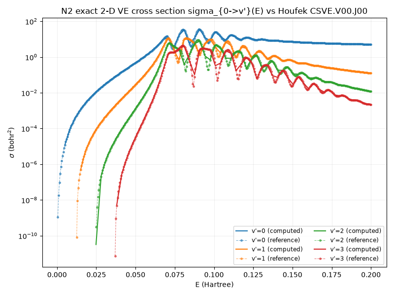

# TI energy-sweep symbolic reuse + the dense σ(E) cross-section curve

**Location:** the reuse lives in `qscat.linalg.SparseLU.refactor(A_new)`
(backed by `_ScipyBackend.refactor` / `_MumpsBackend.refactor` in
`qscat.linalg._mumps_backend`); the wired sweep is in
`projects.n2_2d_cross_section.cross_section_2d.ve_cross_section_2d`. The
display is the experiment-agnostic
`projects.n2_2d_cross_section.cross_section_plot.plot_cross_sections` plus the
N₂ driver `validation.n2.ti_curve`. **Benchmark:** `benchmarks/sweep_reuse.py`.
**Figure:** `docs/physics/figures/n2-2d-ti-cross-section.png` (+ regenerable
`.npz`). **Origin:** sub-project #9; builds directly on #6 (the exact 2-D
driven solver) and #8 (the MUMPS backend, see
`docs/physics/mumps-sparse-backend.md`). **Units:** atomic units throughout.

## The idea: one symbolic analysis, many numeric factorizations

A driven-equation cross-section sweep factors `A(E) = E_tot·I − H` once per
collision energy and solves against the driving term. Across the sweep only the
scalar diagonal shift `E_tot·I` changes — `H` is fixed, and the identity merely
shifts the already-populated diagonal — so **every `A(E)` has an identical
sparsity pattern.** A sparse direct solve has two separable phases:

1. **Symbolic analysis** — fill-reducing ordering (SCOTCH nested dissection on
   the MUMPS backend) + symbolic factorization. Depends only on the *pattern*.
2. **Numeric factorization** — the actual `LDLᵀ` values. Depends on the
   *entries*.

Because the pattern is E-independent, the analysis is correct for every energy
in the sweep and need be done **only once**; only the numeric factorization
must repeat. MUMPS exposes exactly this split: `factor(reuse_analysis=True)`
re-uses the stored analysis on the persistent `Context` and skips the ordering.

## `SparseLU.refactor(A_new)`

`refactor` re-runs only the numeric factorization, reusing the symbolic
analysis from construction:

- **MUMPS backend:** `set_matrix(a); factor(reuse_analysis=True)` on the same
  `Context` — the SCOTCH ordering is *not* recomputed. This is where the reuse
  win materializes.
- **scipy/SuperLU backend:** SuperLU has no clean symbolic-reuse hook, so
  `refactor` honestly re-runs `splu(A_new)` — correct, but no speedup. SuperLU
  remains the always-available fallback **and the differential oracle**.
- **Pattern guard (a correctness requirement, not an optimization):**
  `reuse_analysis=True` is valid *only* for an identical nonzero structure —
  reusing an ordering computed for a different pattern would silently produce a
  wrong factorization. Each backend stores the analyzed matrix's canonicalized
  `(indices, indptr)` pattern (of the *supplied* matrix — the `triu` upper
  triangle on the SYM=2 symmetric path, the full matrix otherwise) and
  `refactor` raises `ValueError` on any shape or structure mismatch. A diagonal
  shift `E_tot·I − H` always passes; a genuinely different matrix is rejected.
- `refactor` keeps the **same backend and symmetry decision** as construction
  (the analysis assumed them).

The reuse is bit-identical: `SparseLU(A0); lu.refactor(A1); lu.solve(b)` equals
a fresh `SparseLU(A1).solve(b)` to round-off. Verified on the MUMPS backend
across several distinct diagonal shifts at real N₂ 2-D scale (rel err ~7e-16,
matching a fresh SuperLU solve), and on the scipy path on the dev box.

## The wired sweep

`ve_cross_section_2d` now sweeps analyze-once/refactor-per-energy. It builds the
solver **lazily at the first open (`E > 0`) energy** (`SparseLU(A(E))` —
analyze + factor) and `refactor(A(E))` for every subsequent open energy;
below-threshold energies (`E ≤ 0`) return zeros with **no factorization at
all** (there is no scattering solution below threshold). The returned σ, its
scalar/array shape contract, and the `return_wavefunction` behavior are
**unchanged** — the physics is identical, only the factorization path differs.
The per-energy `e_tot = E + eps[v_init]` fed to `refactor` is exactly the value
the solve uses internally, so the reused solver always factors the right
matrix. A differential test asserts the reuse-swept σ equals the same σ
computed one energy at a time, to round-off, on both backends.

## Measured speedup — larger than first expected, and here is why

The original design spec estimated the analysis at "~10–30% of a MUMPS
factorization," so it predicted a *bounded, modest* sweep saving. **The
measured saving on the working grid is ~80% (a ~5× wall-clock speedup)** —
substantially larger. The benchmark (`benchmarks/sweep_reuse.py`, on the N₂
working grid `N = 26,857`, `H` nnz = 476,377):

| backend | M energies | reuse total | no-reuse total | fraction saved |
|---|---|---|---|---|
| mumps | 50 | 4.25 s | 21.06 s | **79.8%** |
| mumps | 100 | 8.06 s | 39.96 s | **79.8%** |
| scipy | 8 | 39.50 s | 39.56 s | 0.2% (control) |

The reason the saving exceeds the spec's estimate is a property of *this grid*,
and the honest framing matters: on the working grid the full analyze+factor is
~0.41 s, of which the **SCOTCH analysis is ~0.33 s and the numeric
factorization only ~0.08 s.** Here the ordering *dominates* the cheap numeric
factor, so skipping it saves ~80%, not ~10–30%. The self-consistency check
holds: no-reuse ≈ M × 0.41 s (50 × 0.41 ≈ 21 s), reuse ≈ 0.41 s + (M−1) ×
0.08 s (0.41 + 49 × 0.08 ≈ 4.3 s).

**This fraction is grid-dependent and shrinks for larger matrices.** Numeric
factorization cost grows super-linearly with `N` (fill-in), while the analysis
grows more slowly; on a much larger deck the ~0.08 s numeric factor becomes the
dominant term and the reuse fraction falls back toward the spec's original
~10–30%. The ~80% is the honest number *for the working grid*, not a universal
claim — the saving is always real on MUMPS and always grows with the energy
count `M`, but its *fraction* depends on the analysis/factor ratio of the
specific matrix. The scipy control shows ~0% as expected (no symbolic reuse).

## The dense exact-2-D σ(E) curve for N₂

With the sweep cheap, the dense exact-2-D VE cross section is affordable to
compute and display — which #6 (anchors only) and #7 (finite-T-limited TD
curve) did not deliver. `validation.n2.ti_curve.compute_ti_curve` sweeps
`ve_cross_section_2d` over a dense `E_grid` (60 energies over (0, 0.2] Ha on the
working grid), and `plot_cross_sections` overlays it on Houfek's independent
`CSVE.V00.J00` golden data:

The exact-2-D curve (solid) tracks Houfek (dashed markers) tightly across the
entire resonance region for every channel v′ = 0…3, reproducing the boomerang
oscillation structure peak-for-peak. At the gated anchors the agreement is the
same tight differential-oracle bound #6 already established (e.g. E = 0.1 Ha,
v′ = 1: exact/Houfek = 1.000267, within `GATED_RTOL = 1e-3`); the two
documented-limited anchors — the elastic background (v′ = 0) at high E and the
near-threshold v′ = 1 point at E = 0.02 Ha — sit within the loose cross-model
`ANCHOR_FACTOR = 3.0` band, exactly the LCP limitations #6 characterized and the
exact solver largely closes. This certifies the exact solver *as a curve*, not
just at isolated coordinates. `plot_cross_sections` is experiment-agnostic
(takes reference data as an argument, no Houfek/N₂ knowledge) so F₂/NO reuse it;
the N₂-specific, Houfek-reading driver lives on the `validation/` side, keeping
`projects/` free of any `validation/` import.

## Provenance and scope

SuperLU stays the differential oracle at every step. Core `qscat` remains
numpy/scipy-only; the MUMPS reuse is exercised in the Docker `test` image and
skips on the dev box. **Deferred** (each a later sub-project, unchanged from
#8's list): `complex64` + iterative refinement; MKL PARDISO as a second x86
backend; the publishing pipeline (multi-arch images, PyPI core/`[mumps]` extra,
wheels); a Rust non-LU kernel; interactive/HTML display; other model systems
(F₂/NO/H₂⁺) and higher-dimensional models. See
`docs/physics/mumps-sparse-backend.md` for the underlying backend.
